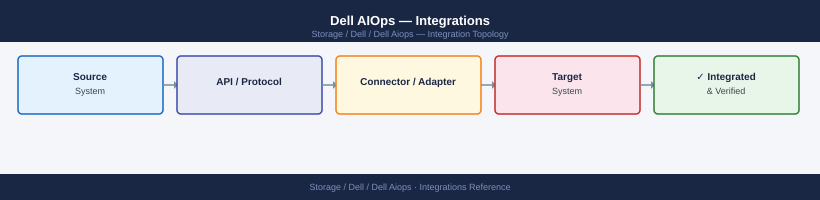

---
tags:
  - architecture
  - dell
---
# Dell AIOps — Integrations

Dell AIOps is embedded in CloudIQ — integrations are shared. Supported Dell array types, notification channels, and the APEX Console API are the key integration surfaces.

*Applies to: Dell AIOps*

## Integration with ServiceNow CMDB

- AIOps anomaly alerts can auto-create ServiceNow incidents linked to the affected CI
- Requires SCG → CloudIQ → ServiceNow connector configured with the correct CMDB table mapping (`cmdb_ci_storage_server`)
- Map CloudIQ array names to ServiceNow CI names to ensure correct CI assignment on incident creation

---

## See also

- [Dell Aiops — How It Works](how-it-works/)
- [Dell Aiops — Design Standards](design-standards/)
