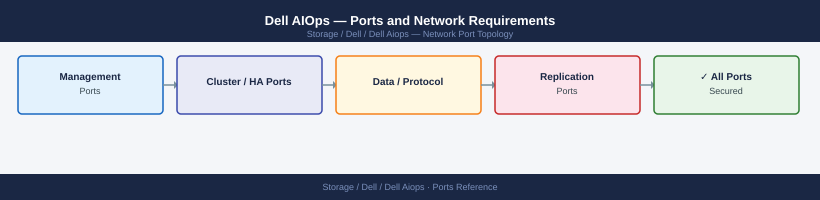

---
tags:
  - dell-aiops
  - dell
  - networking
  - firewall
  - ports
  - monitoring
---
# Dell AIOps — Ports and Network Requirements

Firewall port reference for Dell AIOps (AI-driven operations platform for Dell infrastructure). Dell AIOps aggregates telemetry from storage, compute, and networking components and provides predictive analytics.

*Applies to: Dell AIOps / CloudIQ AIOps*

## How It Works

Dell AIOps is a cloud-delivered (SaaS) analytics layer built on top of CloudIQ and ESRS telemetry. On-premise components send data outbound to Dell's cloud — no on-premise AIOps server is deployed.

## Outbound — Infrastructure to Dell Cloud (Required)

| Port | Protocol | Source | Destination | Purpose |
|---|---|---|---|---|
| 443 | TCP | All monitored array management IPs | cloudiq.dell.com, aiops.dell.com, esrs.dell.com | Telemetry upload for AIOps analytics |

## Admin Access (SaaS)

| Port | Protocol | Destination | Purpose |
|---|---|---|---|
| 443 | TCP | cloudiq.dell.com | Admin browser — AIOps dashboards and recommendations |

## Firewall Summary

| From | To | Ports | Notes |
|---|---|---|---|
| Array mgmt IPs | cloudiq.dell.com | 443 | Telemetry for AIOps — same as CloudIQ |
| Admin browsers | cloudiq.dell.com | 443 | SaaS access |

## See also

- [Dell AIOps — Architecture](how-it-works/)
- [Dell CloudIQ — Ports](../../cloudiq/architecture/ports.md)
