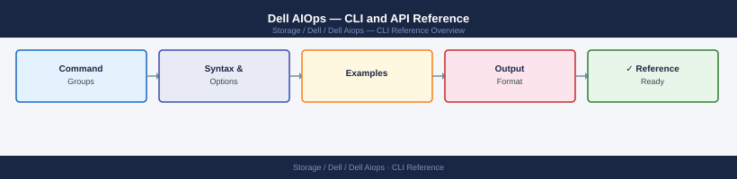

---
tags:
  - dell
---
# Dell AIOps — CLI and API Reference



```bash
# Obtain access token
curl -s -X POST "https://api.cloudiq.dell.com/auth/oauth/v2/token" \
  -H "Content-Type: application/x-www-form-urlencoded" \
  -d "grant_type=client_credentials&client_id=${CLIENT_ID}&client_secret=${CLIENT_SECRET}" \
  | jq -r '.access_token'
```

```bash
# List active anomalies
curl -s "https://api.cloudiq.dell.com/cloudiq/rest/v1/anomalies?filter=state%20eq%20'ACTIVE'" \
  -H "Authorization: Bearer ${TOKEN}" | jq '.results[] | {id,system_name,metric,detected_at}'

# Anomalies in last 24 hours
SINCE=$(date -u -v-1d +"%Y-%m-%dT%H:%M:%SZ")
curl -s "https://api.cloudiq.dell.com/cloudiq/rest/v1/anomalies?filter=created_at%20gt%20'${SINCE}'" \
  -H "Authorization: Bearer ${TOKEN}" | jq '.results | length'
```
```bash
# List all active alerts
curl -s "https://api.cloudiq.dell.com/cloudiq/rest/v1/alerts?filter=state%20eq%20'ACTIVE'" \
  -H "Authorization: Bearer ${TOKEN}" | jq '.results[] | {id,name,severity,system_name}'

# Alerts for a specific system
curl -s "https://api.cloudiq.dell.com/cloudiq/rest/v1/alerts?filter=system_id%20eq%20'${SYSTEM_ID}'" \
  -H "Authorization: Bearer ${TOKEN}" | jq '.results[] | {name,severity,created_at}'
```
```bash
# Capacity data for a specific system
curl -s "https://api.cloudiq.dell.com/cloudiq/rest/v1/systems/${SYSTEM_ID}/capacity" \
  -H "Authorization: Bearer ${TOKEN}" | jq '{used_bytes,total_bytes,days_until_full}'
```
```bash
# Paginated request — first 50 results
curl -s "https://api.cloudiq.dell.com/cloudiq/rest/v1/recommendations?limit=50&offset=0" \
  -H "Authorization: Bearer ${TOKEN}" | jq '{total: .total_results, count: (.results | length)}'

# Combined filter
curl -s "https://api.cloudiq.dell.com/cloudiq/rest/v1/recommendations?\
filter=severity%20eq%20'High'%20and%20state%20eq%20'ACTIVE'&limit=100" \
  -H "Authorization: Bearer ${TOKEN}" | jq '.results[] | {id,title,system_name}'
```

```d2
direction: right

center: "Dell AIOps" {shape: rectangle}
component_a: "Component A" {shape: rectangle}
component_b: "Component B" {shape: rectangle}
component_c: "Component C" {shape: rectangle}

center -> component_a
center -> component_b
center -> component_c
```

## See also

- [Dell AIOps — Overview](../../)
