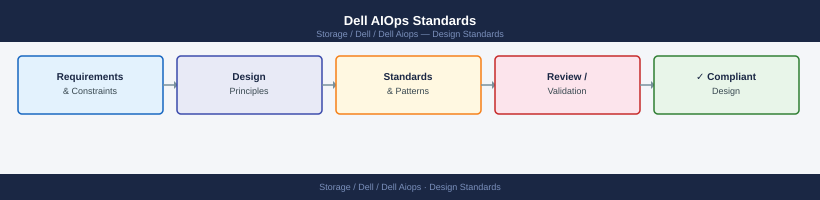

---
tags:
  - dell
---
# Dell AIOps Standards


<div class="kb-summary">
Dell AIOps Standards reference covering System Tagging Requirements, Recommendation Priority and Response SLA, Alert Routing, Change Management Requirements, Deferral Policy and 3 more sections.

*Applies to: Dell AIOps*
</div>



```d2
direction: down

system_tagging_requirements: "System Tagging Requirements" {shape: rectangle}
recommendation_priority_and_response: "Recommendation Priority and Response SLA" {shape: rectangle}
alert_routing: "Alert Routing" {shape: rectangle}
change_management_requirements: "Change Management Requirements" {shape: rectangle}
deferral_policy: "Deferral Policy" {shape: rectangle}
sensitivity_configuration: "Sensitivity Configuration" {shape: rectangle}

system_tagging_requirements -> recommendation_priority_and_response: hardens
recommendation_priority_and_response -> alert_routing: hardens
alert_routing -> change_management_requirements: hardens
change_management_requirements -> deferral_policy: hardens
deferral_policy -> sensitivity_configuration: hardens
```

## System Tagging Requirements

Every storage system managed by Dell AIOps must carry the three mandatory tags. Tags are applied in CloudIQ and propagate to AIOps recommendation filtering and reporting.

| Tag Key | Required | Example Values |
|---|---|---|
| `site` | Yes | `dc1`, `dc2`, `dr` |
| `environment` | Yes | `prod`, `non-prod`, `dev` |
| `tier` | Yes | `tier1`, `tier2`, `tier3` |

Untagged systems must be remediated within 48 hours. Monthly tag compliance report: filter untagged assets in CloudIQ > Assets.

## Recommendation Priority and Response SLA

| Priority | Examples | Response SLA |
|---|---|---|
| Critical | Imminent capacity exhaustion, active hardware fault | Acknowledge within 15 min; action same business day |
| High | Performance root cause identified, firmware vulnerability | Review within 4 hours; action within next change window |
| Medium | Approaching threshold, sub-optimal configuration | Review in weekly ops queue |
| Low | Best-practice suggestion, non-urgent tuning | Review in monthly review |

## Alert Routing

| Priority | Notification Channel |
|---|---|
| Critical | PagerDuty (on-call rotation) |
| High | Email to storage-ops + Slack/Teams channel |
| Medium | Email to storage-ops weekly digest |
| Low | CloudIQ portal only |

Alert routing rules are configured in **CloudIQ portal > Settings > Notifications**. Each rule must be owned and reviewed by the storage operations team lead.

## Change Management Requirements

All AIOps recommendations that require changes to production infrastructure must follow the standard change management process:

1. Raise a ServiceNow change request, referencing the CloudIQ recommendation ID
2. Include the recommended action, affected system, and risk assessment
3. Obtain change advisory board (CAB) or standard change approval as appropriate
4. Action the change during the approved window
5. Close the change record with outcome and post-change health score

Recommendations that involve emergency changes (Critical priority, imminent failure) may use the emergency change process — document after the fact.

## Deferral Policy

If a High or Critical recommendation cannot be actioned within the SLA:

1. Document the deferral rationale in the ServiceNow change/incident record
2. Note the deferred recommendation ID and target date in the weekly ops notes
3. Re-review at the next weekly ops meeting
4. Escalate to management if a High recommendation has been deferred more than twice

## Sensitivity Configuration

AIOps anomaly detection sensitivity can be tuned in CloudIQ to reduce noise from known workload patterns.

- Default sensitivity level: Medium (recommended starting point)
- For stable, predictable workloads: reduce sensitivity to Low to reduce false positives
- For tier-1 workloads with strict SLAs: increase sensitivity to High for earlier detection
- Changes to sensitivity settings must be reviewed quarterly

## Capacity Forecast Alert Thresholds

| Metric | Warning | Critical |
|---|---|---|
| Days until capacity threshold | 45 days | 15 days |
| Capacity used (usable) | 70% | 85% |
| Data reduction ratio decline | > 20% below 30-day baseline | > 30% decline |

## Reporting Cadence

| Report | Schedule | Owner |
|---|---|---|
| AIOps Recommendations Summary | Weekly (Mondays) | Storage ops lead |
| Anomaly Trend Analysis | Monthly | Storage ops lead |
| Capacity Forecast Review | Monthly | Storage team + capacity planner |
| Recommendation Backlog Status | Weekly ops meeting | Storage ops team |
