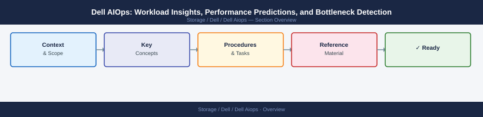

---
tags:
  - dell
---
# Dell AIOps: Workload Insights, Performance Predictions, and Bottleneck Detection


<div class="kb-summary">
Dell AIOps: Workload Insights, Performance Predictions, and Bottleneck Detection reference covering Performance Predictions, Bottleneck Detection, Noisy Neighbour Detection, Common Insight Issues.

*Applies to: Dell AIOps*
</div>



Common bottleneck types and remediation:

| Bottleneck Type | Root Cause | Typical Remediation |
|---|---|---|
| Front-end bandwidth saturated | Host-facing port congestion | Add front-end ports or upgrade to 32G FC |
| Cache write-pending high | Backend write throughput insufficient | Check backend drives health, RAID rebuild? |
| Controller CPU bound | Too many volumes or complex RAID | Rebalance volumes; consider tiering |
| Back-end bandwidth saturated | Drive enclosure bandwidth limit | Spread volumes across enclosures |

```d2
direction: right

center: "Dell AIOps" {shape: hexagon}
noisy_neighbour_detection: "Noisy Neighbour Detection" {shape: rectangle}
common_insight_issues: "Common Insight Issues" {shape: rectangle}

center -> noisy_neighbour_detection
center -> common_insight_issues
```

## Noisy Neighbour Detection

AIOps can identify when one workload is monopolising shared resources and impacting co-located workloads.

```bash
# Get noisy neighbour insights
curl -sk -X GET \
  "https://cloudiq.apis.dell.com/cloudiq/rest/v1/aiops/insights?filter=type%20eq%20%27NOISY_NEIGHBOUR%27" \
  -H "Authorization: Bearer <access_token>" \
  -H "Accept: application/json" | jq '.results[] | {noisy_volume, affected_volumes, impact_percent}'
```

## Common Insight Issues

| Issue | Likely Cause | Fix |
|---|---|---|
| No insights generated | System recently added | Allow 7–14 days for model training |
| Bottleneck not detected despite obvious issue | System metrics below detection threshold | Use native system UI for immediate diagnosis |
| Prediction confidence < 0.6 | Irregular workload pattern | Extend data collection window |
| Noisy neighbour false positive | Coincident backup job | Review time correlation; dismiss if scheduled |
