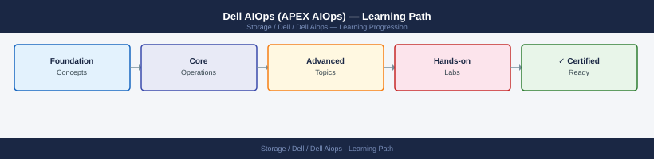
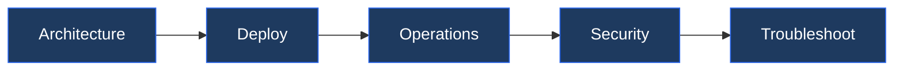

---
tags:
  - dell
  - learning-path
---
# Dell AIOps (APEX AIOps) — Learning Path

<div class="kb-summary">
Recommended reading order for Dell AIOps. Follow these stages in order to build a complete mental model before working with it in production.

*Applies to: Dell AIOps*
</div>





```d2
direction: right

stage_1_architecture: "Stage 1 — Architecture" {shape: rectangle}
stage_2_deployment: "Stage 2 — Deployment" {shape: rectangle}
stage_3_operations: "Stage 3 — Operations" {shape: rectangle}
stage_4_security: "Stage 4 — Security" {shape: rectangle}
stage_5_troubleshooting: "Stage 5 — Troubleshooting" {shape: rectangle}

stage_1_architecture -> stage_2_deployment: next
stage_2_deployment -> stage_3_operations: next
stage_3_operations -> stage_4_security: next
stage_4_security -> stage_5_troubleshooting: next
```

## Stage 1 — Architecture
**Goal**: Understand how Dell AIOps ingests telemetry from Dell infrastructure, applies machine learning models to detect anomalies and predict failures, and surfaces actionable recommendations.

**Read in this order**:
- [How It Works](../architecture/how-it-works/) — APEX AIOps platform architecture: telemetry pipeline from on-premises Dell systems via CloudIQ and Secure Connect Gateway, ML model stack (anomaly detection, predictive failure scoring, capacity forecasting), recommendation engine logic, and how AIOps extends CloudIQ with automated remediation suggestions and cross-product correlation.
- [Design Standards](../architecture/design-standards/) — Which Dell products feed AIOps telemetry (PowerMax, PowerStore, PowerScale, Unity, Data Domain), telemetry collection frequency, AIOps alert tier configuration, integration scope with ServiceNow and other ITSM platforms, and dashboard organisation for multi-product fleets.
- [Integrations](../architecture/integrations/) — CloudIQ as the underlying data layer, Secure Connect Gateway for on-premises telemetry forwarding, ServiceNow integration for automated incident creation from AIOps alerts, Slack and email webhooks, REST API for external analytics platforms, and integration with APEX Console for STaaS customers.

**Why first**: Dell AIOps sits on top of CloudIQ. Understanding the two-layer architecture (CloudIQ for health scores, AIOps for ML-driven recommendations) prevents confusion about which platform to use for which operational task.

---

## Stage 2 — Deployment
**Goal**: Enable AIOps on existing CloudIQ-connected systems, configure alert routing, and validate that recommendations are flowing before relying on them operationally.

**Read**:
- [Deploy](../deploy/) — AIOps enablement on a CloudIQ account (subscription activation), recommendation engine configuration, ServiceNow integration setup, notification channel configuration (Slack, email, webhook), and first recommendation validation.
- [Lifecycle](../lifecycle/) — AIOps subscription lifecycle management, renewal, and scope changes as the Dell infrastructure fleet changes.

**Why second**: AIOps requires sufficient telemetry history to generate meaningful predictions. Enable it early and validate recommendation quality before treating outputs as production-grade alerts.

---

## Stage 3 — Operations
**Goal**: Review and act on AIOps recommendations daily, integrate predictive alerts into the change management workflow, and use insights to drive proactive maintenance.

**Read in this order**:
- [Health Checks](../operations/health-checks/) — run the routine first on every shift; covers open AIOps recommendations by severity, predictive failure alerts with estimated time-to-failure, and cross-product anomaly correlations.
- [CLI Reference](../cli-reference/) — AIOps REST API endpoints for recommendation retrieval, alert status updates, insight queries, and telemetry health checks.
- [Procedures](../operations/procedures/) — Acting on a predictive failure recommendation (raise change request, coordinate maintenance), dismissing false-positive recommendations, tuning alert sensitivity thresholds, and exporting recommendation history for capacity planning.
- [Insights](../insights/) — How to interpret cross-product correlation insights and use them to identify systemic infrastructure issues before they surface as incidents.
- [Recommendations](../recommendations/) — Recommendation types taxonomy (hardware replacement, configuration change, capacity expansion), how to evaluate confidence scores, and how to feed outcomes back to improve model accuracy.
- [Alerts](../alerts/) — Alert severity tiers, routing rules, and how AIOps alerts differ from CloudIQ threshold alerts.
- [Reporting](../reporting/) — Monthly AIOps value reports: incidents avoided, recommendations acted on, and MTTR improvement metrics.
- [Scripts](../scripts/) — Automation: daily recommendation polling via REST API, automated ServiceNow ticket creation from high-severity predictions, and recommendation resolution tracking.

**Why third**: AIOps recommendations have a confidence score and a time window. Operators who do not check daily miss the window where proactive action prevents an outage.

---

## Stage 4 — Security
**Goal**: Control access to AIOps recommendations, secure the REST API, and understand data handling for ML telemetry sent to Dell's SaaS platform.

**Read**:
- [Access Control](../security/access-control/) — AIOps user roles (Administrator, Operator, Observer), system-level visibility scoping, and REST API service account permission boundaries.
- [Authentication](../security/authentication/) — SSO configuration for AIOps portal access, MFA enforcement, and OAuth2 token management for REST API integrations.
- [Encryption](../security/encryption/) — Telemetry encryption in transit (TLS), Dell data handling policy for ML training data, data residency options, and anonymisation of customer-identifying metadata in telemetry.
- [Hardening](../security/hardening/) — Restricting API token scope, audit log review for recommendation access, MFA mandate for all admin roles, and Secure Connect Gateway egress restriction to approved Dell AIOps endpoints.

**Why fourth**: AIOps telemetry leaves the on-premises environment and is used for ML model training. Compliance teams need to review the data handling model before sign-off.

---

## Stage 5 — Troubleshooting
**Goal**: Diagnose missing recommendations, stale telemetry feeding AIOps, false-positive alert floods, and integration failures with ITSM systems.

**Read**:
- [Troubleshooting](../troubleshooting/) — AIOps producing no recommendations (insufficient telemetry history or SCG connectivity issue), high false-positive rate (sensitivity threshold too low), ServiceNow integration dropping tickets (webhook authentication failure), and cross-product correlation showing incorrect system relationships.
- [Vendor Support](../vendor-support/) — Dell AIOps support tiers, SLA for recommendation accuracy issues, how to report systematic false positives or missed predictions, and escalation path for SaaS platform outages.

**Why last**: Troubleshooting makes most sense once you know the normal operating state.

---

## See also

- [Dell Aiops — Deploy](../deploy/)
