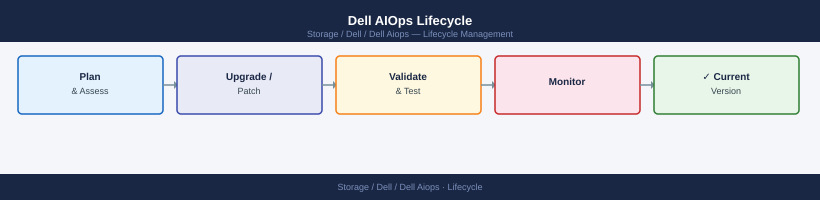

---
tags:
  - dell
---
# Dell AIOps Lifecycle

<div class="kb-summary">
Dell AIOps Lifecycle reference covering Platform Update Model, Customer Lifecycle Responsibilities, Secure Connect Gateway (SCG) Lifecycle, Feature Enablement, API Lifecycle and 1 more sections.

*Applies to: Dell AIOps*
</div>



```d2
direction: right

plan: "Plan" {shape: oval}
platform_update_model: "Platform Update Model" {shape: rectangle}
customer_lifecycle_responsibilities: "Customer Lifecycle Responsibilities" {shape: rectangle}
secure_connect_gateway_scg_lifecycle: "Secure Connect Gateway (SCG) Lifecycle" {shape: rectangle}
api_lifecycle: "API Lifecycle" {shape: rectangle}
system_decommission: "System Decommission" {shape: rectangle}
validate: "Validate" {shape: oval}

plan -> platform_update_model
platform_update_model -> customer_lifecycle_responsibilities
customer_lifecycle_responsibilities -> secure_connect_gateway_scg_lifecycle
secure_connect_gateway_scg_lifecycle -> api_lifecycle
api_lifecycle -> system_decommission
system_decommission -> validate
```

## Platform Update Model

Dell AIOps is a SaaS platform — feature updates, AI model improvements, and bug fixes are deployed by Dell without customer action. Customers should monitor CloudIQ release notes for:

- New AI model capabilities
- New recommendation types
- API endpoint changes or deprecations
- New platform support (confirm newly deployed arrays are supported)

**Release notes location**: CloudIQ portal > Settings > Release Notes

## Customer Lifecycle Responsibilities

| Activity | Responsibility | Frequency |
|---|---|---|
| Platform updates / AI model rollouts | Dell (automatic) | Per Dell release schedule |
| SCG version management | Customer | As new versions are released |
| New system onboarding | Customer | When new arrays are deployed |
| API token lifecycle management | Customer | Annual rotation |
| Tag compliance review | Customer | Monthly |
| Feature enablement review | Customer | Quarterly |

## Secure Connect Gateway (SCG) Lifecycle

The SCG is the only customer-managed component in the Dell AIOps stack. Keeping SCG current ensures access to new platform support and AIOps features.

### Check Current SCG Version


## API Lifecycle

The CloudIQ REST API used by AIOps scripts is versioned. Deprecated endpoints are published in CloudIQ release notes.

```text
Monitor for deprecation notices in:
- CloudIQ release notes
- Dell API documentation: developer.dell.com/cloudiq

When an endpoint is deprecated:
1. Identify all scripts/integrations using the deprecated endpoint
2. Update scripts to use the replacement endpoint
3. Test in non-prod before rolling out
4. Target completion before the deprecation date published by Dell
```

## System Decommission

When decommissioning a Dell system that is managed by AIOps:

```text
1. Ensure all open recommendations for the system are resolved or closed
2. Remove the system from the SCG: SCG admin UI > Systems > [System] > Delete
3. Remove the system from CloudIQ: CloudIQ portal > Assets > [System] > Remove
4. Update notification rules to remove the decommissioned system from alert scopes
```
