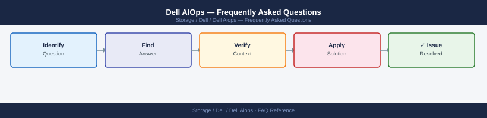

---
tags:
  - dell-aiops
  - faq
  - operations
---
# Dell AIOps — Frequently Asked Questions

Common questions about Dell AIOps operations, configuration, and troubleshooting. For step-by-step procedures, see the <a href="index.md">Operations</a> section.

## General

**Q: How do I check the Dell AIOps platform version?**
A: Dell AIOps is delivered as a SaaS or integrated component of CloudIQ. Check the version in the AIOps UI → Help → About, or in the CloudIQ platform release notes.

**Q: How do I check the current Dell AIOps version?**
A: `Dell AIOps UI → Help → About`

## Configuration

**Q: What is the default anomaly detection sensitivity?**
A: Medium sensitivity is the default — balances alert volume with detection coverage. Increase to High for critical arrays where even minor anomalies warrant investigation. Reduce for stable, predictable environments to reduce noise.

**Q: How do I enable predictive failure alerts in Dell AIOps?**
A: Ensure SupportAssist is active on all monitored systems. In AIOps/CloudIQ, enable Predictive Recommendations under Settings → Analytics. Dell's ML models analyse telemetry and generate predictions based on fleet-wide failure patterns.

## Operations

**Q: How does Dell AIOps update its ML models?**
A: Dell updates AIOps ML models automatically as a SaaS service. New model versions are trained on aggregated (anonymised) fleet telemetry. No customer action required. Prediction accuracy improves over time as more data is collected.

**Q: What is the correct procedure to add a new system to AIOps monitoring?**
A: Register the system with SupportAssist. AIOps automatically discovers newly connected systems within 24 hours. Configure alert recipients for the new system under AIOps Settings → Notifications.

## Troubleshooting

**Q: AIOps shows 'Predicted Failure: Drive X within 14 days'. What does it mean?**
A: AIOps ML models have detected patterns consistent with imminent drive failure based on SMART data and error patterns. Contact Dell Support immediately to arrange a preventive drive replacement before data loss or performance impact occurs.

**Q: AIOps recommendations are generating too many low-priority alerts — where do I start?**
A: Tune alert thresholds in AIOps Settings → Alert Configuration. Suppress known-benign recommendations using the 'Acknowledge' workflow. Review suppressed alerts monthly to ensure no real issues are being masked.

## Backup and Recovery

**Q: Is AIOps data backed up?**
A: AIOps is a SaaS platform — Dell manages all data retention and backup. Historical telemetry, model outputs, and alert history are retained per Dell's SaaS data retention policy. No customer backup action required.

**Q: What happens to AIOps data if I replace an array?**
A: AIOps historical data is linked to the system serial number. After replacement, the new array builds its own telemetry history. Dell Support can link the new serial to the old data for continuity if needed.

## See Also

- [Dell AIOps Operations](index.md)
- [Dell AIOps Troubleshooting](../../../troubleshooting/index.md)
