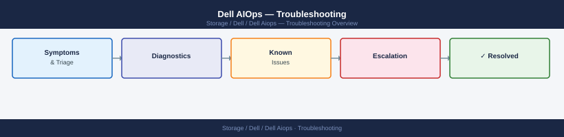

---
tags:
  - dell
  - troubleshooting
search:
  boost: 1.5
---
# Dell AIOps — Troubleshooting



```bash
# List recent AI alerts with confidence scores
curl -sk -X GET \
  "https://cloudiq.apis.dell.com/cloudiq/rest/v1/aiops/alerts?filter=state%20eq%20%27ACTIVE%27&select=id,type,metric,confidence,started_at,system_name" \
  -H "Authorization: Bearer <access_token>" \
  -H "Accept: application/json" | jq '.results[] | select(.confidence < 0.75)'

# Dismiss and flag a false positive for model feedback
curl -sk -X POST \
  "https://cloudiq.apis.dell.com/cloudiq/rest/v1/aiops/alerts/<alertId>/dismiss" \
  -H "Authorization: Bearer <access_token>" \
  -H "Content-Type: application/json" \
  -d '{"reason": "FALSE_POSITIVE", "comment": "Weekly backup job 22:00–02:00, expected anomaly"}'
```


## Before you begin

- **Access:** Storage admin credentials (cluster admin or equivalent)
- **Gather first:** recent error message text, event timestamps, and affected object names
- **Scope:** confirm whether the issue affects a single object, host, cluster, or site
- **Escalation:** open a vendor support ticket before running any destructive step
- **Logging:** document each command and output — required if escalation is needed

---

---

## Verify resolution

- Confirm the original symptom no longer occurs
- Check logs for any residual errors related to the issue
- Monitor for 10–15 minutes to confirm the fix is stable

## See also

- [Alerts](../alerts/)
- [Architecture](../architecture/)
- [Cli Reference](../cli-reference/)
- [Deploy](../deploy/)
- [Design Standards](../design-standards/)
- [Insights](../insights/)
- [Integration](../integration/)
- [Learning Path](../learning-path/)
- [Lifecycle](../lifecycle/)
- [Operations](../operations/)
- [Recommendations](../recommendations/)
- [Reporting](../reporting/)
- [Scripts](../scripts/)
- [Security](../security/)
- [Vendor Support](../vendor-support/)
- [Dell AIOps — Overview](../)
