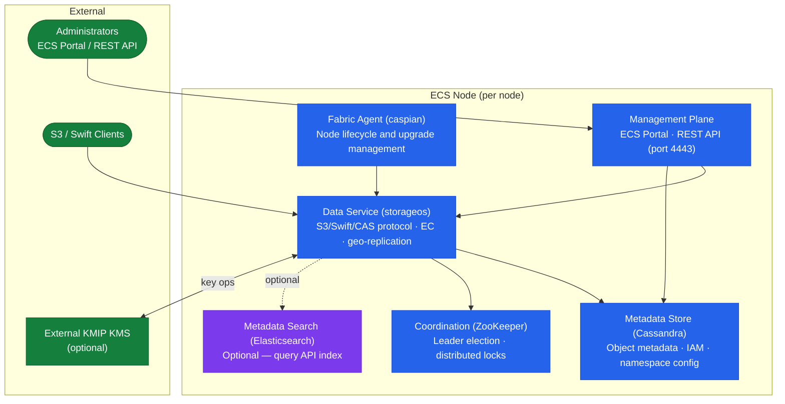
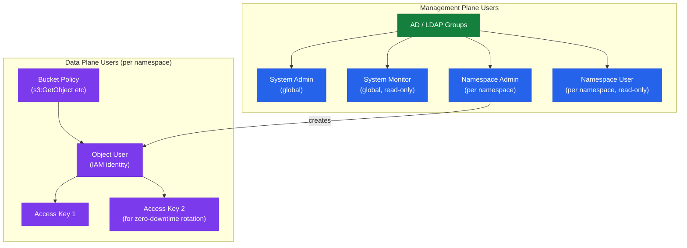

# Dell ECS — Components

## Core Components

| Component | Role |
|---|---|
| ECS Node | Commodity x86 server running the ECS software stack; each node contributes CPU, memory, and direct-attached disks to the cluster |
| Virtual Data Center (VDC) | Logical grouping of nodes within a single site; the smallest independently manageable unit |
| Replication Group | Named policy object that links two or more VDCs and governs how objects are replicated across sites |
| ECS Portal | Web-based management console (HTTPS, port 443) for administration; backed by the ECS Management REST API |
| Management REST API | Programmatic interface on port 4443 for all administrative operations; used by `ecscli` and automation scripts |
| Data Services layer | Handles S3/Swift/Atmos/CAS protocol translation, chunking, erasure-coding, and geo-replication |
| Namespace | Multi-tenancy boundary; each namespace has its own replication group assignment, IAM users, and quota |
| Bucket | Object container within a namespace; versioning, lifecycle, and access policy are configured per bucket |

## Software Stack

ECS runs a purpose-built distributed software stack on each node. Key internal components include:



| Component | Technology | Role |
|---|---|---|
| Data Service | Custom C++/Java service (`storageos`) | Handles object I/O, erasure coding, chunk placement, and geo-replication |
| Metadata Store | Apache Cassandra (embedded) | Stores object metadata, bucket/namespace configuration, IAM definitions |
| Coordination Service | Apache ZooKeeper (embedded) | Cluster coordination, leader election, distributed locking |
| Management Plane | Java application server | Backs the ECS Portal UI and Management REST API on port 4443 |
| Geo-Replication Journal | Custom journaling subsystem | Tracks dirty chunks for replication; replays on reconnection after TSF |
| Metadata Search Indexer | Elasticsearch (embedded, optional) | Enables object-level metadata search via the ECS Query API |

These services run as a unified stack managed by the ECS `storageos` system service. On-node startup and health management is handled by the ECS fabric agent (`caspian`).

## Node Hardware Profile

ECS nodes are validated on Dell ECS U-Series and CX-Series appliances. Each node is a single unit of capacity and compute in the cluster.

| Component | Typical Specification |
|---|---|
| CPU | Dual socket Intel Xeon (16–32 cores per socket) |
| Memory | 256 GB – 1.5 TB RAM per node (Cassandra and data service are memory-intensive) |
| Data disks | 60–90 × 8 TB, 12 TB, or 20 TB NL-SAS/SATA HDDs per node (dense shelf) |
| Boot/OS disk | 2 × SSD in RAID 1 for OS (not for data) |
| Network | 2 × 10 GbE or 25 GbE (data); 1 × 1 GbE (management); separate VLANs required |
| Data IP | Static IP on the data network — used for S3, Swift, and inter-node erasure coding traffic |
| Management IP | Static IP on the management network — used for ECS Portal, REST API, and SSH |

Do not mix hardware generations within a single VDC. All nodes in a VDC must use a validated Dell ECS appliance configuration; deploying on unsupported hardware voids support.

## Storage Pools and Disk Management

Within each node, ECS manages storage at the raw disk level. Disks are presented as raw block devices; ECS formats them with XFS and manages chunk placement internally.

| Concept | Description |
|---|---|
| Storage Pool | A logical grouping of disks within a VDC used for capacity planning and replication group targeting. Multiple storage pools can exist within one VDC. |
| Data Disk | Any disk added to the ECS pool; ECS striped erasure coding fragments across data disks on all nodes |
| Disk State | ECS tracks each disk state: `GOOD`, `SUSPECT`, `FAILED`, `REBUILDING`. A failed disk triggers automatic rebuild across surviving disks. |
| Rebuild | When a disk or node is marked `FAILED`, ECS automatically reconstructs missing EC fragments from surviving fragments across the cluster. Rebuild time depends on cluster size and available bandwidth. |

```bash
# Check disk status on all nodes via viprexec (run from any node as root)
viprexec -v -cmd "lsblk -o NAME,SIZE,FSTYPE,STATE,MOUNTPOINT"

# Check per-node disk usage on the ECS data partition
viprexec -v -cmd "df -h /data/"

# Check Cassandra disk (metadata) usage per node
viprexec -v -cmd "df -h /opt/storageos/db/"
```

## Networking Architecture

ECS separates management and data traffic. Each node has at minimum two network interfaces:

```
Node
├── Management NIC (1 GbE or 10 GbE)
│   ├── ECS Portal (443)
│   ├── Management REST API (4443)
│   ├── SSH (22)
│   └── SNMP / Syslog (161/514)
└── Data NIC (10 GbE or 25 GbE, bonded recommended)
    ├── S3 API (443 / 9021)
    ├── Swift API (9024)
    ├── Intra-cluster EC traffic
    └── Geo-replication (9100)
```

Inter-VDC geo-replication traffic flows on port 9100 across the WAN link between sites. Size the WAN circuit for peak ingest rates; replication lag grows when WAN utilisation sustains above 80%.

## Replication

ECS replication provides geo-redundancy by replicating objects across sites using replication groups.

### Replication Groups

ECS uses **replication groups** to define which VDCs participate in replication and the replication mode:

| Mode | Description |
|---|---|
| Synchronous | Write acknowledged only after replicated to all VDCs |
| Asynchronous | Write acknowledged immediately; replicated in background |
| Metered | Asynchronous with bandwidth throttling |

### Monitoring Replication

From the ECS Management Console:

- **Monitor** → **Replication** → view per-replication-group status
- Check **Replication Lag** — bytes or time behind
- Check for **Failed** replication segments

```bash
# REST API — check geo-replication status for all replication groups
curl -s -k -H "X-SDS-AUTH-TOKEN: $TOKEN" \
  "https://<ecs-node>:4443/vdc/geo-replication/status" | python3 -m json.tool

# S3 API — verify object exists on remote site (after replication)
aws s3 ls s3://<bucket>/<key> \
    --endpoint-url https://<remote_ecs_endpoint> \
    --no-verify-ssl
```

### Replication Failure Response

If replication fails:

1. Check the ECS Management Console for the specific replication error
2. Check network connectivity between VDCs on port 9100
3. Check disk space on the destination VDC (`GET /vdc/capacity`)
4. Review ECS system logs for replication-specific error codes (`/var/log/ecs/` on affected nodes)
5. If the backlog is large after reconnection, monitor the replication queue drain via ECS Portal → Geo Monitoring; do not restart nodes while the backlog is draining

### Cross-VDC Failover

In a failover scenario (primary VDC unavailable):

1. Update client S3 endpoint to the secondary ECS VDC IP/FQDN
2. Confirm data is accessible:
   ```bash
   aws s3 ls s3://<bucket>/ --endpoint-url https://<secondary_ecs> --no-verify-ssl
   ```
3. Note: asynchronous replication may have RPO lag — verify with the ECS monitoring console before declaring recovery complete
4. When the primary VDC recovers, re-add it to the replication group and monitor the resync backlog before sending production traffic back

### Bandwidth Management

Replication throttling prevents geo-replication from saturating WAN links during peak hours. Configure per-replication-group bandwidth limits in ECS Portal → Replication → Bandwidth Management.

```bash
# Replication throttling is configured via ECS Management Console
# ECS Portal → Replication Groups → <group> → Edit → Bandwidth Limit
# Values are specified in MB/s per replication group
```

### Common Issues

| Issue | Check | Action |
|---|---|---|
| High replication lag | Network bandwidth saturation | Check inter-site bandwidth utilisation; throttle lower-priority replication groups if needed |
| Replication failed | Destination VDC offline or full | Restore connectivity or add capacity; check `GET /vdc/capacity` on remote VDC |
| Objects missing on replica | Check replication lag time | Wait for async replication; check `GET /vdc/alerts` on remote VDC for errors |
| Replication stuck after TSF recovery | Backlog too large; timeout during replay | Monitor drain in Geo Monitoring; contact Dell support if stuck for >24h |

## IAM and User Model

ECS uses two distinct user types: management users (portal/API) and object users (S3/Swift data access).



| User Type | Scope | Authentication | Purpose |
|---|---|---|---|
| Management User (System Admin/Monitor) | Global | Local or LDAP | ECS Portal and Management API administration |
| Namespace Admin | Per namespace | Local or LDAP | Manage buckets, IAM users, lifecycle within a namespace |
| Object User | Per namespace | S3 access key / secret key | S3, Swift, or Atmos data access |

Object users are assigned one or more S3 access key / secret key pairs. These are the credentials configured in S3 client applications and backup software. Secret keys are shown only once at creation and cannot be retrieved afterwards.

```bash
# Create an object user and generate their first S3 key pair
ecscli user create --namespace analytics-prod --name svc-spark-prod
ecscli user secret-key create --namespace analytics-prod --name svc-spark-prod

# List existing object users in a namespace
ecscli user list-object-users --namespace analytics-prod

# Rotate a secret key: create a new key, update the application, then delete the old key
ecscli user secret-key create --namespace analytics-prod --name svc-spark-prod
# (deploy new key to application)
ecscli user secret-key delete --namespace analytics-prod --name svc-spark-prod --secret-key <old-key-id>
```
