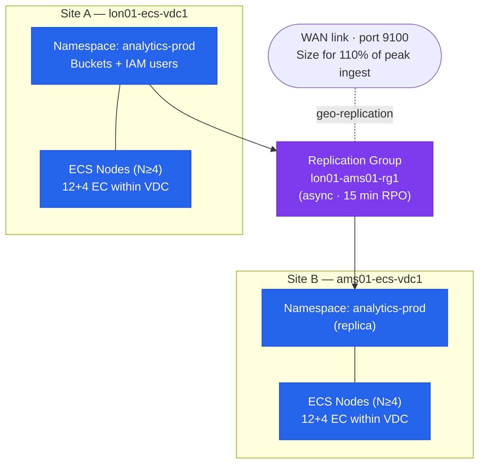

---
tags:
  - architecture
  - dell
---
# Dell ECS — Standards


<div class="kb-summary">
Standards reference covering Sizing and Capacity Model, Sizing by Workload, Network Sizing, Naming Conventions, Build and Deployment Baseline and 4 more sections.

*Applies to: ECS 3.x*
</div>
```text
┌────────────────────────────── Dell ECS — Architecture Design Standards ───────────────────────────────┐
│                                                                                                       │
│   ┌───────────────────────────────────────────────────────────────────────────────────────────────┐   │
│   │        ECS design standards: network isolation, redundancy, sizing, naming conventions        │   │
│   │          Network: dedicated storage VLAN; jumbo frames for iSCSI; dual-fabric for FC          │   │
│   │          Redundancy: dual controllers, multipath I/O, and no single points of failure         │   │
│   │       Monitoring: set capacity and latency alerts; baseline performance after deployment      │   │
│   └───────────────────────────────────────────────────────────────────────────────────────────────┘   │
│                                                                                                       │
│    Requirements → architecture design → redundancy review → size → deploy                             │
│                                                                                                       │
│                  ▼                                ▼                                ▼                  │
│                                                                                                       │
│   ┌─────────────────────────────┐  ┌─────────────────────────────┐  ┌─────────────────────────────┐   │
│   │            Layer            │  │          Component          │  │            Notes            │   │
│   │             Node            │  │        x86 appliance        │  │        Shared-nothing       │   │
│   │         Storage pool        │  │          Node group         │  │        Erasure coded        │   │
│   │             VDC             │  │          Virtual DC         │  │        Per-site unit        │   │
│   │          Rep. group         │  │          Multi-VDC          │  │        Geo redundancy       │   │
│   │            Bucket           │  │       Object container      │  │        S3/Swift/Blob        │   │
│   └─────────────────────────────┘  └─────────────────────────────┘  └─────────────────────────────┘   │
│                                                                                                       │
│                          ▼                                                 ▼                          │
│                                                                                                       │
│   ┌───────────────────────────────────────────────────────────────────────────────────────────────┐   │
│   │    Component     │     Purpose      │      Protocol     │       Auth       │      Notes       │   │
│   │   Storage pool   │ Drive aggregatio │      Internal     │       N/A        │   Erasure 12+4   │   │
│   │       VDC        │  Site grouping   │      Internal     │       N/A        │   HA per site    │   │
│   │      Bucket      │ Object namespace │   S3/Swift/Blob   │   S3 keys/IAM    │    Per tenant    │   │
│   │ Replication grp  │ Geo replication  │    ECS protocol   │   Certificate    │    3-way geo     │   │
│   └───────────────────────────────────────────────────────────────────────────────────────────────┘   │
│                                                                                                       │
│    Physical: ECS appliance nodes · 10/25 GbE backend network · commodity SAS drives                   │
│                                                                                                       │
│    Key terms:                                                                                         │
│                                                                                                       │
│    ECS                = Elastic Cloud Storage; Dell S3-compatible object store for unstructured data  │
│    VDC                = Virtual Data Center; group of ECS nodes at a single geographic site           │
│    Storage pool       = collection of nodes within a VDC; defines the erasure coding domain           │
│    Replication group  = links VDCs for geo-redundant object storage; 3-way replication                │
│    Bucket             = top-level S3 namespace; equivalent to S3 bucket or Azure container            │
│    Erasure coding     = data protection scheme; default 12+4 provides 4-drive fault tolerance         │
│    Namespace          = tenant-level isolation; multiple tenants share a single ECS cluster           │
│    CAS                = Content Addressed Storage; fixed-content object storage with WORM support     │
│    Replication factor = number of VDC copies; 3-way geo-replication for maximum durability            │
│    Atmos API          = legacy Dell Atmos-compatible API; supported for migration from Atmos systems  │
│    HDFS connector     = ECS Hadoop connector; ECS appears as HDFS namespace for analytics jobs        │
│    Quota              = per-namespace or per-bucket storage quota; enforced as hard or soft limit     │
│                                                                                                       │
└───────────────────────────────────────────────────────────────────────────────────────────────────────┘
```


## Sizing and Capacity Model

ECS nodes are standardised appliance configurations (ECS U-Series, CX-Series). Raw capacity is converted to usable capacity after erasure coding overhead (approximately 1.33× raw for 12+4 EC) and a 30% overhead reservation for metadata, journals, and rebuild workspace.

| Metric | Guideline |
|---|---|
| Minimum cluster size | 4 nodes per VDC for production (required for 12+4 EC) |
| Target utilisation threshold | 70% of usable capacity — plan expansion before this point |
| Hard-limit concern | ECS performance degrades significantly above 85% utilisation |
| Geo-replication node count | Each VDC must independently satisfy minimum node requirements |
| Storage per node | Typically 60–90 × 8 TB, 12 TB, or 20 TB HDDs per node in dense configurations |

**Usable capacity formula:**

```text
Raw capacity = nodes × disks_per_node × disk_size_TB
EC overhead factor = 1.33 (for 12+4); 1.20 (for 10+2)
Metadata/journal reservation = 30% of raw after EC
Usable capacity ≈ (Raw × (1 / EC_overhead_factor)) × 0.70
```

Example: 8-node cluster, 60 × 12 TB disks per node, 12+4 EC:
- Raw: 8 × 60 × 12 = 5,760 TB
- After EC: 5,760 / 1.33 ≈ 4,331 TB
- After 30% reservation: 4,331 × 0.70 ≈ 3,032 TB usable

Plan node additions in increments of at least one full row (4 nodes minimum) to maintain erasure coding stripe width and avoid rebalancing penalties.

## Sizing by Workload

| Workload Type | Key Sizing Driver | Guidance |
|---|---|---|
| Backup target (Veeam, Commvault) | Ingest bandwidth and retention period | Size WAN / network for peak ingest rate; size capacity for daily ingest × retention days |
| Analytics data lake | Random read IOPS and object count | ECS performs best with objects > 1 MB; avoid large numbers of tiny objects |
| Compliance archival | Capacity and retention period | Size for total data volume + annual growth; enable Object Lock; no performance SLA required |
| Active media / streaming | Throughput (MB/s) | Size for concurrent stream count × bitrate; use load balancer for even node distribution |
| Multi-tenant (namespaces) | Per-namespace quota and isolation | Set hard quotas per namespace; model each team's capacity independently |

## Network Sizing

| Traffic Type | Bandwidth Guidance |
|---|---|
| Intra-cluster EC traffic | Minimum 10 GbE per node (bonded 2 × 10 GbE for production) |
| Client S3 traffic | Size the load balancer uplink for peak client throughput × node count |
| Geo-replication (async) | Size inter-site WAN for 110% of peak ingest rate to allow replication to keep pace |
| Geo-replication (sync) | Size inter-site WAN for 200%+ of peak ingest rate; synchronous replication doubles the write traffic on the WAN |
| Management | 1 GbE per node is sufficient; management traffic is low-volume |

## Naming Conventions

| Object | Convention | Example |
|---|---|---|
| VDC name | `<site-code>-ecs-vdc<n>` | `lon01-ecs-vdc1` |
| Replication group | `<primary-site>-<secondary-site>-rg<n>` | `lon01-ams01-rg1` |
| Namespace | `<team>-<env>` (lowercase, hyphen-separated) | `analytics-prod` |
| Bucket | `<namespace>-<purpose>` or `<namespace>-<purpose>-<tier>` | `analytics-prod-raw`, `analytics-prod-archive` |
| IAM object user | `svc-<app>-<env>` (lowercase) | `svc-veeam-prod`, `svc-spark-prod` |
| ECS node hostname | `<site>-ecs-n<node-number>` | `lon01-ecs-n01`, `lon01-ecs-n02` |
| Management service account | `svc-ecs-mgmt` | — |
| Replication policy profile | `<rpo>-<consistency>` | `15min-async`, `0min-sync` |
| Lifecycle policy ID | `<purpose>-<action>-<days>d` | `versioned-expire-90d`, `mpu-abort-7d` |
| Audit bucket | `<namespace>-access-logs` | `analytics-prod-access-logs` |

S3 bucket names must comply with S3 naming rules: 3–63 characters, lowercase letters, numbers, and hyphens only. Do not use dots (`.`) in bucket names — they cause virtual-hosted-style TLS certificate matching issues.

## Build and Deployment Baseline

- Deploy ECS via the Dell ECS Installation and Configuration Guide; do not deviate from the supported hardware bill of materials
- Each VDC must have a minimum of 4 nodes for production; 3-node clusters are not supported for the default 12+4 erasure coding scheme
- All nodes in a VDC must run the same ECS software version; mixed-version clusters are unsupported
- Assign a dedicated management IP and data IP per node; separate management and data traffic onto different VLANs or NICs
- Configure NTP on all nodes to a consistent time source — ECS geo-replication consistency depends on clock synchronisation across VDCs; NTP offset should not exceed 100ms between nodes
- Enable syslog forwarding from ECS nodes to a centralised log management platform at deployment
- Create a dedicated management service account (`svc-ecs-mgmt`) for API automation; never use `sysadmin` in automation scripts
- Document the replication group topology (VDC names, replication mode, RPO) in the site runbook before go-live
- Configure namespace and bucket quotas from the outset; unconstrained namespaces are a capacity risk
- Replace self-signed TLS certificates on the Management API and S3 endpoint before connecting production applications
- Register all ECS nodes in the Dell Support portal under the active support contract before go-live

## Replication Group Design



| Decision | Guidance |
|---|---|
| Number of VDCs per replication group | Minimum 2 for geo-redundancy; 3 for active-active-active topology |
| Replication mode | Async for most workloads; Sync for compliance/financial data where RPO must be zero |
| RPO targets | Document the RPO target per replication group in the runbook; align with business requirements |
| Bandwidth throttling | Configure per-replication-group bandwidth limits to prevent replication from saturating WAN links during business hours |
| Temporary Site Failure behaviour | `is_stale_allowed: true` for HA (reads served from stale local copy during TSF); `false` for strong consistency (reads may fail during TSF) |

## IAM Design Principles

| Principle | Implementation |
|---|---|
| One object user per application | Never share S3 credentials between applications |
| Least-privilege bucket policies | Grant only the S3 actions required by the application; no `Action: "*"` |
| No wildcard bucket resources | Restrict policy resources to specific buckets, not `arn:aws:s3:::*` |
| Separate users for read and write | Create read-only users for reporting tools; create read-write users for ingest applications |
| No shared credentials for humans | Human access to S3 data should use short-lived presigned URLs, not permanent access keys |
| Key rotation schedule | Rotate all object user access keys every 12 months; document rotation dates in the IAM registry |

## Configuration Checklist

- [ ] All nodes visible in ECS Portal → Hardware with status `GOOD`
- [ ] NTP configured and synchronised on all nodes (`date` output matches across nodes to within 100ms)
- [ ] Syslog forwarding configured and events visible in the SIEM
- [ ] Management REST API accessible over HTTPS on port 4443; self-signed certificate replaced with a signed certificate
- [ ] S3 API endpoint TLS certificate is signed and trusted by consuming applications
- [ ] Admin service account `svc-ecs-mgmt` created; default `sysadmin` password changed
- [ ] HTTP (port 9021 plain HTTP) disabled in production; HTTPS only
- [ ] TLS 1.2 minimum enforced; TLS 1.0 and 1.1 disabled
- [ ] Replication group created and remote VDC connectivity verified (geo-replication lag = 0 at steady state)
- [ ] Each namespace has an assigned replication group and a hard quota
- [ ] Bucket versioning enabled only on buckets with a corresponding lifecycle policy to expire non-current versions
- [ ] Lifecycle policies configured on all versioned buckets (non-current version expiration + MPU abort)
- [ ] Baseline `GET /vdc/nodes` and `GET /vdc/capacity` outputs captured and stored in the runbook
- [ ] SNMP or syslog alerting configured for node or disk failure events
- [ ] IAM users created per application with least-privilege bucket policies; no wildcard actions in production bucket policies
- [ ] Geo-replication tested: write an object to one VDC and confirm it is readable from the remote VDC
- [ ] ECS nodes registered in the Dell Support portal under the active support contract
- [ ] CloudIQ connectivity configured (ECS 3.9+) for capacity analytics and proactive alerts
- [ ] Access logging enabled on all buckets with compliance or audit requirements
- [ ] Certificate expiry dates recorded in the monitoring system with 30-day advance alert

## Change Management Standards

| Change Type | Required Pre-Conditions | Approval Level |
|---|---|---|
| Bucket/namespace creation | Change record; pre-change health check passed | Standard change (pre-approved) |
| IAM user creation or deletion | Change record; justification documented | Standard change |
| Software upgrade | Pre-change health check; change window; application team notification | Normal change |
| Node addition | Pre-change health check; capacity headroom verified | Normal change |
| Replication group modification | Pre-change health check; impact assessed; approval from storage lead | Normal change |
| Disk replacement | ECS Portal guided procedure; change record | Emergency change (if unplanned) |
| VDC decommission | Full data migration verified; all replication groups updated; application teams confirmed | Major change |

---

## See also

- [Ecs — How It Works](how-it-works/)
- [Ecs — Integrations](integrations/)
