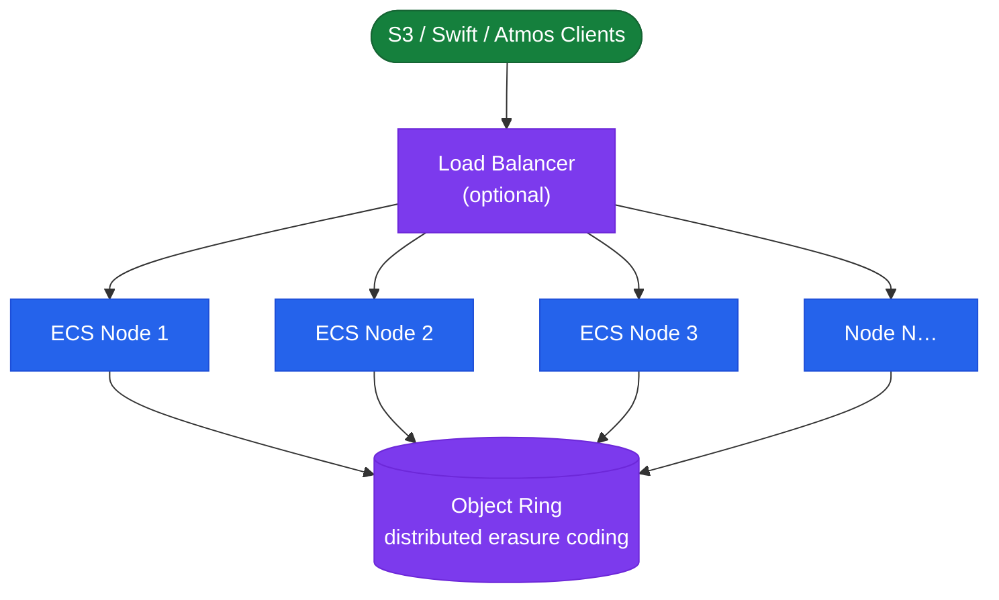

---
tags:
  - architecture
  - dell
---
# Dell ECS — How It Works


<div class="kb-summary">
How It Works reference covering Overview, Scale-Out Object Storage Topology, Erasure Coding, Virtual Data Centers (VDC), Replication Groups and Geo-Distribution and 3 more sections.
</div>
```text
┌─────────────────────────────────────── Dell ECS — How It Works ───────────────────────────────────────┐
│                                                                                                       │
│   ┌───────────────────────────────────────────────────────────────────────────────────────────────┐   │
│   │        ECS operational flow: request → controller → data service → host acknowledgement       │   │
│   │            Data path: host I/O → ECS controller → storage media → persistent write            │   │
│   │ Management: ECS Management Portal / REST API provides unified control for all operational fun │   │
│   │           Protection: snapshots, replication, and redundancy ensure data durability           │   │
│   └───────────────────────────────────────────────────────────────────────────────────────────────┘   │
│                                                                                                       │
│    Host I/O → ECS controller → storage media → acknowledge → replicate                                │
│                                                                                                       │
│                  ▼                                ▼                                ▼                  │
│                                                                                                       │
│   ┌─────────────────────────────┐  ┌─────────────────────────────┐  ┌─────────────────────────────┐   │
│   │            Layer            │  │          Component          │  │            Notes            │   │
│   │             Node            │  │        x86 appliance        │  │        Shared-nothing       │   │
│   │         Storage pool        │  │          Node group         │  │        Erasure coded        │   │
│   │             VDC             │  │          Virtual DC         │  │        Per-site unit        │   │
│   │          Rep. group         │  │          Multi-VDC          │  │        Geo redundancy       │   │
│   │            Bucket           │  │       Object container      │  │        S3/Swift/Blob        │   │
│   └─────────────────────────────┘  └─────────────────────────────┘  └─────────────────────────────┘   │
│                                                                                                       │
│                          ▼                                                 ▼                          │
│                                                                                                       │
│   ┌───────────────────────────────────────────────────────────────────────────────────────────────┐   │
│   │    Component     │     Purpose      │      Protocol     │       Auth       │      Notes       │   │
│   │   Storage pool   │ Drive aggregatio │      Internal     │       N/A        │   Erasure 12+4   │   │
│   │       VDC        │  Site grouping   │      Internal     │       N/A        │   HA per site    │   │
│   │      Bucket      │ Object namespace │   S3/Swift/Blob   │   S3 keys/IAM    │    Per tenant    │   │
│   │ Replication grp  │ Geo replication  │    ECS protocol   │   Certificate    │    3-way geo     │   │
│   └───────────────────────────────────────────────────────────────────────────────────────────────┘   │
│                                                                                                       │
│    Physical: ECS appliance nodes · 10/25 GbE backend network · commodity SAS drives                   │
│                                                                                                       │
│    Key terms:                                                                                         │
│                                                                                                       │
│    ECS                = Elastic Cloud Storage; Dell S3-compatible object store for unstructured data  │
│    VDC                = Virtual Data Center; group of ECS nodes at a single geographic site           │
│    Storage pool       = collection of nodes within a VDC; defines the erasure coding domain           │
│    Replication group  = links VDCs for geo-redundant object storage; 3-way replication                │
│    Bucket             = top-level S3 namespace; equivalent to S3 bucket or Azure container            │
│    Erasure coding     = data protection scheme; default 12+4 provides 4-drive fault tolerance         │
│    Namespace          = tenant-level isolation; multiple tenants share a single ECS cluster           │
│    CAS                = Content Addressed Storage; fixed-content object storage with WORM support     │
│    Replication factor = number of VDC copies; 3-way geo-replication for maximum durability            │
│    Atmos API          = legacy Dell Atmos-compatible API; supported for migration from Atmos systems  │
│    HDFS connector     = ECS Hadoop connector; ECS appears as HDFS namespace for analytics jobs        │
│    Quota              = per-namespace or per-bucket storage quota; enforced as hard or soft limit     │
│                                                                                                       │
└───────────────────────────────────────────────────────────────────────────────────────────────────────┘
```


## Overview

Dell ECS (Enterprise Content Storage) is a scale-out, software-defined object storage platform built on commodity x86 nodes. It exposes S3, Swift, Atmos, and CAS APIs over HTTPS. The software stack runs entirely on commodity hardware and provides geo-distribution across sites via Virtual Data Centers (VDCs) linked into replication groups.

## Scale-Out Object Storage Topology



## Erasure Coding

ECS uses erasure coding (EC) rather than replication for within-VDC data protection. Objects are broken into data fragments and parity fragments; the cluster reconstructs the original object when a defined number of fragments are lost.

| EC Scheme | Data Fragments | Parity Fragments | Min Nodes | Tolerated Failures |
|---|---|---|---|---|
| 12+4 (default) | 12 | 4 | 16 | Up to 4 simultaneous node/disk failures |
| 10+2 | 10 | 2 | 12 | Up to 2 simultaneous failures |
| 4+2 (small cluster) | 4 | 2 | 6 | Up to 2 simultaneous failures |

The EC scheme is selected automatically based on VDC node count. A 12+4 scheme has a 1.33× raw-to-usable overhead ratio. ECS also reserves ~30% overhead for metadata, journals, and rebuild workspace.

## Virtual Data Centers (VDC)

| Concept | Description |
|---|---|
| VDC | Single-site logical cluster of ECS nodes; independently manageable; serves S3 requests autonomously |
| VDC Quorum | Requires majority of VDC nodes online — `(n/2)+1` for even node counts |
| Temporary Site Failure (TSF) | VDC continues accepting writes locally; queues replication backlog; replays on reconnection |
| VDC Federation | Multiple VDCs peered into one management domain via ECS Portal for cross-VDC replication |

## Replication Groups and Geo-Distribution

Replication groups define which VDCs participate in geo-replication. Every namespace is assigned to a replication group.

| Mode | Consistency | RPO | Use Case |
|---|---|---|---|
| Synchronous | Strong — write confirmed on all VDCs | Near-zero | Compliance, financial records |
| Asynchronous | Eventual — write acknowledged locally; replicated in background | Minutes | General workloads, backup targets |
| Metered | Async with WAN bandwidth throttling | Longer | WAN-constrained environments |

## Namespace and Bucket Hierarchy

```text
VDC
└── Namespace (multi-tenancy boundary)
    ├── Assigned to one Replication Group
    ├── Quota (hard or advisory)
    ├── IAM Users (object users with S3 access keys)
    └── Bucket
        ├── Versioning, lifecycle policy, access policy
        └── Object Lock (WORM — compliance or governance mode)
```

## Supported API Protocols

| Protocol | Port | Use Case |
|---|---|---|
| S3 | HTTPS 443 / 9021 | General-purpose; primary API; widest client support |
| Swift | HTTPS 9024 | OpenStack integration |
| CAS (Centera) | HTTPS | Fixed-content WORM compliance (legacy EMC Centera migration) |
| HDFS | TCP 9003 | Hadoop/Spark via ECS HDFS connector JAR |
| NFS (ECS 3.8+) | TCP 2049 | POSIX namespace access via NFS gateway |
| Management REST API | HTTPS 4443 | Administration and automation |

## Data Write Path

1. Client sends S3 PUT to the ECS load balancer (or directly to a node)
2. Receiving node acts as the request coordinator
3. Coordinator chunks the object, applies erasure coding, distributes fragments across data nodes
4. Once local write completes, coordinator acknowledges write to client
5. Geo-replication journal records the new object; replication service transmits to peer VDCs
