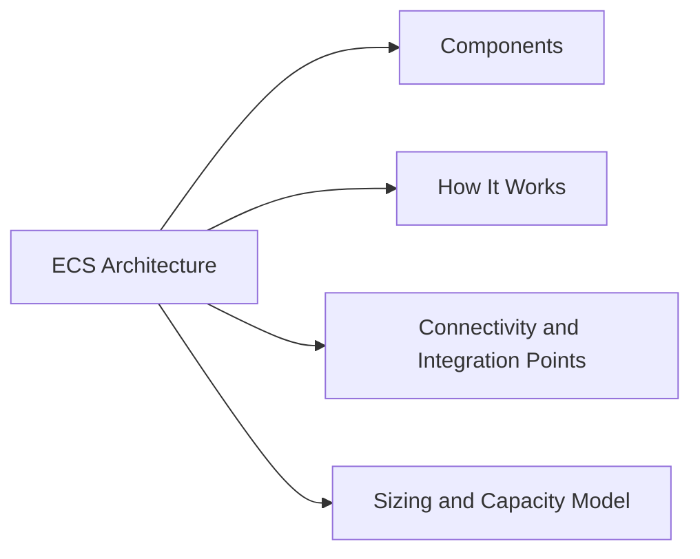

# ECS Architecture

## Overview

Dell ECS (Enterprise Content Storage) is a scale-out, software-defined object storage platform built on commodity x86 nodes. It exposes S3, Swift, Atmos, and CAS (Content Addressable Storage) APIs over standard HTTPS. The software stack runs entirely on commodity hardware and provides geo-distribution across sites via Virtual Data Centers (VDCs) linked into replication groups.

## Components

| Component | Role |
|---|---|
| ECS Node | Commodity x86 server running the ECS software stack; each node contributes CPU, memory, and direct-attached disks to the cluster |
| Virtual Data Center (VDC) | Logical grouping of nodes within a single site; the smallest independently manageable unit |
| Replication Group | Named policy object that links two or more VDCs and governs how objects are replicated across sites |
| ECS Portal | Web-based management console (HTTPS, port 443) for administration; backed by the ECS Management REST API |
| Management REST API | Programmatic interface on port 4443 for all administrative operations; used by `ecscli` and automation scripts |
| Data Services layer | Handles S3/Swift/Atmos/CAS protocol translation, chunking, erasure-coding, and geo-replication |
| Namespace | Multi-tenancy boundary; each namespace has its own replication group assignment, IAM users, and quota |
| Bucket | Object container within a namespace; versioning, lifecycle, and access policy are configured per bucket |

## How It Works

ECS writes incoming objects by chunking them into fixed-size chunks, applying erasure coding (typically 12+4 or 10+2 depending on node count and VDC span), and distributing coded fragments across nodes. For geo-replication, ECS asynchronously or synchronously replicates chunk journals to remote VDCs according to the replication group policy.

- **Single-site deployment**: All nodes in one VDC. Erasure coding protects against disk and node failure. No geographic redundancy.
- **Multi-site (geo) deployment**: Two or more VDCs in a replication group. Active-active writes are possible; object consistency uses a geo-replication journal. VDC-level failures do not cause data loss if replication lag is near zero.
- **Temporary Site Failure (TSF) mode**: When a VDC is unreachable, the remaining VDC enters TSF mode, continues serving data from local copies, and queues a replication backlog to replay on reconnection.

## Connectivity and Integration Points

| Interface | Protocol / Port | Purpose |
|---|---|---|
| S3 API endpoint | HTTPS 443 or 9021 | Object read/write for applications and backup tools |
| Swift API endpoint | HTTPS 9024 | OpenStack-compatible object access |
| Management REST API | HTTPS 4443 | Administration, monitoring, and automation |
| ECS Portal | HTTPS 443 | Web-based administration console |
| Geo-replication | TCP 9100 | Inter-VDC replication traffic between nodes |
| LDAP/AD | TCP 389 / 636 | Optional namespace-level user authentication |
| Syslog | UDP/TCP 514 | External log forwarding for SIEM integration |

## Sizing and Capacity Model

ECS nodes are standardised appliance configurations (ECS U-Series, CX-Series). Raw capacity is converted to usable capacity after erasure coding overhead (approximately 1.33× raw for 12+4 EC) and a 30% overhead reservation.

| Metric | Guideline |
|---|---|
| Minimum cluster size | 4 nodes per VDC for production (required for 12+4 EC) |
| Target utilisation threshold | 70% of usable capacity — plan expansion before this point |
| Hard-limit concern | ECS performance degrades significantly above 85% utilisation |
| Geo-replication node count | Each VDC must independently satisfy minimum node requirements |
| Storage per node | Typically 60–90 × 8 TB or 12 TB HDDs per node in dense configurations |

Plan ECS node additions in increments of at least one full row (4 nodes minimum) to maintain erasure coding stripe width and avoid rebalancing penalties.
