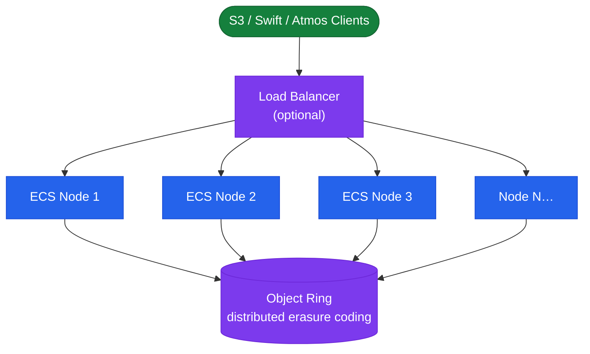

# Dell ECS — Architecture

<div class="kb-summary">
Scale-out software-defined object storage on commodity x86 nodes. Exposes S3, Swift, Atmos, and CAS APIs; protects data within a site using erasure coding; replicates geo-distributed across Virtual Data Centers linked in replication groups.
</div>
```text
┌─────────────────────────────────────── Dell ECS — Architecture ───────────────────────────────────────┐
│                                                                                                       │
│   ┌───────────────────────────────────────────────────────────────────────────────────────────────┐   │
│   │   ECS architecture overview: Elastic Cloud Storage enterprise S3-compatible object platform   │   │
│   │           Protocols: S3 · Azure Blob API · Swift · Atmos · NFS (via gateway) · HDFS           │   │
│   │               Key components: ECS nodes, Storage pools, VDCs, Replication groups              │   │
│   │          Design principles: HA, scalability, non-disruptive operations, and security          │   │
│   └───────────────────────────────────────────────────────────────────────────────────────────────┘   │
│                                                                                                       │
│    Design → deploy → configure → validate → monitor → optimise                                        │
│                                                                                                       │
│                  ▼                                ▼                                ▼                  │
│                                                                                                       │
│   ┌─────────────────────────────┐  ┌─────────────────────────────┐  ┌─────────────────────────────┐   │
│   │            Layer            │  │          Component          │  │            Notes            │   │
│   │             Node            │  │        x86 appliance        │  │        Shared-nothing       │   │
│   │         Storage pool        │  │          Node group         │  │        Erasure coded        │   │
│   │             VDC             │  │          Virtual DC         │  │        Per-site unit        │   │
│   │          Rep. group         │  │          Multi-VDC          │  │        Geo redundancy       │   │
│   │            Bucket           │  │       Object container      │  │        S3/Swift/Blob        │   │
│   └─────────────────────────────┘  └─────────────────────────────┘  └─────────────────────────────┘   │
│                                                                                                       │
│                          ▼                                                 ▼                          │
│                                                                                                       │
│   ┌───────────────────────────────────────────────────────────────────────────────────────────────┐   │
│   │    Component     │     Purpose      │      Protocol     │       Auth       │      Notes       │   │
│   │   Storage pool   │ Drive aggregatio │      Internal     │       N/A        │   Erasure 12+4   │   │
│   │       VDC        │  Site grouping   │      Internal     │       N/A        │   HA per site    │   │
│   │      Bucket      │ Object namespace │   S3/Swift/Blob   │   S3 keys/IAM    │    Per tenant    │   │
│   │ Replication grp  │ Geo replication  │    ECS protocol   │   Certificate    │    3-way geo     │   │
│   └───────────────────────────────────────────────────────────────────────────────────────────────┘   │
│                                                                                                       │
│    Physical: ECS appliance nodes · 10/25 GbE backend network · commodity SAS drives                   │
│                                                                                                       │
│    Key terms:                                                                                         │
│                                                                                                       │
│    ECS                = Elastic Cloud Storage; Dell S3-compatible object store for unstructured data  │
│    VDC                = Virtual Data Center; group of ECS nodes at a single geographic site           │
│    Storage pool       = collection of nodes within a VDC; defines the erasure coding domain           │
│    Replication group  = links VDCs for geo-redundant object storage; 3-way replication                │
│    Bucket             = top-level S3 namespace; equivalent to S3 bucket or Azure container            │
│    Erasure coding     = data protection scheme; default 12+4 provides 4-drive fault tolerance         │
│    Namespace          = tenant-level isolation; multiple tenants share a single ECS cluster           │
│    CAS                = Content Addressed Storage; fixed-content object storage with WORM support     │
│    Replication factor = number of VDC copies; 3-way geo-replication for maximum durability            │
│    Atmos API          = legacy Dell Atmos-compatible API; supported for migration from Atmos systems  │
│    HDFS connector     = ECS Hadoop connector; ECS appears as HDFS namespace for analytics jobs        │
│    Quota              = per-namespace or per-bucket storage quota; enforced as hard or soft limit     │
│                                                                                                       │
└───────────────────────────────────────────────────────────────────────────────────────────────────────┘
```


<div class="kb-grid kb-grid-3">
<a class="kb-card" href="how-it-works/"><strong>How It Works</strong><span>How it works, integrations, and design standards.</span></a>
<a class="kb-card" href="integrations/"><strong>Integrations</strong><span>Integration with S3 clients, Hadoop, LDAP/AD, KMS, and backup tools.</span></a>
<a class="kb-card" href="design-standards/"><strong>Design Standards</strong><span>VDC sizing, replication group design, namespace and bucket configuration standards.</span></a>
</div>

## Erasure Coding Schemes

| EC Scheme | Data + Parity | Min Nodes | Tolerated Failures |
|---|---|---|---|
| 12+4 (default) | 12 + 4 | 16 | Up to 4 simultaneous node/disk failures |
| 10+2 | 10 + 2 | 12 | Up to 2 simultaneous failures |
| 4+2 (small cluster) | 4 + 2 | 6 | Up to 2 simultaneous failures |

## Scale-Out Object Storage Topology


