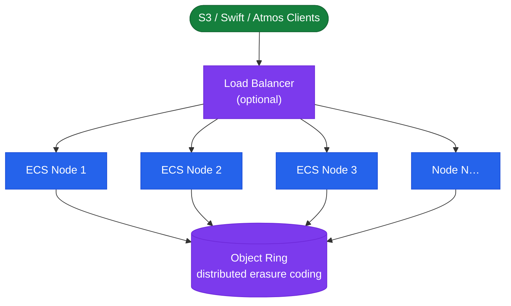
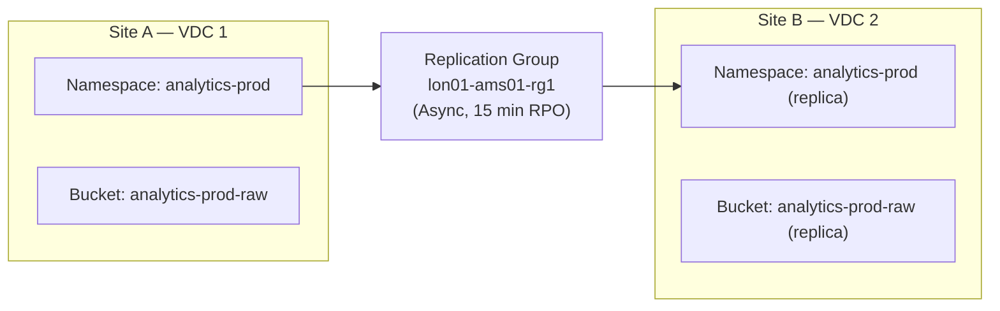
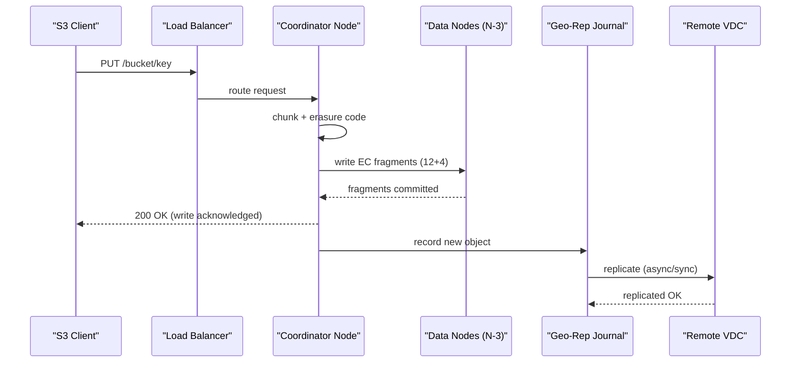

# Dell ECS — Overview

Dell ECS (Enterprise Content Storage) is a scale-out, software-defined object storage platform built on commodity x86 nodes. It exposes S3, Swift, Atmos, and CAS (Content Addressable Storage) APIs over standard HTTPS. The software stack runs entirely on commodity hardware and provides geo-distribution across sites via Virtual Data Centers (VDCs) linked into replication groups.

## Scale-Out Object Storage Topology



## How It Works

ECS writes incoming objects by chunking them into fixed-size chunks, applying erasure coding (typically 12+4 or 10+2 depending on node count and VDC span), and distributing coded fragments across nodes. For geo-replication, ECS asynchronously or synchronously replicates chunk journals to remote VDCs according to the replication group policy.

- **Single-site deployment**: All nodes in one VDC. Erasure coding protects against disk and node failure. No geographic redundancy.
- **Multi-site (geo) deployment**: Two or more VDCs in a replication group. Active-active writes are possible; object consistency uses a geo-replication journal. VDC-level failures do not cause data loss if replication lag is near zero.
- **Temporary Site Failure (TSF) mode**: When a VDC is unreachable, the remaining VDC enters TSF mode, continues serving data from local copies, and queues a replication backlog to replay on reconnection.

## Erasure Coding

ECS uses erasure coding (EC) rather than replication for within-VDC data protection. Erasure coding breaks each object into data fragments and generates parity fragments; the cluster can reconstruct the original object even when a defined number of fragments are lost.

| EC Scheme | Data Fragments | Parity Fragments | Minimum Nodes | Tolerated Failures |
|---|---|---|---|---|
| 12+4 (default) | 12 | 4 | 16 | Up to 4 simultaneous node/disk failures |
| 10+2 | 10 | 2 | 12 | Up to 2 simultaneous failures |
| 4+2 (small cluster) | 4 | 2 | 6 | Up to 2 simultaneous failures |

The EC scheme is selected automatically based on VDC node count. Clusters with fewer than 16 nodes use a narrower EC scheme. Adding nodes to an existing VDC does not immediately change the EC scheme; ECS rebalances data in the background after expansion.

**Capacity overhead**: A 12+4 scheme has 1.33× raw-to-usable overhead ratio. For every 133 TB of raw disk, approximately 100 TB is usable after EC parity. Additionally, ECS reserves a further ~30% overhead for metadata, journals, and temporary rebuild workspace. Plan usable capacity accordingly.

## Virtual Data Centers (VDC)

A VDC is the fundamental administrative and fault boundary in ECS. All nodes in a VDC reside at a single physical site and share a single cluster management plane.

| Concept | Description |
|---|---|
| VDC | A single-site logical cluster of ECS nodes. Each VDC is independently manageable and can serve S3 requests autonomously. |
| VDC Quorum | ECS requires a majority of VDC nodes to be online to maintain the management and data planes. A VDC with an even number of nodes requires `(n/2)+1` nodes for quorum. |
| Temporary Site Failure (TSF) | When a VDC in a multi-VDC replication group loses connectivity to peer VDCs, it enters TSF mode, continues accepting writes locally, and queues a replication backlog. On reconnection, the backlog is replayed and the VDC resynchronises. |
| VDC Federation | Multiple VDCs are federated into a single management domain by peering them through the ECS Portal. This enables cross-VDC replication group configuration and geo monitoring from a single pane of glass. |

## Replication Groups and Geo-Distribution

Replication groups are named policy objects that define which VDCs participate in geo-replication and how objects are distributed. Every namespace is assigned to a replication group, which determines where its objects are stored and replicated.



Replication groups support three replication modes:

| Mode | Consistency | RPO | Use Case |
|---|---|---|---|
| Synchronous | Strong — write acknowledged after confirmed on all VDCs | Near-zero | Compliance, financial records |
| Asynchronous | Eventual — write acknowledged locally; replicated in background | Minutes (configurable) | General workloads, backup targets |
| Metered | Asynchronous with WAN bandwidth throttling | Longer (depends on throttle) | WAN-constrained environments |

## Namespace and Bucket Hierarchy

ECS organises data in a two-level hierarchy below the VDC: namespaces and buckets.

```
VDC
└── Namespace (multi-tenancy boundary)
    ├── Assigned to one Replication Group
    ├── Quota (hard or advisory)
    ├── IAM Users (object users with S3 access keys)
    └── Bucket (object container)
        ├── Versioning enabled/disabled
        ├── Lifecycle policy (expiration, transitions)
        ├── Access policy (bucket policy, ACLs)
        └── Object Lock (WORM, compliance or governance mode)
```

- **Namespace**: The top-level multi-tenancy boundary. Separate namespaces isolate teams, applications, or compliance zones. Each namespace has its own IAM users, quotas, and replication group assignment.
- **Bucket**: An object container within a namespace. Buckets are the S3-visible unit. Versioning, lifecycle, and access policy are configured per bucket.
- **Object**: The individual data item stored in a bucket, identified by a key (path-like string). Objects can carry custom metadata tags used by the metadata search API.

## Connectivity and Integration Points

| Interface | Protocol / Port | Purpose |
|---|---|---|
| S3 API endpoint | HTTPS 443 or 9021 | Object read/write for applications and backup tools |
| Swift API endpoint | HTTPS 9024 | OpenStack-compatible object access |
| Management REST API | HTTPS 4443 | Administration, monitoring, and automation |
| ECS Portal | HTTPS 443 | Web-based administration console |
| Geo-replication | TCP 9100 | Inter-VDC replication traffic between nodes |
| LDAP/AD | TCP 389 / 636 | Optional namespace-level user authentication |
| Syslog | UDP/TCP 514 | External log forwarding for SIEM integration |
| HDFS | TCP 9003 | Hadoop ecosystem access via ECS HDFS connector |
| KMIP | TCP 5696 | External key management for encryption at rest |

## Data Path Summary

1. Client sends an S3 PUT request to the ECS load balancer (or directly to a node).
2. The receiving node acts as the request coordinator for this object.
3. The coordinator chunks the object, applies erasure coding, and distributes coded fragments across data nodes according to the EC scheme.
4. Once the local write is complete (all fragments placed), the coordinator acknowledges the write to the client.
5. The geo-replication journal records the new object. The replication service picks up journal entries and transmits them to peer VDCs according to the replication group mode (sync/async).
6. On the remote VDC, fragments are written and the replication journal is updated. The remote VDC can now serve the object to readers.



## Supported API Protocols

| Protocol | Use Case | Notes |
|---|---|---|
| S3 | General-purpose object access, backup, analytics | Primary API; widest client support |
| Swift | OpenStack integration | Supported but less commonly deployed in new installations |
| CAS (Centera) | Fixed-content, WORM compliance storage | Atmos/Centera API compatibility for migration from legacy EMC Centera |
| Atmos | Legacy EMC Atmos workloads | Maintained for backward compatibility; not recommended for new deployments |
| HDFS | Hadoop/Spark workloads | Requires ECS HDFS connector JAR on compute nodes |
| NFS (ECS 3.8+) | POSIX namespace access | Namespace-level NFS export; requires NFS gateway configuration |
