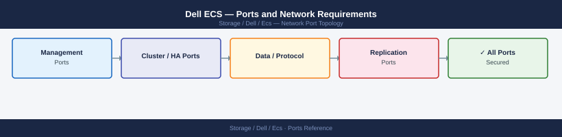

---
tags:
  - ecs
  - dell
  - object-storage
  - networking
  - firewall
  - ports
---
# Dell ECS — Ports and Network Requirements

<div class="kb-summary">
Firewall port reference for Dell ECS (Elastic Cloud Storage). Covers S3-compatible object API, management UI, and inter-node cluster communication.

*Applies to: Dell ECS 3.x*
</div>



## Inbound — Management

| Port | Protocol | Source | Purpose |
|---|---|---|---|
| 443 | TCP | Admin workstations | ECS management portal UI and REST API |
| 22 | TCP | Jump hosts | SSH — ECS node OS access |
| 9101 | TCP | Admin workstations | ECS management API (Metering, provisioning) |

## Object Access (S3 API)

| Port | Protocol | Source | Purpose |
|---|---|---|---|
| 9020 | TCP | S3 clients | S3 HTTP object API |
| 9021 | TCP | S3 clients | S3 HTTPS object API |

## Inter-Node Cluster Communication

ECS uses several internal ports between nodes. These should be on a dedicated private network with no external firewall.

| Port | Protocol | Between | Purpose |
|---|---|---|---|
| 9094 | TCP | ECS nodes | Inter-node object data communication |
| 4443 | TCP | ECS nodes | Inter-node management |
| 2181 | TCP | ECS nodes | ZooKeeper (internal coordination) |
| 9160 | TCP | ECS nodes | Cassandra metadata |

## Outbound

| Port | Protocol | Destination | Purpose |
|---|---|---|---|
| 162 | UDP | SNMP receiver | SNMP traps |
| 514 | UDP | Syslog | Event log forwarding |
| 123 | UDP | NTP | Time sync |
| 443 | TCP | cloudiq.dell.com | CloudIQ telemetry |

## Geo-Replication (Multi-Site)

| Port | Protocol | Between | Purpose |
|---|---|---|---|
| 9011 | TCP | ECS site A ↔ ECS site B | ECS geo-replication data |

## Firewall Zone Summary

| From | To | Ports | Notes |
|---|---|---|---|
| Admin clients | ECS mgmt IP | 443, 9101 | Management |
| S3 clients | ECS data IPs | 9020/9021 | Object API |
| ECS nodes | ECS nodes | 9094, 4443 | Cluster internal — dedicated VLAN |
| ECS site A | ECS site B | 9011 | Geo-replication |

## Verify

```bash
# From S3 client — test object API
curl -sk -o /dev/null -w "%{http_code}" https://<ecs-data-ip>:9021/

# From admin workstation — test management portal
curl -sk -o /dev/null -w "%{http_code}" https://<ecs-mgmt-ip>/login
```

## See also

- [Dell ECS — Architecture](how-it-works/)
- [Ceph — Ports](../../../ceph/architecture/ports.md)
