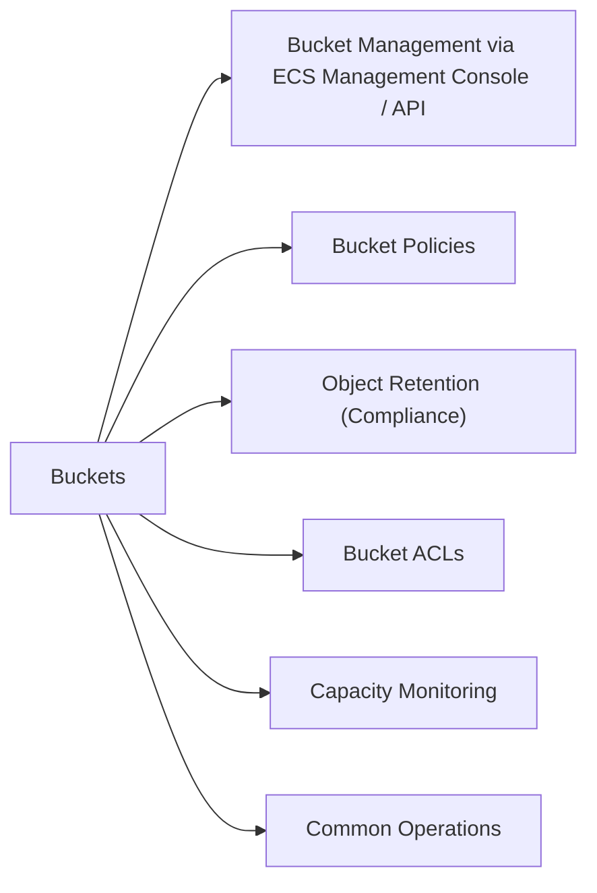

# Buckets

Dell ECS (Elastic Cloud Storage) uses S3-compatible buckets as the fundamental storage object. Buckets contain objects and have associated policies, retention settings, and replication configuration.



## Bucket Management via ECS Management Console / API

ECS is primarily managed via its web UI or REST API. The key CLI tool is `ecscli` for scripted operations.

```bash
# List all buckets (using AWS CLI against ECS S3 endpoint)
aws s3 ls s3:// --endpoint-url https://<ecs_s3_endpoint>

# Create a bucket
aws s3 mb s3://<bucket_name> --endpoint-url https://<ecs_s3_endpoint>

# Delete a bucket (must be empty)
aws s3 rb s3://<bucket_name> --endpoint-url https://<ecs_s3_endpoint>
```

## Bucket Policies

ECS supports S3-compatible bucket policies for access control:

```bash
# View a bucket policy
aws s3api get-bucket-policy \
    --bucket <bucket_name> \
    --endpoint-url https://<ecs_s3_endpoint>

# Apply a bucket policy
aws s3api put-bucket-policy \
    --bucket <bucket_name> \
    --policy file://bucket_policy.json \
    --endpoint-url https://<ecs_s3_endpoint>
```

## Object Retention (Compliance)

ECS supports WORM (Write Once, Read Many) object lock for compliance use cases:

```bash
# Check object lock configuration on a bucket
aws s3api get-object-lock-configuration \
    --bucket <bucket_name> \
    --endpoint-url https://<ecs_s3_endpoint>
```

## Bucket ACLs

```bash
# View bucket ACL
aws s3api get-bucket-acl \
    --bucket <bucket_name> \
    --endpoint-url https://<ecs_s3_endpoint>
```

## Capacity Monitoring

| Metric | Check Location |
|---|---|
| Per-bucket usage | ECS Management Console → Monitoring → Bucket Usage |
| Cluster utilisation | ECS Management Console → Dashboard |
| Replication lag | ECS Management Console → Replication Groups |

## Common Operations

| Task | Command |
|---|---|
| List bucket contents | `aws s3 ls s3://<bucket> --endpoint-url ...` |
| Copy object to bucket | `aws s3 cp <file> s3://<bucket>/ --endpoint-url ...` |
| Delete object | `aws s3 rm s3://<bucket>/<key> --endpoint-url ...` |
| Sync local to bucket | `aws s3 sync <local_dir> s3://<bucket>/ --endpoint-url ...` |
