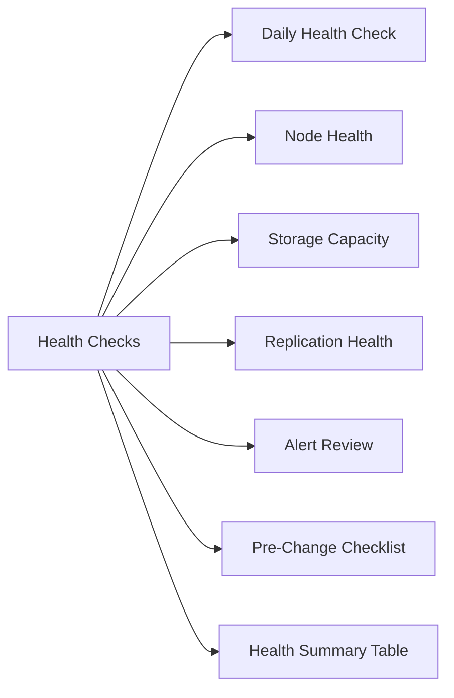

# ECS Health Checks



## Daily Health Check

```bash
# Check cluster status via ECS Management Console
# Dashboard → Cluster Health

# S3 endpoint connectivity test
curl -k https://<ecs_s3_endpoint>/
# Expected: 200 or 403 (not connection refused)

# Check via AWS CLI (using admin credentials)
aws s3 ls --endpoint-url https://<ecs_s3_endpoint>
```

## Node Health

ECS is typically a scale-out appliance cluster. Check node status from the ECS Management Console:

- **Dashboard** → **Nodes** → verify all nodes `ONLINE`
- Any node `DEGRADED` or `OFFLINE` requires immediate investigation

## Storage Capacity

- Navigate to **Monitoring** → **Disk Usage**
- ECS raises alerts at 70% and 80% capacity by default
- Raw capacity includes overhead for replication and metadata

## Replication Health

ECS replication groups ensure data is replicated across sites:

- **Monitor** → **Replication** → check replication group health
- Verify replication lag is within acceptable RPO
- Any `FAILED` replication context requires investigation

## Alert Review

- **Alerts** → **Current Alerts** in ECS Management Console
- ECS integrates with SNMP and email for alerting
- Review all `ERROR` and `CRITICAL` alerts before making changes

## Pre-Change Checklist

- [ ] All nodes online and healthy
- [ ] No active alerts at ERROR or CRITICAL level
- [ ] Replication health OK (no lag or failed replication)
- [ ] Capacity below 75%
- [ ] S3 endpoint responding

## Health Summary Table

| Check | Expected | Action if Not Met |
|---|---|---|
| Node state | All ONLINE | Investigate offline nodes |
| Capacity | < 75% | Plan expansion |
| Replication | No lag/failures | Check network and replication group |
| S3 endpoint | Reachable | Check load balancer and node services |
| Alerts | None critical | Resolve before changes |
