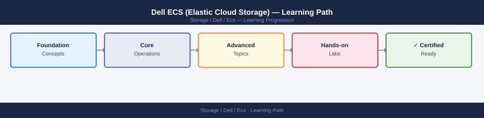

---
tags:
  - dell
  - learning-path
---
# Dell ECS (Elastic Cloud Storage) — Learning Path

<div class="kb-summary">
Recommended reading order for Dell ECS. Follow these stages in order to build a complete mental model before working with it in production.

*Applies to: ECS 3.x*
</div>



```d2
direction: right

stage_1_architecture: "Stage 1 — Architecture" {shape: rectangle}
stage_2_deployment: "Stage 2 — Deployment" {shape: rectangle}
stage_3_operations: "Stage 3 — Operations" {shape: rectangle}
stage_4_security: "Stage 4 — Security" {shape: rectangle}
stage_5_troubleshooting: "Stage 5 — Troubleshooting" {shape: rectangle}

stage_1_architecture -> stage_2_deployment: next
stage_2_deployment -> stage_3_operations: next
stage_3_operations -> stage_4_security: next
stage_4_security -> stage_5_troubleshooting: next
```

## Stage 1 — Architecture
**Goal**: Understand how ECS distributes objects across commodity nodes, how geo-federation replicates across sites, and how the namespace hierarchy maps to S3 buckets.

**Read in this order**:
- [How It Works](../architecture/how-it-works/) — ECS object storage architecture: commodity node clusters, chunk-based erasure coding, geo-federation topology (replication groups spanning sites), namespace and bucket hierarchy, CAS (content addressable storage) for fixed-content compliance, and S3/Swift/NFS protocol front-ends.
- [Design Standards](../architecture/design-standards/) — Replication group design (which sites hold copies), namespace and bucket policy planning, data service policies (retention, versioning, quota), erasure coding scheme selection, and ECS Portal administration model.
- [Integrations](../architecture/integrations/) — S3 API compatibility (including AWS S3 SDK), Swift API, HDFS connector for Hadoop workloads, Atmos API for legacy CAS clients, and integration with Dell PowerProtect for backup target use.

**Why first**: ECS's geo-federation and replication group model is its most differentiating capability. Understanding it prevents bucket placement decisions that result in single-site data.

---

## Stage 2 — Deployment
**Goal**: Build an ECS node cluster, configure replication groups, create namespaces and buckets, and validate object ingest.

**Read**:
- [Install & Upgrade](../operations/install-upgrade/) — ECS node provisioning (appliance or software-defined), ECS Portal initial configuration, storage pool and replication group creation, namespace and bucket setup, and ECS software version upgrade procedure.

**Why second**: Replication group assignment at bucket creation time is permanent without data migration. Cluster topology decisions at deploy time determine available geo-federation options.

---

## Stage 3 — Operations
**Goal**: Monitor geo-replication health, manage bucket policies, handle capacity growth, and operate the ECS Portal.

**Read in this order**:
- [Health Checks](../operations/health-checks/) — run the routine first on every shift; covers geo-replication queue depth, node health and disk status, bucket capacity utilisation, and chunk repository integrity check status.
- [CLI Reference](../operations/cli-reference/) — ECS management API (REST) and ECS Portal CLI commands for node, replication group, namespace, bucket, and user management.
- [Procedures](../operations/procedures/) — Bucket policy modification, replication group expansion with new site, user and access key management, data service policy updates, CAS retention lock management, and node decommission.
- [Backup & Restore](../operations/backup-restore/) — Geo-replication as DR mechanism, bucket cross-replication for compliance copies, and object versioning for accidental deletion recovery.
- [Scripts](../operations/scripts/) — Automation: geo-replication queue monitoring, bucket capacity reporting, S3 lifecycle policy application via AWS SDK, and object integrity verification scripts.

**Why third**: ECS geo-replication is the primary data protection mechanism. Operators must understand queue depth and replication lag before relying on ECS for DR.

---

## Stage 4 — Security
**Goal**: Enforce namespace isolation, control S3 bucket access with policies, and protect management access to ECS Portal.

**Read**:
- [Access Control](../security/access-control/) — ECS namespace isolation, bucket ACLs and bucket policy (S3-compatible), IAM-style user and group management within namespaces, and ECS Portal admin roles.
- [Authentication](../security/authentication/) — S3 access key and secret key management, LDAP integration for ECS Portal users, and certificate management for HTTPS object endpoints.
- [Encryption](../security/encryption/) — Server-side encryption (SSE) with ECS-managed keys or customer-managed keys (KMIP), in-transit encryption (TLS) for S3 and Swift endpoints, and D@RE on node drives.
- [Hardening](../security/hardening/) — Namespace-level access restriction, TLS enforcement, bucket policy deny-all default, audit log configuration, and ECS Portal management network restriction.

**Why fourth**: S3 bucket policies are complex and mistakes lead to public data exposure. Apply security controls after the operational model is fully understood.

---

## Stage 5 — Troubleshooting
**Goal**: Diagnose geo-replication failures, S3 API errors, node hardware faults, and chunk repository corruption.

**Read**:
- [Common Issues](../troubleshooting/common-issues/) — Geo-replication queue backed up (WAN link or remote site down), S3 403/404 errors (access key or bucket policy misconfiguration), node disk failure impact on erasure coding, and chunk scrub errors.
- [Diagnostics](../troubleshooting/diagnostics/) — ECS Portal diagnostic tools, node log collection, replication group status API queries, chunk repository integrity reports, and SupportAssist bundle generation.
- [Escalation](../troubleshooting/escalation/) — When to open a Dell support case, required ECS diagnostic bundles, and escalation path for chunk repository corruption or node hardware replacement.

**Why last**: Troubleshooting makes most sense once you know the normal operating state.

---

## See also

- [Ecs — Procedures](../operations/procedures/)
- [Ecs — Common Issues](../troubleshooting/common-issues/)
