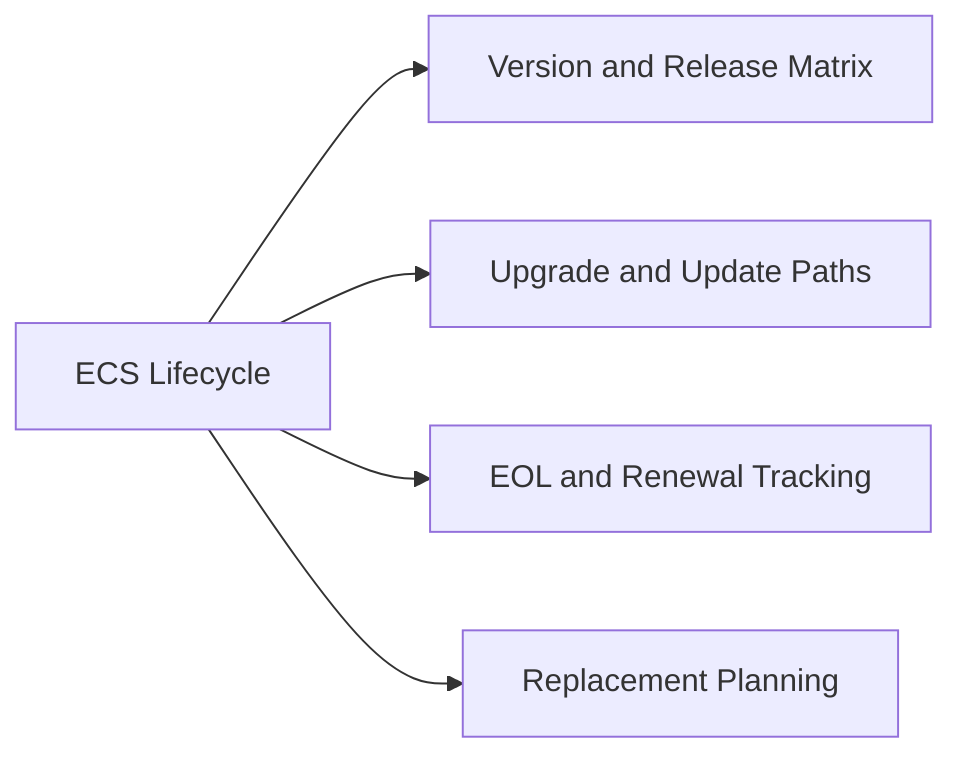

# ECS Lifecycle

## Version and Release Matrix

| ECS Version | Release Year | Key Features | Support Status |
|---|---|---|---|
| ECS 3.6.x | 2021 | Baseline geo-distribution, S3/Swift/CAS | End of Life |
| ECS 3.7.x | 2022 | Enhanced S3 Object Lock, metadata search v2 | End of Life |
| ECS 3.8.x | 2023 | NFS namespace access, improved replication monitoring | Active |
| ECS 3.9.x | 2024 | CloudIQ integration, expanded CAS compliance features | Active (Current) |

Check the Dell ECS Support Matrix on the Dell Support portal for the current supported version list and minimum supported version for new deployments.

## Upgrade and Update Paths

ECS upgrades are rolling — the cluster remains online throughout. The ECS Portal handles upgrade orchestration.

1. Confirm all nodes are in `GOOD` health and geo-replication lag is zero before initiating an upgrade
2. Download the ECS upgrade bundle from the Dell Support portal (requires active support contract)
3. Upload the bundle to the ECS Portal → Settings → Software Update staging area
4. Review the release notes for the target version; note any mandatory interim stops (some major version jumps require an intermediate version)
5. Initiate the upgrade from the portal; ECS upgrades nodes sequentially with automatic health validation between each node
6. Monitor upgrade progress in the portal; each node reboot takes approximately 15–30 minutes depending on hardware
7. After all nodes complete, confirm cluster version, node health, and geo-replication status

**Supported upgrade paths**: Single-version minor upgrades are always supported. Major version jumps may require an intermediate stop — verify in the release notes before proceeding.

## EOL and Renewal Tracking

| Tracked Item | Where to Find | Action Trigger |
|---|---|---|
| ECS software version EOS date | Dell Product Lifecycle page / Support portal | Begin upgrade planning 6 months before EOS |
| Hardware (node) End of Service Life | Dell Support → Asset Management | Begin refresh planning 12 months before EOSL |
| Support contract expiry | Dell MyService360 / Support portal | Renew at least 90 days before expiry |
| TLS certificate (Management API / S3 endpoint) | ECS Portal → Settings → Certificates | Renew 30 days before expiry |
| Object user secret key rotation | ECS Portal → Namespace → IAM Users | Rotate every 12 months per policy |

## Replacement Planning

- ECS nodes have a typical service life of 5–7 years; plan hardware refresh based on Dell EOSL dates, not just age
- Data migration from an old cluster to a new ECS deployment is performed via geo-replication: stand up the new cluster as a VDC, add it to the replication group, let data sync, then cut over applications and retire the old VDC
- When replacing individual nodes within a cluster, use the ECS Portal guided node replacement procedure; do not remove a node without following the procedure as ECS must rebalance erasure coding stripes
- For platform migration (ECS to a different object storage platform), use S3 replication tools (e.g., rclone, Veeam Data Mover) to copy objects; ECS does not have a native cross-platform migration tool
- Decommission steps: drain the VDC (move all replication groups to other VDCs), remove VDC from replication groups, then shut down nodes; do not shut down nodes while still in an active replication group
