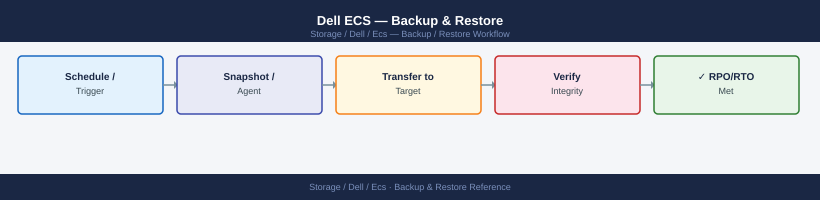
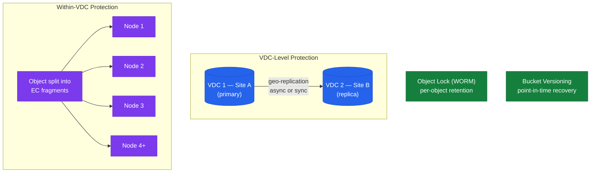

---
tags:
  - dell
  - operations
---
# Dell ECS — Backup & Restore

<div class="kb-summary">
Backup & Restore reference covering Overview, Data Durability Model, Configuration Backup, Restoring Object Data, Veeam Backup Integration and 1 more sections.

*Applies to: ECS 3.x*
</div>


## Before you begin

- **Access:** Storage admin credentials (cluster admin or equivalent)
- **Timing:** safe to run during business hours unless a step is marked ⚠ (causes interruption)
- **Dependencies:** no active upgrades or migrations on the same infrastructure
- **Logging:** capture command output — paste into the change record on completion

---

## Overview

Dell ECS is an object storage platform. Data protection is primarily delivered through:

- **Geo-replication**: Objects are replicated across VDCs via replication groups. This is the primary mechanism for data durability and site-level recovery.
- **Erasure coding**: Within a VDC, objects are protected against disk and node failure through erasure coding (typically 12+4).
- **S3 Object Lock (WORM)**: Immutable retention for compliance and backup data; prevents deletion or overwrite within the retention period.

ECS does not have a traditional backup agent. Configuration backup covers the management layer; data is protected by replication and erasure coding.

## Data Durability Model



| Protection Layer | Scope | Failure Domain Covered |
|---|---|---|
| Erasure coding (12+4) | Within a single VDC | Protects against up to 4 simultaneous disk/node failures within a VDC |
| Geo-replication (async) | Cross-VDC | Protects against VDC-level site failure with RPO governed by replication lag |
| Geo-replication (sync) | Cross-VDC | Zero-RPO VDC-level protection; requires sufficient WAN bandwidth |
| Object Lock (WORM) | Per-object, per-bucket | Prevents accidental or malicious deletion/overwrite within the retention window |
| Bucket versioning | Per-bucket | Allows point-in-time recovery of individual objects to previous versions |

## Configuration Backup

Back up the following ECS configuration artefacts regularly. Configuration is not backed up by erasure coding or geo-replication — it must be captured separately.

| Artefact | Location | Backup Method | Frequency |
|---|---|---|---|
| Replication group topology | ECS Portal → Settings | `GET /vdc/data-service/vpools` — save JSON output | Weekly |
| Namespace configuration | `ecscli namespace get --name <ns>` | Script-based export via REST API | Weekly |
| Bucket configuration | `ecscli bucket get --namespace <ns> --name <bucket>` | Script-based export via REST API | Weekly |
| IAM users (object user names) | `ecscli user list-object-users --namespace <ns>` | Script-based export — keys cannot be retrieved after creation | Weekly |
| TLS certificates | ECS Portal → Settings → Certificates | Export certificate files; store private key in secrets management | Before rotation |
| Syslog and SNMP configuration | ECS Portal → Settings | Document in runbook | On change |
| Bucket policies | `aws s3api get-bucket-policy --bucket <bucket>` | Script-based export per bucket | Weekly |
| Lifecycle policies | `aws s3api get-bucket-lifecycle-configuration --bucket <bucket>` | Script-based export per bucket | Weekly |

### Scripted Configuration Export

```bash
#!/bin/bash
# Export key ECS configuration artefacts to a local directory
# Usage: ECS_HOST=ecs01.example.com ECS_USER=sysadmin ECS_PASS=secret ./ecs_config_export.sh

ECS_HOST="${ECS_HOST:-}"
ECS_USER="${ECS_USER:-sysadmin}"
ECS_PASS="${ECS_PASS:-}"
OUTDIR="./ecs-config-$(date +%Y%m%d)"
ECS="https://$ECS_HOST:4443"

mkdir -p "$OUTDIR"

TOKEN=$(curl -sk -u "$ECS_USER:$ECS_PASS" -D - "$ECS/login" \
  | grep "X-SDS-AUTH-TOKEN" | awk '{print $2}' | tr -d '\r')

[[ -z "$TOKEN" ]] && echo "ERROR: Authentication failed." && exit 1

api() { curl -sk -H "X-SDS-AUTH-TOKEN: $TOKEN" -H "Accept: application/json" "$ECS$1"; }

# Export VDC info, nodes, alerts, capacity
api "/vdc/capacity"          > "$OUTDIR/vdc_capacity.json"
api "/vdc/nodes"             > "$OUTDIR/vdc_nodes.json"
api "/vdc/data-service/vpools" > "$OUTDIR/replication_groups.json"
api "/object/namespaces"     > "$OUTDIR/namespaces.json"

# Export per-namespace bucket list
NAMESPACES=$(api "/object/namespaces" | python3 -c \
  "import sys,json; [print(n['name']) for n in json.load(sys.stdin).get('namespace',[])]")

for NS in $NAMESPACES; do
  api "/object/bucket?namespace=$NS" > "$OUTDIR/buckets_${NS}.json"
done

curl -sk -H "X-SDS-AUTH-TOKEN: $TOKEN" "$ECS/logout" > /dev/null

echo "Configuration exported to $OUTDIR"
```


```text title="Expected output"
Configuration exported to ./ecs-config-20240115
$ ls -lh ./ecs-config-20240115/
total 284K
-rw-r--r-- 1 admin admin  45K Jan 15 10:23 vdc_capacity.json
-rw-r--r-- 1 admin admin  12K Jan 15 10:23 vdc_nodes.json
-rw-r--r-- 1 admin admin  28K Jan 15 10:23 replication_groups.json
-rw-r--r-- 1 admin admin  8.2K Jan 15 10:23 namespaces.json
-rw-r--r-- 1 admin admin  156K Jan 15 10:23 buckets_prod-ns.json
-rw-r--r-- 1 admin admin  35K Jan 15 10:23 buckets_archive-ns.json
```

!!! warning "Common errors"
    **`ERROR: Authentication failed.`** — Verify ECS_HOST, ECS_USER, and ECS_PASS environment variables are set correctly and the ECS management interface is reachable on port 4443.
    **`curl: (60) SSL certificate problem: self signed certificate`** — Add the `-k` flag (already present) or import the ECS certificate into your system CA bundle; if persisting, check that curl was compiled with SSL support.
    **`jq: command not found`** — Install python3-json or use the existing Python JSON parser in the script; the script already uses Python for namespace parsing instead of jq.
## Restoring Object Data

Object data restore depends on the failure scenario.

### Node Failure (Within a VDC)

ECS automatically rebuilds erasure coding stripes to surviving nodes when a node or disk fails.

```d2
direction: right

FAIL: "Node or disk marked FAILED" {shape: rectangle}
AUTO: "ECS auto-rebuild begins\nEC fragments reconstructed\nfrom surviving nodes" {shape: rectangle}
MON: "Monitor: ECS Portal →\nHardware → Disks\nStatus: REBUILDING → GOOD" {shape: rectangle}
DONE: "DONE" {shape: rectangle}
WAIT: "Wait — rebuild time:\n8–24 h for dense node\nDo NOT run upgrades or\nnode additions during rebuild" {shape: rectangle}
CHK: "Confirm node/disk shows GOOD\nCheck cluster capacity headroom" {shape: rectangle}
CLEAR: "Cluster redundancy restored" {shape: rectangle}

FAIL -> AUTO
AUTO -> MON
DONE -> WAIT
WAIT -> MON
DONE -> CHK
CHK -> CLEAR
```

- No manual restore required
- Monitor rebuild progress: ECS Portal → Hardware → Disks — `REBUILDING` state progresses to `GOOD` when complete
- Rebuild duration depends on the amount of data on the failed disk and available cluster bandwidth; typically 8–24 hours for a dense node
- Do not attempt any planned maintenance (upgrades, node additions) while a rebuild is in progress

```bash
# Monitor overall node and disk state during a rebuild
curl -s -k -H "X-SDS-AUTH-TOKEN: $TOKEN" \
  "https://<ecs-node>:4443/vdc/nodes" | python3 -m json.tool

# Watch capacity to ensure the cluster has sufficient headroom for the rebuild
curl -s -k -H "X-SDS-AUTH-TOKEN: $TOKEN" \
  "https://<ecs-node>:4443/vdc/capacity" | python3 -m json.tool
```


```text title="Expected output"
{
  "node": [
    {
      "id": "urn:storageos:Node:node-01",
      "name": "node-01",
      "ip": "192.168.1.45",
      "version": "3.6.1.0.20240115",
      "status": "UP",
      "disk_count": 12,
      "disk_raw_gb": 144000,
      "disk_used_gb": 98560,
      "disk_available_gb": 45440
    },
    {
      "id": "urn:storageos:Node:node-02",
      "name": "node-02",
      "ip": "192.168.1.46",
      "version": "3.6.1.0.20240115",
      "status": "UP",
      "disk_count": 12,
      "disk_raw_gb": 144000,
      "disk_used_gb": 102340,
      "disk_available_gb": 41660
    },
    {
      "id": "urn:storageos:Node:node-03",
      "name": "node-03",
      "ip": "192.168.1.47",
      "version": "3.6.1.0.20240115",
      "status": "DEGRADED",
      "disk_count": 11,
      "disk_raw_gb": 132000,
      "disk_used_gb": 105280,
      "disk_available_gb": 26720
    }
  ]
}
{
  "capacity": {
    "total_capacity_gb": 420000,
    "used_capacity_gb": 306180,
    "available_capacity_gb": 113820,
    "provisioned_capacity_gb": 385000,
    "free_capacity_percent": 27.1,
    "replication_factor": 3,
    "minimum_required_gb": 95000
  }
}
```

!!! warning "Common errors"
    **`curl: (60) SSL certificate problem: self signed certificate`** — Add `-k` flag to curl command to skip SSL verification, or import the ECS node's certificate into your CA bundle.
    **`error: 401 Unauthorized`** — Verify the `$TOKEN` variable is set correctly with a valid authentication token from `POST /login`.
    **`jq: command not found`** — Install `python3-json.tool` or use `jq` instead; if using jq, replace `python3 -m json.tool` with `jq '.'`.
### VDC Failure (Geo-Replication Configured)

When a VDC becomes unavailable:

1. Update client S3 endpoints to point to the surviving VDC IP/FQDN
2. Confirm data is accessible:
   ```bash
   aws s3 ls s3://<bucket>/ \
     --endpoint-url https://<secondary-vdc>:9021 \
     --no-verify-ssl \
     --profile ecs
   ```
3. Check replication lag at the time of failure to understand RPO exposure — the geo-monitoring lag value at the moment of failure represents the maximum data loss window
4. Communicate RPO status to application owners; for asynchronous replication, objects written in the lag window may not be present on the surviving VDC
5. When the failed VDC recovers, re-add it to the replication group and allow data to resync before sending writes back to it
6. Monitor resync progress in ECS Portal → Geo Monitoring; wait for lag to return to zero before considering recovery complete

### Accidental Object Deletion

**With bucket versioning enabled:**

```bash
# List all versions and delete markers for an object
aws s3api list-object-versions \
  --bucket <bucket> \
  --prefix <object-key> \
  --endpoint-url https://<ecs-endpoint>:9021 \
  --no-verify-ssl \
  --profile ecs

# Remove the delete marker to restore the object to the latest version
aws s3api delete-object \
  --bucket <bucket> \
  --key <object-key> \
  --version-id <delete-marker-version-id> \
  --endpoint-url https://<ecs-endpoint>:9021 \
  --no-verify-ssl \
  --profile ecs

# Alternatively, restore a specific previous version by copying it as the current object
aws s3api copy-object \
  --bucket <bucket> \
  --copy-source "<bucket>/<object-key>?versionId=<version-id>" \
  --key <object-key> \
  --endpoint-url https://<ecs-endpoint>:9021 \
  --no-verify-ssl \
  --profile ecs
```


```text title="Expected output"
{
    "Versions": [
        {
            "ETag": "\"a1b2c3d4e5f6g7h8i9j0k1l2m3n4o5p6\"",
            "Size": 2048576,
            "StorageClass": "STANDARD",
            "Key": "documents/report-2024.pdf",
            "VersionId": "g8X9Y0Z1A2B3C4D5E6F7G8H9I0J1K2L3",
            "IsLatest": false,
            "LastModified": "2024-01-15T10:23:45+00:00"
        },
        {
            "ETag": "\"b2c3d4e5f6g7h8i9j0k1l2m3n4o5p6q7\"",
            "Size": 2048576,
            "StorageClass": "STANDARD",
            "Key": "documents/report-2024.pdf",
            "VersionId": "h9Y0Z1A2B3C4D5E6F7G8H9I0J1K2L3M4",
            "IsLatest": true,
            "LastModified": "2024-01-20T14:56:32+00:00"
        },
        {
            "ETag": "\"c3d4e5f6g7h8i9j0k1l2m3n4o5p6q7r8\"",
            "Key": "documents/report-2024.pdf",
            "VersionId": "delete-marker-i0Z1A2B3C4D5E6F7G8H9I0J1K2L3M4N5",
            "IsLatest": true,
            "LastModified": "2024-01-22T09:12:18+00:00",
            "DeleteMarker": true
        }
    ],
    "RequestId": "tx8a9b0c1d2e3f4g5h6i7j8k9l0m1n2o3"
}

(no output — command completes silently)

{
    "CopyObjectResult": {
        "ETag": "\"b2c3d4e5f6g7h8i9j0k1l2m3n4o5p6q7\"",
        "LastModified": "2024-01-22T10:05:42+00:00"
    },
    "VersionId": "h9Y0Z1A2B3C4D5E6F7G8H9I0J1K2L3M4"
}
```

!!! warning "Common errors"
    **`An error occurred (InvalidAccessKeyId) when calling the ListObjectVersions operation: The Access Key Id you provided does not exist in our records.`** — Verify the AWS profile `ecs` is configured correctly with valid credentials in `~/.aws/credentials`.
    **`An error occurred (InvalidBucketName) when calling the ListObjectVersions operation: The specified bucket is not valid.`** — Confirm the bucket name is correct and that the ECS endpoint URL and profile have access to it.
**Without versioning enabled:**
- The object is unrecoverable unless it exists on a remote VDC with replication lag less than the time of deletion
- Immediately check the remote VDC:
  ```bash
  aws s3api head-object \
    --bucket <bucket> \
    --key <object-key> \
    --endpoint-url https://<remote-vdc>:9021 \
    --no-verify-ssl \
    --profile ecs
  ```
- If found on the remote VDC, copy it back:
  ```bash
  aws s3 cp \
    s3://<bucket>/<object-key> \
    s3://<bucket>/<object-key> \
    --source-region us-east-1 \
    --copy-props none \
    --endpoint-url https://<remote-vdc>:9021 \
    --no-verify-ssl \
    --profile ecs
  ```

### Object Lock (WORM) Protected Objects

Objects within their Object Lock retention period cannot be deleted or overwritten. This is expected behaviour for compliance deployments.

- To verify the retention status of an object:
  ```bash
  aws s3api get-object-retention \
    --bucket <bucket> \
    --key <object-key> \
    --endpoint-url https://<ecs-endpoint>:9021 \
    --no-verify-ssl \
    --profile ecs
  ```
- Compliance mode locks cannot be shortened or removed even by `sysadmin`; they expire automatically when the `RetainUntilDate` passes
- Governance mode locks can be overridden by a user with the `s3:BypassGovernanceRetention` permission — do not use Governance mode for regulated compliance workloads

## Veeam Backup Integration

ECS serves as an S3-compatible target for Veeam Backup & Replication (Capacity Tier or Scale-out Backup Repository). ECS retains Veeam backup data; Veeam manages its own restore procedures.

**ECS configuration for Veeam:**

1. Create a dedicated namespace: `veeam-prod`
2. Create a dedicated bucket: `veeam-prod-offload` with Object Lock enabled (if immutable backups are required)
3. Create a dedicated object user: `svc-veeam-prod` with read/write access to the bucket
4. Set a hard quota on the namespace equal to the planned Veeam storage allocation + 20% buffer
5. In Veeam: Backup Infrastructure → Add Backup Repository → Object Storage → S3 Compatible
   - Endpoint: `https://<ecs-load-balancer>:9021`
   - Credentials: access key and secret key for `svc-veeam-prod`
   - Bucket: `veeam-prod-offload`
   - Enable immutability if Object Lock was enabled on the bucket

**Validating Veeam backup data on ECS:**

```bash
# Confirm backup data is present on ECS
aws s3 ls s3://veeam-prod-offload/ \
  --recursive --human-readable \
  --endpoint-url https://<ecs-endpoint>:9021 \
  --no-verify-ssl \
  --profile ecs

# Check bucket size and object count
aws s3api list-objects-v2 \
  --bucket veeam-prod-offload \
  --query 'length(Contents)' \
  --endpoint-url https://<ecs-endpoint>:9021 \
  --no-verify-ssl \
  --profile ecs
```


```text title="Expected output"
2024-01-15 08:32:14    4.2 GiB veeam-prod-offload/vm-backup-prod-01/2024-01-15T06:30:00Z/full.vbk
2024-01-15 08:45:22    2.1 GiB veeam-prod-offload/vm-backup-prod-02/2024-01-15T06:45:00Z/full.vbk
2024-01-15 09:12:08    1.8 GiB veeam-prod-offload/vm-backup-prod-03/2024-01-15T07:00:00Z/incr.vbk
2024-01-15 09:28:41    892 MiB veeam-prod-offload/vm-backup-prod-01/2024-01-15T06:30:00Z/incr.vbk
2024-01-15 10:01:33    567 MiB veeam-prod-offload/vm-backup-prod-02/2024-01-15T06:45:00Z/incr.vbk
...

Total Objects: 247
```

!!! warning "Common errors"
    **`An error occurred (InvalidEndpointAddress) when calling the ListBuckets operation: Could not connect to the endpoint URL: https://<ecs-endpoint>:9021`** — Replace `<ecs-endpoint>` with the actual ECS node hostname or IP address (e.g., `ecs-node-01.internal`).
    **`An error occurred (AccessDenied) when calling the ListObjectsV2 operation: Access Denied`** — Verify the AWS profile `ecs` has valid credentials configured in `~/.aws/credentials` and the ECS access key has ListBucket permissions.
    **`SSL: CERTIFICATE_VERIFY_FAILED`** — Confirm `--no-verify-ssl` flag is present in both commands; if SSL errors persist, verify the ECS certificate is valid or use HTTP instead of HTTPS.
## Validation After Restore or Failover

After any restore or VDC failover, validate the following before declaring recovery complete:

- [ ] S3 endpoint functional test: `HeadBucket` or `ListBuckets` succeeds from the primary consuming application
- [ ] `ecscli namespace list` — all expected namespaces present on the surviving VDC
- [ ] Spot-check a sample of critical objects with `HeadObject` to confirm accessibility and correct size
- [ ] For versioned buckets: verify expected versions are present with `list-object-versions`
- [ ] Confirm geo-replication is running and lag is at zero between all VDCs (after VDC recovery)
- [ ] Application teams confirm S3 workloads are running normally with no authentication or connectivity errors
- [ ] No new `FAILED` or `DEGRADED` nodes in `GET /vdc/nodes`
- [ ] Capacity utilisation is within expected range; no unexpected jump from rebalancing

---

## Verify

- `GET /vdc/nodes` returns all nodes with no `FAILED` or `DEGRADED` status
- S3 `HEAD Bucket` and `GET Object` operations succeed from the application side
- Geo-replication lag between VDCs is 0 bytes after the restore completes
- Capacity utilisation is within expected range — no unexpected spike from rebalancing

---

## See also

- [Ecs — Procedures](../procedures/)
- [Ecs — Health Checks](../health-checks/)
- [Ecs — Common Issues](../../troubleshooting/common-issues/)
