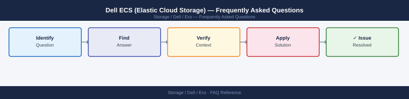

---
tags:
  - dell-ecs
  - faq
  - operations
---
# Dell ECS (Elastic Cloud Storage) — Frequently Asked Questions

*Applies to: Dell EMC Storage*

Common questions about Dell ECS (Elastic Cloud Storage) operations, configuration, and troubleshooting. For step-by-step procedures, see the <a href="index.md">Operations</a> section.

## General

**Q: What ECS version is recommended for new deployments?**
A: ECS 3.8.x is the current recommendation. Check with `ecs version` CLI or via ECS Management Portal → System → Software Version.

**Q: How do I check the current Dell ECS (Elastic Cloud Storage) version?**
A: `ecs version`

## Configuration

**Q: What is the default replication factor for ECS object storage?**
A: ECS uses erasure coding rather than replication. Default is EC 12+4 for large objects, 2+1 replication for small objects (< 1 MB). Increase parity shards for higher durability requirements; this increases raw storage overhead.

**Q: How do I enable S3 versioning on an ECS bucket?**
A: Use the S3 API or ECS Management Portal: Bucket → Properties → Versioning → Enable. Versioning allows recovery of overwritten or deleted objects. Note: versioned objects consume additional capacity.

## Operations

**Q: How do I upgrade ECS without disrupting object storage access?**
A: ECS supports rolling upgrades — nodes upgrade one at a time. Use the ECS Management Portal → Upgrade to initiate. Data access continues throughout. Schedule during low-activity periods for reduced client impact.

**Q: What is the correct procedure to add a new ECS node to an existing site?**
A: Add the node hardware, configure networking and hostname. In ECS Management Portal → Nodes → Add Node. ECS rebalances data across the expanded node count automatically. Rebalancing can take hours for large clusters.

## Troubleshooting

**Q: ECS shows 'Storage Pool capacity > 80%'. What does it mean?**
A: The storage pool is nearing full. ECS performance degrades above 85% utilisation. Plan capacity expansion immediately. Review bucket quotas and lifecycle policies to reduce unnecessary data retention.

**Q: ECS object PUT/GET performance is degraded — where do I start?**
A: Check ECS Management Portal → Performance for per-node metrics. Review network bandwidth. Check for rebalancing activity (reduces available IOPS during rebalance). Verify client-side connection pooling is configured.

## Backup and Recovery

**Q: How do I protect ECS metadata?**
A: ECS metadata is replicated across nodes within the cluster. For disaster recovery, configure geo-replication to a second ECS site. Back up ECS system configuration weekly via Management Portal → System → Export Configuration.

**Q: Can I restore a specific object version in ECS?**
A: Yes — with versioning enabled, use the S3 API: `aws s3api get-object --bucket <name> --key <key> --version-id <vid> output.file`. In ECS Management Portal, browse bucket versions and restore via UI.

## See Also

- [Dell ECS (Elastic Cloud Storage) Operations](index.md)
- [Dell ECS (Elastic Cloud Storage) Troubleshooting](../../../troubleshooting/index.md)
