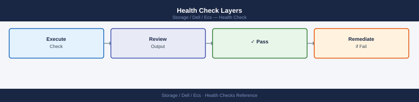
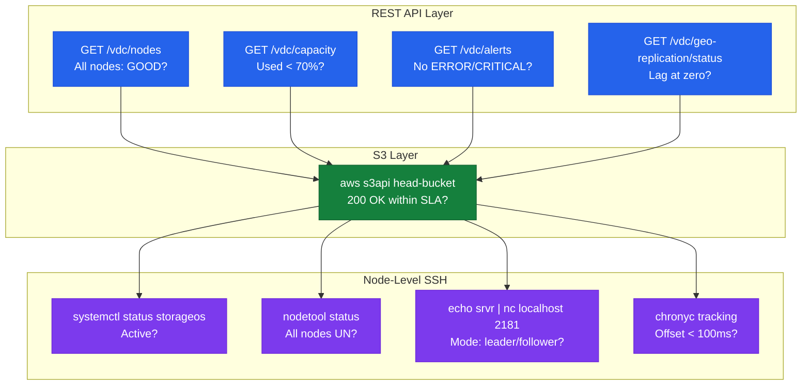
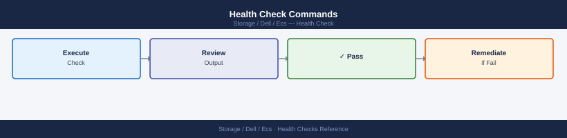

---
tags:
  - dell
  - operations
---
# Dell ECS — Health Checks

<div class="kb-summary">
Health Checks reference covering Health Check Layers, Daily Checks, Pre-Change Health Check, Health Check Commands, Node-Level Diagnostic Checks and 3 more sections.

*Applies to: ECS 3.x*
</div>

## Before you begin

- **Access:** Storage admin credentials (cluster admin or equivalent)
- **Timing:** safe to run during business hours unless a step is marked ⚠ (causes interruption)
- **Dependencies:** no active upgrades or migrations on the same infrastructure
- **Logging:** capture command output — paste into the change record on completion

---

## Run This Routine

1. **Node health:** ECS UI → Dashboard → Nodes — all nodes Green/Online
2. **Disk status:** Dashboard → Disks — check for failed or degraded disks
3. **Replication group lag:** ECS UI → Geo Replication → check RPO lag per RG
4. **Bucket capacity:** `ecscli bucket list` — check used vs quota per bucket
5. **Data protection status:** check Erasure Coding health in Dashboard
6. **Active alerts:** Dashboard → Alerts — resolve any critical alerts
7. **API endpoint health:** `curl -sk https://<ecs-node>:9101/diagnostic/` — expect HTTP 200

## Health Check Layers





## Daily Checks


| Check | Command / Location | Notes |
|---|---|---|
| Log in to ECS Portal → Dashboard and review the Alerts panel | ECS Portal → Dashboard → Alerts | Triage by severity; any `ERROR` or `CRITICAL` alert requires same-day action |
| Review cluster capacity utilisation | ECS Portal → Dashboard → Capacity | Alert if used capacity exceeds 70%; plan expansion before 80% |
| Verify all nodes are in `GOOD` state | `GET /vdc/nodes` | A `DEGRADED` or offline node requires immediate investigation |
| Retrieve current capacity metrics | `GET /vdc/capacity` | Compare to previous day's baseline; unexpected growth indicates a lifecycle or versioning issue |
| Check geo-replication lag | ECS Portal → Geo Monitoring | Any growing lag between VDCs requires investigation; zero lag is the steady-state target |
| Confirm S3 endpoint is responding | `HEAD /<bucket>` or `aws s3 ls` | A non-200 response or timeout indicates a data service or network issue |
| Review disk health on all nodes | ECS Portal → Hardware → Disks | Any `FAILED` or `SUSPECT` disk requires disk replacement initiation |
| Check active alerts programmatically | `GET /vdc/alerts` | Automate this check from a monitoring script for 24/7 alerting |

## Pre-Change Health Check


Run these checks before any planned change — node additions, software upgrades, replication group changes, or VDC configuration updates.

- [ ] ECS Portal → Hardware → Nodes: all nodes show `GOOD`; no nodes are `DEGRADED` or offline
- [ ] `GET /vdc/nodes` — programmatic confirmation that all nodes report healthy status
- [ ] `GET /vdc/capacity` — cluster is below 70% used; sufficient free capacity to absorb a node rebuild
- [ ] `GET /vdc/alerts` — no active alerts of `ERROR` or `CRITICAL` severity
- [ ] ECS Portal → Geo Monitoring — all VDC replication groups are in sync with zero or near-zero lag
- [ ] ECS Portal → Hardware → Disks: no disks in `FAILED` or `SUSPECT` state; no `REBUILDING` disks in progress
- [ ] S3 endpoint functional test: a `ListBuckets` or `HeadBucket` request completes within expected latency
- [ ] `ecscli namespace list` — all expected namespaces are present and accessible
- [ ] Cassandra ring health: `nodetool status` from any node shows all nodes as `UN` (Up/Normal)
- [ ] ZooKeeper health: `echo stat | nc localhost 2181` from a node shows a valid `Mode: leader` or `Mode: follower`

## Health Check Commands



```bash
# --- Authenticate to the ECS Management REST API ---
# Returns X-SDS-AUTH-TOKEN in response headers
TOKEN=$(curl -s -k -u "sysadmin:<password>" \
  "https://<ecs-node>:4443/login" -D - \
  | grep "X-SDS-AUTH-TOKEN" | awk '{print $2}' | tr -d '\r')

ECS="https://<ecs-node>:4443"

# --- Node health ---
# All nodes should show nodestatus: GOOD
curl -s -k -H "X-SDS-AUTH-TOKEN: $TOKEN" \
  "$ECS/vdc/nodes" | python3 -m json.tool

# --- Capacity ---
# Fields: totalProvisioned_gb, usedCapacity_gb, availableCapacity_gb
curl -s -k -H "X-SDS-AUTH-TOKEN: $TOKEN" \
  "$ECS/vdc/capacity" | python3 -m json.tool

# --- Active alerts ---
# No alerts should be present before a planned change
curl -s -k -H "X-SDS-AUTH-TOKEN: $TOKEN" \
  "$ECS/vdc/alerts" | python3 -m json.tool

# --- Geo-replication status ---
curl -s -k -H "X-SDS-AUTH-TOKEN: $TOKEN" \
  "$ECS/vdc/geo-replication/status" | python3 -m json.tool

# --- Replication group (vpool) status ---
curl -s -k -H "X-SDS-AUTH-TOKEN: $TOKEN" \
  "$ECS/vdc/data-service/vpools" | python3 -m json.tool

# --- S3 endpoint functional test ---
# List buckets accessible to a specific object user
aws s3 ls \
  --endpoint-url https://<s3-endpoint>:9021 \
  --no-verify-ssl \
  --profile ecs

# HeadBucket test against a known bucket
aws s3api head-bucket \
  --bucket <known-bucket> \
  --endpoint-url https://<s3-endpoint>:9021 \
  --no-verify-ssl \
  --profile ecs

# --- Namespace and bucket inventory ---
ecscli namespace list
ecscli bucket list --namespace <namespace>
ecscli bucket get --namespace <namespace> --name <bucket>
```

## Node-Level Diagnostic Checks


SSH to individual nodes for lower-level health validation.

```bash
# SSH to an ECS node
ssh admin@<ecs-node>

# Check data disk usage (ECS data partition)
df -h /data/

# Check all node disk mounts
lsblk -o NAME,SIZE,FSTYPE,MOUNTPOINT,STATE

# Check ECS data service status
systemctl status storageos

# Check ECS fabric agent status
systemctl status caspian

# Check service status across all nodes simultaneously
viprexec -v -cmd "systemctl is-active storageos"

# --- Cassandra (metadata store) health ---
# UN = Up/Normal (healthy); UL = Up/Leaving; DN = Down/Normal (problem)
/opt/storageos/tools/nodetool status

# Cassandra compaction — excessive compaction can cause elevated metadata latency
/opt/storageos/tools/nodetool compactionstats

# Cassandra heap usage — heap pressure causes GC pauses and metadata slowness
/opt/storageos/tools/nodetool info | grep -i heap

# --- ZooKeeper (cluster coordination) health ---
# Should return Mode: leader or Mode: follower for all ZK nodes
echo "srvr" | nc localhost 2181 | grep Mode

# Check ZooKeeper connection count (high connections may indicate a stuck process)
echo "stat" | nc localhost 2181 | grep -E "connections|outstanding"

# --- NTP sync status (geo-replication is sensitive to clock drift) ---
chronyc tracking
# Reference ID should be a valid time source; offset should be < 100ms
timedatectl status
```

## Capacity Planning Checks


Run these checks weekly or integrate into capacity reporting.

```bash
# Get cluster capacity and compute percent used
curl -s -k -H "X-SDS-AUTH-TOKEN: $TOKEN" \
  "$ECS/vdc/capacity" | python3 -c "
import sys, json
d = json.load(sys.stdin)
total = float(d.get('totalProvisioned_gb', 0))
used  = float(d.get('usedCapacity_gb', 0))
pct   = (used/total*100) if total > 0 else 0
print(f'Total: {total:.0f} GB | Used: {used:.0f} GB | Utilisation: {pct:.1f}%')
"

# List all namespaces and review per-namespace allocation
ecscli namespace list

# Per-bucket usage (requires iterating via API)
# Get all buckets in a namespace and their reported sizes
curl -s -k -H "X-SDS-AUTH-TOKEN: $TOKEN" \
  "$ECS/object/bucket?namespace=<namespace>" | python3 -m json.tool
```

## Pre-Change Checklist

Complete all items before any planned maintenance. Do not proceed if any item is unresolved.

| Item | Expected State | Status |
|---|---|---|
| All nodes GOOD | `nodestatus: GOOD` for every node in `GET /vdc/nodes` | |
| No active disk rebuilds | No disks in `REBUILDING` state in Portal → Hardware → Disks | |
| Geo-replication lag at zero | Lag = 0 bytes / 0 seconds for all replication groups | |
| No ERROR or CRITICAL alerts | `GET /vdc/alerts` returns empty or only informational alerts | |
| Cluster capacity < 70% | Utilisation from `GET /vdc/capacity` is below 70% | |
| Cassandra ring healthy | All nodes show `UN` in `nodetool status` | |
| ZooKeeper quorum intact | All ZK nodes reachable; `srvr` shows `Mode: leader/follower` | |
| NTP synchronised | All nodes have offset < 100ms per `chronyc tracking` | |
| S3 endpoint responding | `HeadBucket` or `ListBuckets` returns 200 | |

## Health Summary Table

| Check | Expected | Action if Not Met |
|---|---|---|
| Node state | All `GOOD` | SSH to affected node; check OS and ECS service logs; raise Dell support case if hardware failure |
| Disk state | All `GOOD`; no `FAILED` or `REBUILDING` | Initiate disk replacement via ECS Portal guided procedure; monitor rebuild progress |
| Capacity utilisation | < 70% | Plan node expansion; check for unexpected versioned object growth and lifecycle policy gaps |
| Replication lag | 0 bytes / 0 seconds | Check WAN bandwidth; verify remote VDC health; check for failed replication jobs in Portal |
| Active alerts | None at ERROR/CRITICAL | Triage each alert; do not proceed with changes while critical alerts are open |
| S3 endpoint | 200 OK on HeadBucket | Check load balancer; check `storageos` service on nodes; review node health |
| Cassandra health | All nodes `UN` | Check Cassandra logs on affected node; high heap usage requires tuning or node restart |
| ZooKeeper quorum | Leader/follower reachable | Check ZK logs; quorum loss requires immediate Dell support engagement |
| NTP offset | < 100ms | Fix NTP configuration immediately; ECS geo-replication consistency depends on clock sync |

---

## Verify

- Confirm the operation completed without errors in the log or management UI
- Verify the expected state change is visible (service running, object created, config applied)
- Document the outcome in the change record

---

## See also

- [Ecs — Procedures](../procedures/)
- [Ecs — CLI Reference](../cli-reference/)
- [Ecs — Common Issues](../../troubleshooting/common-issues/)
