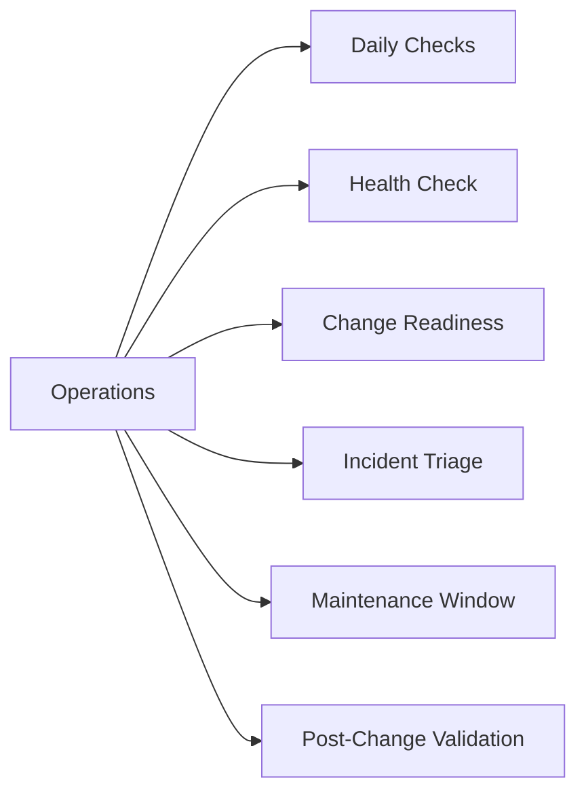

# Operations

> Part of the [Dell ECS](../) reference.

---

## Daily Checks

| Check | Command | Notes |
|---|---|---|
| [ ] Log in to ECS Portal → Dashboard and review the Alerts panel for a |  | triage by severity |
| [ ] ECS Portal → Dashboard → Capacity |  |  |
| [ ] Query `GET /vdc/nodes` via the Management REST API (or check ECS P | `GET /vdc/nodes` | all nodes should report `GOOD`; a `DEGRADED` or offline node requires immediate investigation |
| [ ] Query `GET /vdc/capacity` to retrieve current cluster capacity met | `GET /vdc/capacity` |  |
| [ ] ECS Portal → Geo Monitoring |  |  |
| [ ] Confirm the S3 endpoint is responding | `HEAD` |  |
| [ ] Review bucket-level capacity for fast-growing buckets |  | identify any namespace where week-over-week growth is accelerating beyond expected rates |

## Health Check

Run these checks before any planned change or as first-response steps when investigating node, replication, or S3 access issues.

- [ ] ECS Portal → Hardware → Nodes: all nodes show `GOOD`; no nodes are `DEGRADED` or offline
- [ ] `GET /vdc/nodes` — programmatic confirmation that all nodes report healthy status
- [ ] `GET /vdc/capacity` — cluster is below 80% used; free capacity is sufficient to absorb a node rebuild if needed
- [ ] `GET /vdc/alerts` — no active alerts of `ERROR` or `CRITICAL` severity
- [ ] ECS Portal → Geo Monitoring — all VDC replication groups are in sync with zero or near-zero lag
- [ ] ECS Portal → Hardware → Disks: no disks in `FAILED` or `SUSPECT` state
- [ ] S3 endpoint functional test: a `ListBuckets` or `HeadBucket` request completes within expected latency
- [ ] `ecscli namespace list` — all expected namespaces are present and accessible

~~~bash
# Authenticate to the ECS Management REST API (returns X-SDS-AUTH-TOKEN)
curl -s -k -u "sysadmin:<password>" \
  "https://<ecs-node>:4443/login" -D -

# Retrieve VDC capacity (total, used, available, percent full)
curl -s -k -H "X-SDS-AUTH-TOKEN: <token>" \
  "https://<ecs-node>:4443/vdc/capacity"

# List all nodes and their health status
curl -s -k -H "X-SDS-AUTH-TOKEN: <token>" \
  "https://<ecs-node>:4443/vdc/nodes"

# Retrieve active alerts for the VDC
curl -s -k -H "X-SDS-AUTH-TOKEN: <token>" \
  "https://<ecs-node>:4443/vdc/alerts"

# Test S3 endpoint — list buckets for a namespace using a valid access key
aws s3 ls s3:// --endpoint-url https://<s3-endpoint>:9021 \
  --no-verify-ssl

# List namespaces via ecscli
ecscli namespace list

# List buckets in a specific namespace
ecscli bucket list --namespace <namespace>
~~~

## Change Readiness

Verify these items before performing any change on an ECS cluster — node additions, software upgrades, replication group changes, or VDC configuration updates.

- [ ] All nodes report `GOOD` in ECS Portal or `GET /vdc/nodes` — do not begin an upgrade or node addition while any node is `DEGRADED` or offline
- [ ] No active disk rebuilds: ECS Portal → Hardware → Disks shows no `REBUILDING` disks — a concurrent rebuild during a node upgrade increases rebuild time and risk
- [ ] Geo-replication lag is at zero or within acceptable threshold for all VDC replication groups — confirm in ECS Portal → Geo Monitoring
- [ ] VDC quorum is healthy — all VDC nodes are online and the cluster has quorum before any configuration change
- [ ] Cluster capacity is below 70% — expansion operations and data rebalancing require headroom above the current used level
- [ ] No active alerts of `ERROR` or `CRITICAL` severity: `GET /vdc/alerts` — resolve pre-existing alerts before starting
- [ ] Inform consuming application teams of the maintenance window; confirm S3 application owners are aware if the endpoint may briefly be unavailable
- [ ] For upgrades: verify the target ECS version is a supported upgrade path from the current version in the Dell ECS release notes

| Item | Status | Notes |
|---|---|---|
| All nodes GOOD | | |
| No active disk rebuilds | | |
| Geo-replication lag at zero | | |
| VDC quorum healthy | | |
| Cluster capacity < 70% | | |

## Incident Triage

When S3 writes fail, geo-replication falls behind, or a node goes offline, work through this sequence first.

- [ ] Check ECS Portal → Hardware → Nodes immediately — identify any node that has moved to `DEGRADED` or offline state; note when the state change occurred
- [ ] Query `GET /vdc/alerts` — retrieve the active alert list and identify alerts timestamped near the start of the incident
- [ ] Check geo-replication lag: ECS Portal → Geo Monitoring — growing lag between VDCs can indicate a WAN link issue or a remote VDC node problem
- [ ] Test S3 API availability: send a `HeadBucket` request to the S3 endpoint — a non-200 response or timeout confirms S3 API impact
- [ ] Check ECS Portal → Hardware → Disks for `FAILED` or `SUSPECT` disks on the affected node — disk failures trigger node rebalancing that can cause temporary capacity or performance impact
- [ ] If geo-replication lag is growing: check WAN bandwidth utilisation between sites and confirm the remote VDC is healthy; review replication group configuration with `ecscli bucket get`
- [ ] For S3 authentication failures: confirm the IAM user and access key are correct; check bucket policies with `ecscli bucket get --namespace <ns> --name <bucket>`
- [ ] If the node is unresponsive to the REST API: SSH to the node and check the ECS service status; open a Dell support case for hardware faults

| Question | Answer |
|---|---|
| Which nodes are DEGRADED or offline? | |
| What active alerts does GET /vdc/alerts return? | |
| Is geo-replication lag growing between VDCs? | |
| Is the S3 API endpoint responding? | |
| Are there FAILED or SUSPECT disks on the affected node? | |

## Maintenance Window

Steps for planned maintenance on an ECS cluster — node maintenance, software upgrades, or VDC configuration changes.

1. Confirm the maintenance window and notify all teams consuming S3, Swift, or CAS endpoints from the cluster
2. Confirm all nodes are `GOOD` and geo-replication lag is at zero before starting
3. For node-level maintenance: use ECS Portal → Hardware → Node → Enter Maintenance Mode to safely drain the node before physical access; do not power off a node without placing it in maintenance mode first
4. For a rolling software upgrade: upload the upgrade package via ECS Portal → Settings → Software Update; ECS upgrades one node at a time — do not interrupt the rolling upgrade once started
5. Monitor per-node upgrade progress in the portal; wait for each node to return to `GOOD` state before the upgrade proceeds to the next node
6. If VDC quorum requires attention during the change, follow the Dell ECS quorum recovery procedure — do not attempt manual quorum changes without Dell support guidance
7. After the change, confirm all nodes return to `GOOD` via `GET /vdc/nodes` and geo-replication resumes with no lag
8. Run a functional S3 test from at least one consuming application before closing the maintenance window

## Post-Change Validation

Run these checks after any change to confirm the ECS cluster is healthy and object storage services have resumed.

- [ ] `GET /vdc/nodes` — all nodes report `GOOD`; no nodes remain in `DEGRADED` or maintenance state
- [ ] `GET /vdc/capacity` — capacity metrics are consistent with pre-change baseline; no unexpected increase
- [ ] ECS Portal → Geo Monitoring — geo-replication lag has returned to zero for all VDC replication groups
- [ ] `GET /vdc/alerts` — no new alerts introduced by the change
- [ ] S3 endpoint functional test: `HeadBucket` or `ListBuckets` succeeds from a representative consuming application
- [ ] `ecscli namespace list` — all namespaces accessible and intact
- [ ] ECS Portal → Hardware → Disks — no new `FAILED` or `SUSPECT` disks after the change
- [ ] Application teams confirm S3 workloads are running normally with no authentication or connectivity errors
