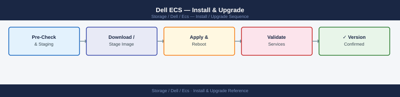
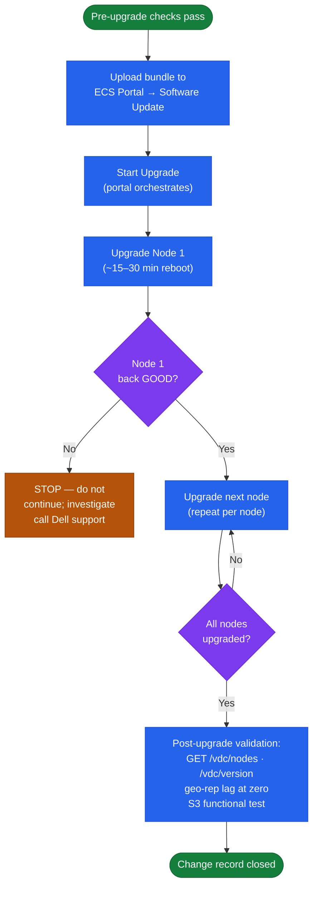
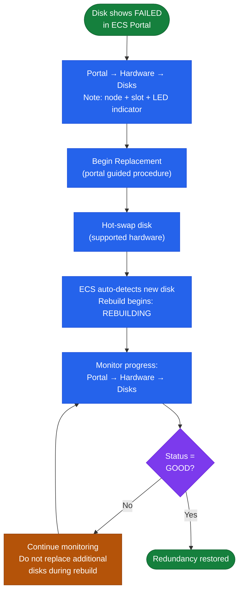

---
tags:
  - dell
  - operations
---
# Dell ECS — Install & Upgrade


<div class="kb-summary">
Install & Upgrade reference covering Version and Release Matrix, Pre-Upgrade Checks, Upgrade and Update Paths, Adding a New Node to an Existing VDC, Disk Replacement and 3 more sections.

*Applies to: ECS 3.x*
</div>



## Before you begin

- **Access:** Storage admin credentials (cluster admin or equivalent)
- **Timing:** safe to run during business hours unless a step is marked ⚠ (causes interruption)
- **Dependencies:** no active upgrades or migrations on the same infrastructure
- **Logging:** capture command output — paste into the change record on completion

---

## Version and Release Matrix

| ECS Version | Release Year | Key Features | Support Status |
|---|---|---|---|
| ECS 3.6.x | 2021 | Baseline geo-distribution, S3/Swift/CAS | End of Life |
| ECS 3.7.x | 2022 | Enhanced S3 Object Lock, metadata search v2 | End of Life |
| ECS 3.8.x | 2023 | NFS namespace access, improved replication monitoring | Active |
| ECS 3.9.x | 2024 | CloudIQ integration, expanded CAS compliance features | Active (Current) |

Check the Dell ECS Support Matrix on the Dell Support portal for the current supported version list and minimum supported version for new deployments.

## Pre-Upgrade Checks

Before initiating any software upgrade, confirm all of the following. Do not proceed if any item is not satisfied.

- [ ] All nodes are in `GOOD` health: `GET /vdc/nodes` shows no `DEGRADED` or offline nodes
- [ ] No active disk rebuilds: ECS Portal → Hardware → Disks shows no disks in `REBUILDING` state
- [ ] Geo-replication lag is at zero for all replication groups: ECS Portal → Geo Monitoring
- [ ] No active alerts of `ERROR` or `CRITICAL` severity: `GET /vdc/alerts`
- [ ] Cluster capacity is below 70%: `GET /vdc/capacity`
- [ ] Cassandra ring is healthy: `nodetool status` on any node shows all nodes as `UN`
- [ ] The target version is a supported upgrade path from the current version (check the ECS release notes — some major version jumps require an intermediate stop)
- [ ] The upgrade package has been downloaded from the Dell Support portal and verified (SHA checksum)
- [ ] A maintenance window has been opened and all application teams consuming S3/Swift/CAS endpoints have been notified

```bash
# Capture pre-upgrade baseline (store in the change record)
TOKEN=$(curl -sk -u "sysadmin:<password>" \
  -D - "https://<ecs-node>:4443/login" \
  | grep "X-SDS-AUTH-TOKEN" | awk '{print $2}' | tr -d '\r')

ECS="https://<ecs-node>:4443"

curl -sk -H "X-SDS-AUTH-TOKEN: $TOKEN" "$ECS/vdc/version"  | python3 -m json.tool
curl -sk -H "X-SDS-AUTH-TOKEN: $TOKEN" "$ECS/vdc/nodes"    | python3 -m json.tool
curl -sk -H "X-SDS-AUTH-TOKEN: $TOKEN" "$ECS/vdc/capacity" | python3 -m json.tool
curl -sk -H "X-SDS-AUTH-TOKEN: $TOKEN" "$ECS/vdc/alerts"   | python3 -m json.tool
```

## Upgrade and Update Paths

ECS upgrades are rolling — the cluster remains online throughout. The ECS Portal handles upgrade orchestration; each node is upgraded sequentially with automatic health validation between each node.



**Upgrade procedure:**

1. Confirm all pre-upgrade checks pass (see above)
2. Download the ECS upgrade bundle from the Dell Support portal (requires active support contract)
   - Verify the SHA-256 checksum of the downloaded bundle before uploading
3. Upload the bundle to the ECS Portal → Settings → Software Update staging area
4. Review the release notes for the target version; note any mandatory interim stops
   - Some major version jumps require upgrading to an intermediate version first (e.g., 3.6 → 3.8 may require 3.7 as an intermediate)
5. Initiate the upgrade from the portal: ECS Portal → Settings → Software Update → Start Upgrade
6. ECS upgrades nodes sequentially with automatic health validation between each node
   - Each node reboots during its upgrade; reboot time is approximately 15–30 minutes per node
   - The cluster continues to serve S3 requests during the rolling upgrade (with one fewer node per upgrade step)
7. Monitor upgrade progress in the portal; each node shows its upgrade state
8. Do not interrupt the rolling upgrade once started; do not reboot nodes manually or cut power during an upgrade
9. After all nodes complete, confirm:
   - All nodes return to `GOOD` status: `GET /vdc/nodes`
   - Software version reflects the new version: `GET /vdc/version`
   - Geo-replication resumes and lag returns to zero
   - No new alerts introduced: `GET /vdc/alerts`
10. Run a functional S3 test from at least one consuming application before closing the change

**Supported upgrade paths**: Single-version minor upgrades are always supported. Major version jumps may require an intermediate stop — verify in the release notes before proceeding.

```bash
# Post-upgrade validation commands
TOKEN=$(curl -sk -u "sysadmin:<password>" \
  -D - "https://<ecs-node>:4443/login" \
  | grep "X-SDS-AUTH-TOKEN" | awk '{print $2}' | tr -d '\r')

ECS="https://<ecs-node>:4443"

# Confirm new software version
curl -sk -H "X-SDS-AUTH-TOKEN: $TOKEN" "$ECS/vdc/version" | python3 -m json.tool

# Confirm all nodes are healthy
curl -sk -H "X-SDS-AUTH-TOKEN: $TOKEN" "$ECS/vdc/nodes" | python3 -m json.tool

# Confirm no new alerts
curl -sk -H "X-SDS-AUTH-TOKEN: $TOKEN" "$ECS/vdc/alerts" | python3 -m json.tool

# Confirm geo-replication is healthy
curl -sk -H "X-SDS-AUTH-TOKEN: $TOKEN" "$ECS/vdc/geo-replication/status" | python3 -m json.tool

# Functional S3 test
aws s3 ls --endpoint-url https://<ecs-s3-endpoint>:9021 --no-verify-ssl --profile ecs
```

## Adding a New Node to an Existing VDC

Adding nodes expands cluster capacity and compute. ECS rebalances erasure coding stripes in the background after a new node is added.

**Procedure:**

1. Confirm pre-change checks: all existing nodes `GOOD`, no active rebuilds, capacity < 70%
2. Rack and cable the new node according to the Dell ECS hardware installation guide
3. Boot the new node; it should appear in ECS Portal → Hardware → Nodes with a `NEW` status
4. Navigate to ECS Portal → Hardware → Nodes → select the new node → Add to VDC
5. ECS automatically begins rebalancing data to include the new node in erasure coding stripes
6. Monitor rebalancing progress in ECS Portal → Hardware — the cluster capacity view will update as data moves
7. Do not initiate another planned change (upgrade, node addition) while rebalancing is in progress

**Node addition considerations:**

| Consideration | Detail |
|---|---|
| Minimum increment | Add at least 4 nodes at once to maintain EC stripe width; adding a single node results in temporary stripe imbalance |
| Rebalancing duration | Rebalancing is background I/O-intensive; duration depends on cluster size and data volume — plan 24–72 hours for dense clusters |
| Performance impact | Rebalancing competes with client I/O; avoid adding nodes during peak usage hours |
| Version matching | New nodes must run the same ECS software version as existing nodes before being added to the VDC |

## Disk Replacement

When a disk fails, ECS marks it as `FAILED` and begins automatic rebuild. The disk should be physically replaced promptly to restore full redundancy.



**Procedure:**

1. Identify the failed disk in ECS Portal → Hardware → Disks — note the node and slot position
2. Navigate to ECS Portal → Hardware → Disks → select the failed disk → Begin Replacement
3. The portal identifies which physical disk to replace (slot number, LED indicator if supported)
4. Replace the disk following the Dell hardware guide (hot-swap for supported models)
5. ECS automatically detects the new disk and begins rebuilding erasure coding fragments onto it
6. Monitor rebuild progress in ECS Portal → Hardware → Disks; the disk transitions from `REBUILDING` to `GOOD` when complete
7. Do not replace more than `(parity fragments - 1)` disks simultaneously; for 12+4 EC, do not replace 4 or more disks at the same time

## Node Replacement

Replacing a failed node requires draining it from the cluster before physical replacement.

**Procedure:**

1. Place the node in maintenance mode: ECS Portal → Hardware → Nodes → select node → Enter Maintenance Mode
2. Wait for the node to drain (ECS redistributes its data to surviving nodes)
3. Power off the node and perform hardware replacement
4. Boot the replacement node; install the same ECS software version as the cluster
5. Add the replacement node to the VDC: ECS Portal → Hardware → Nodes → Add to VDC
6. ECS rebalances data to include the replacement node
7. Confirm the replacement node shows `GOOD` in the portal after rebalancing completes

## EOL and Renewal Tracking

| Tracked Item | Where to Find | Action Trigger |
|---|---|---|
| ECS software version EOS date | Dell Product Lifecycle page / Support portal | Begin upgrade planning 6 months before EOS |
| Hardware (node) End of Service Life | Dell Support → Asset Management | Begin refresh planning 12 months before EOSL |
| Support contract expiry | Dell MyService360 / Support portal | Renew at least 90 days before expiry |
| TLS certificate (Management API / S3 endpoint) | ECS Portal → Settings → Certificates | Renew 30 days before expiry; alert at 60 days |
| Object user secret key rotation | IAM registry / secrets manager | Rotate every 12 months per policy |
| KMIP client certificate (if used) | KMS server and ECS key management config | Renew 60 days before expiry |

## Replacement Planning

- ECS nodes have a typical service life of 5–7 years; plan hardware refresh based on Dell EOSL dates, not just age
- Data migration from an old cluster to a new ECS deployment is performed via geo-replication: stand up the new cluster as a VDC, add it to the replication group, let data sync, then cut over applications and retire the old VDC
- When replacing individual nodes within a cluster, use the ECS Portal guided node replacement procedure; do not remove a node without following the procedure as ECS must rebalance erasure coding stripes
- For platform migration (ECS to a different object storage platform), use S3 replication tools (e.g., rclone, Veeam Data Mover) to copy objects; ECS does not have a native cross-platform migration tool

**Decommission steps:**

1. Move all replication groups away from the VDC being decommissioned (migrate to other VDCs)
2. Verify all data is accessible from the surviving VDC before proceeding
3. Update all client S3 endpoints to point to surviving VDCs
4. Remove the VDC from all replication groups in ECS Portal → Settings → Replication Groups
5. Shut down ECS services on all nodes in the VDC: `viprexec -v -cmd "systemctl stop storageos"`
6. Power off and decommission nodes following the Dell hardware decommission guide
7. Securely erase all disks if required by data classification policy (use Dell secure erase tools)

**Do not shut down nodes while still in an active replication group — this will cause data access failures on the surviving VDC.**

---

## Verify

- Confirm the operation completed without errors in the log or management UI
- Verify the expected state change is visible (service running, object created, config applied)
- Document the outcome in the change record

---

## See also

- [Ecs — Procedures](procedures/)
- [Ecs — Health Checks](health-checks/)
