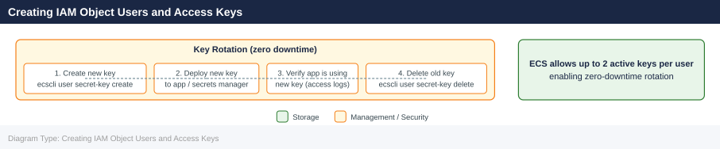
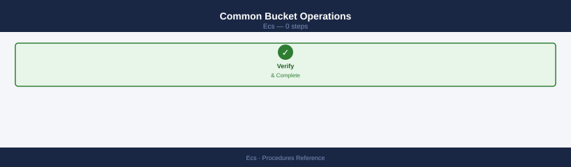
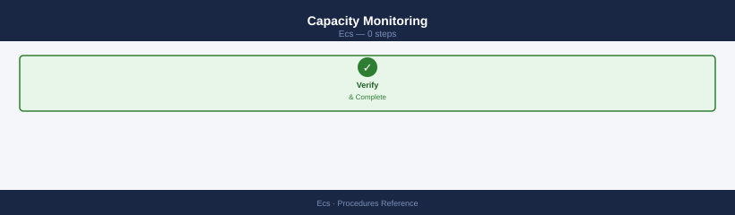
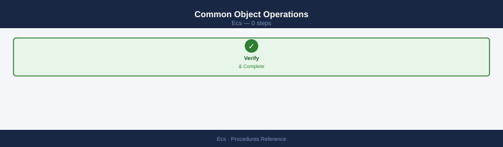

---
tags:
  - dell
  - operations
---
# Dell ECS — Procedures

<div class="kb-summary">
Dell ECS operational procedures — namespace and bucket provisioning, IAM user and policy management, S3 access configuration, replication, retention policy, change readiness, and incident triage.

*Applies to: ECS 3.x*
</div>

## Before you begin

- **Access:** Storage admin credentials (cluster admin or equivalent)
- **Timing:** safe to run during business hours unless a step is marked ⚠ (causes interruption)
- **Dependencies:** no active upgrades or migrations on the same infrastructure
- **Logging:** capture command output — paste into the change record on completion

---

## Change Readiness

Verify these items before performing any change on an ECS cluster — node additions, software upgrades, replication group changes, or VDC configuration updates.

- [ ] All nodes report `GOOD` in ECS Portal or `GET /vdc/nodes` — do not begin an upgrade or node addition while any node is `DEGRADED` or offline
- [ ] No active disk rebuilds: ECS Portal → Hardware → Disks shows no `REBUILDING` disks — a concurrent rebuild during a node upgrade increases rebuild time and risk
- [ ] Geo-replication lag is at zero or within acceptable threshold for all VDC replication groups — confirm in ECS Portal → Geo Monitoring
- [ ] VDC quorum is healthy — all VDC nodes are online and the cluster has quorum before any configuration change
- [ ] Cluster capacity is below 70% — expansion operations and data rebalancing require headroom above the current used level
- [ ] No active alerts of `ERROR` or `CRITICAL` severity: `GET /vdc/alerts` — resolve pre-existing alerts before starting
- [ ] Inform consuming application teams of the maintenance window; confirm S3 application owners are aware if the endpoint may briefly be unavailable
- [ ] For upgrades: verify the target ECS version is a supported upgrade path from the current version in the Dell ECS release notes

| Item | Status | Notes |
|---|---|---|
| All nodes GOOD | | |
| No active disk rebuilds | | |
| Geo-replication lag at zero | | |
| VDC quorum healthy | | |
| Cluster capacity < 70% | | |

## Maintenance Window

Steps for planned maintenance on an ECS cluster — node maintenance, software upgrades, or VDC configuration changes.

1. Confirm the maintenance window and notify all teams consuming S3, Swift, or CAS endpoints from the cluster
2. Confirm all nodes are `GOOD` and geo-replication lag is at zero before starting
3. For node-level maintenance: use ECS Portal → Hardware → Node → Enter Maintenance Mode to safely drain the node before physical access; do not power off a node without placing it in maintenance mode first
4. For a rolling software upgrade: upload the upgrade package via ECS Portal → Settings → Software Update; ECS upgrades one node at a time — do not interrupt the rolling upgrade once started
5. Monitor per-node upgrade progress in the portal; wait for each node to return to `GOOD` state before the upgrade proceeds to the next node
6. If VDC quorum requires attention during the change, follow the Dell ECS quorum recovery procedure — do not attempt manual quorum changes without Dell support guidance
7. After the change, confirm all nodes return to `GOOD` via `GET /vdc/nodes` and geo-replication resumes with no lag
8. Run a functional S3 test from at least one consuming application before closing the maintenance window

## Post-Change Validation

Run these checks after any change to confirm the ECS cluster is healthy and object storage services have resumed.

- [ ] `GET /vdc/nodes` — all nodes report `GOOD`; no nodes remain in `DEGRADED` or maintenance state
- [ ] `GET /vdc/capacity` — capacity metrics are consistent with pre-change baseline; no unexpected increase
- [ ] ECS Portal → Geo Monitoring — geo-replication lag has returned to zero for all VDC replication groups
- [ ] `GET /vdc/alerts` — no new alerts introduced by the change
- [ ] S3 endpoint functional test: `HeadBucket` or `ListBuckets` succeeds from a representative consuming application
- [ ] `ecscli namespace list` — all namespaces accessible and intact
- [ ] ECS Portal → Hardware → Disks — no new `FAILED` or `SUSPECT` disks after the change
- [ ] Application teams confirm S3 workloads are running normally with no authentication or connectivity errors

## Provisioning Flow: Namespace → Bucket → IAM User

```d2
direction: right

START: "New application storage request" {shape: rectangle}
NS: "Create Namespace\necscli namespace create\n+ replication group + hard quota" {shape: rectangle}
BKT: "Create Bucket\nS3 name rules · versioning off by default" {shape: rectangle}
LOCK: "LOCK" {shape: rectangle}
OBJ: "Enable Object Lock at\nbucket creation (cannot add later" {shape: rectangle}
USR: "Create Object User\necscli user create\n--namespace --name svc-<app>-<env>" {shape: rectangle}
KEY: "Generate Access Key + Secret Key\n(shown once — store in vault immediately" {shape: rectangle}
POL: "Apply Bucket Policy\nleast-privilege s3 actions only" {shape: rectangle}
LC: "LC" {shape: rectangle}
LCP: "Add lifecycle policy\nNoncurrentVersionExpiration + MPU abort" {shape: rectangle}
TEST: "Functional test:\naws s3 ls s3://bucket --endpoint-url ..." {shape: rectangle}
DONE: "Bucket ready for application" {shape: rectangle}

START -> NS
NS -> BKT
LOCK -> OBJ
LOCK -> USR
OBJ -> USR
USR -> KEY
KEY -> POL
LC -> LCP
LC -> TEST
LCP -> TEST
TEST -> DONE
```

## Creating a Namespace

Namespaces are the top-level multi-tenancy boundary in ECS. Create a separate namespace per team or application workload.

**Via ECS Portal:**
1. Navigate to ECS Portal → Manage → Namespaces → New Namespace
2. Enter a name (lowercase, hyphen-separated; e.g., `analytics-prod`)
3. Select the Replication Group that spans the required VDCs
4. Set a hard quota (recommended; prevents unbounded capacity growth)
5. Configure encryption at rest if the namespace holds regulated data
6. Enable metadata search if object-level search is required (adds indexer overhead)
7. Save; the namespace becomes immediately available for bucket creation

**Via Management REST API:**

```bash
# Create a namespace
curl -s -k -X POST \
  -H "X-SDS-AUTH-TOKEN: $TOKEN" \
  -H "Content-Type: application/json" \
  "https://<ecs-node>:4443/object/namespaces/namespace" \
  -d '{
    "id": "analytics-prod",
    "default_data_services_vpool": "<replication-group-id>",
    "is_stale_allowed": true,
    "is_compliance_enabled": false,
    "namespace_quota": {
      "blockSize": 10240,
      "notificationSize": 9216
    }
  }' | python3 -m json.tool

# Verify the namespace was created
ecscli namespace get --name analytics-prod
```


```text title="Expected output"
{
  "id": "analytics-prod",
  "link": {
    "rel": "self",
    "href": "/object/namespaces/namespace/analytics-prod"
  },
  "creation_time": 1699564823000,
  "vpool": "urn:storageos:ReplicationGroupInfo:d4c8f2a1-9e3b-4c7f-b1d2-8f5e3a2c9b7d:global",
  "is_stale_allowed": true,
  "is_compliance_enabled": false,
  "namespace_quota": {
    "blockSize": 10240,
    "notificationSize": 9216
  }
}
Namespace: analytics-prod
  ID: analytics-prod
  VPool: urn:storageos:ReplicationGroupInfo:d4c8f2a1-9e3b-4c7f-b1d2-8f5e3a2c9b7d:global
  Created: 2024-11-10T14:47:03Z
  Compliance Enabled: false
  Stale Allowed: true
```

!!! warning "Common errors"
    **`curl: (7) Failed to connect to <ecs-node>:4443: Connection refused`** — Replace `<ecs-node>` with the actual ECS management node hostname or IP address.
    **`{"errorCode":1003,"description":"Invalid authentication token"}`** — Ensure `$TOKEN` is set by running `export TOKEN=$(ecscli login -u <user> -p <password> -m <mgmt-node>)` first.
    **`error: namespace 'analytics-prod' not found`** — Wait 5-10 seconds for replication across the cluster before running the verify command, or check that the POST request returned HTTP 201 status.
**Namespace configuration parameters:**

| Parameter | Description | Recommendation |
|---|---|---|
| `default_data_services_vpool` | The replication group ID assigned to this namespace | Always specify; do not use the system default |
| `is_stale_allowed` | Allow reads from a VDC that may have stale data during TSF | `true` for HA; `false` for strong consistency |
| `is_compliance_enabled` | Enable CAS compliance mode (immutable write-once) | Enable only for compliance/WORM namespaces |
| `namespace_quota.blockSize` | Hard quota in GB — writes fail when exceeded | Set to expected monthly data volume + 20% buffer |
| `namespace_quota.notificationSize` | Soft quota in GB — alerts are raised when exceeded | Set ~10% below the hard quota |

## Creating a Bucket

Buckets are the S3-visible object containers within a namespace.

**Via ECS Portal:**
1. Navigate to ECS Portal → Manage → Buckets → New Bucket
2. Enter a bucket name (must be S3-compatible: lowercase, 3–63 characters, no dots)
3. Select the parent namespace
4. Choose the replication group (inherits from namespace by default)
5. Configure versioning (default: disabled — enable only if application recovery requirements demand it)
6. Set a bucket quota if finer-grained control than namespace quota is needed
7. Enable Object Lock (WORM) only at bucket creation — cannot be enabled after creation

**Via S3 API or ecscli:**

```bash
# Create a bucket (ecscli)
ecscli bucket create \
  --namespace analytics-prod \
  --name analytics-prod-raw \
  --replication-group <rg-id> \
  --versioning-enabled false

# Create a bucket (S3 API via AWS CLI)
aws s3api create-bucket \
  --bucket analytics-prod-raw \
  --endpoint-url https://<ecs-s3-endpoint>:9021 \
  --no-verify-ssl \
  --profile ecs

# Enable Object Lock at creation (cannot be enabled post-creation)
aws s3api create-bucket \
  --bucket compliance-immutable \
  --object-lock-enabled-for-bucket \
  --endpoint-url https://<ecs-s3-endpoint>:9021 \
  --no-verify-ssl \
  --profile ecs

# Set a bucket quota (ecscli)
ecscli bucket update \
  --namespace analytics-prod \
  --name analytics-prod-raw \
  --quota 5000

# Verify bucket configuration
ecscli bucket get --namespace analytics-prod --name analytics-prod-raw
```


```text title="Expected output"
Bucket created successfully.
Bucket Name: analytics-prod-raw
Namespace: analytics-prod
Replication Group: rg-ecs-prod-01
Versioning: disabled
Created: 2024-01-15T09:42:18Z

make_bucket: analytics-prod-raw
Bucket created with endpoint https://ecs-s3-endpoint.corp.local:9021

make_bucket: compliance-immutable
Bucket created with endpoint https://ecs-s3-endpoint.corp.local:9021

Bucket quota updated successfully.
Quota: 5000 GB

Bucket: analytics-prod-raw
  Namespace: analytics-prod
  Replication Group: rg-ecs-prod-01
  Versioning: disabled
  Object Lock: disabled
  Quota: 5000 GB
  Used: 0 GB
  Created: 2024-01-15T09:42:18Z
```

!!! warning "Common errors"
    **`error: bucket 'analytics-prod-raw' already exists`** — Drop the bucket with `ecscli bucket delete --namespace analytics-prod --name analytics-prod-raw` or choose a unique bucket name.
    **`Unable to locate credentials for profile 'ecs'`** — Configure AWS CLI credentials with `aws configure --profile ecs` or ensure `~/.aws/credentials` contains the ECS endpoint profile.
    **`SSL: CERTIFICATE_VERIFY_FAILED`** — The `--no-verify-ssl` flag is present but not working; verify the endpoint URL is correct and accessible, or use a valid certificate if `--no-verify-ssl` is removed.
**Bucket configuration parameters:**

| Parameter | Description | Default | Recommendation |
|---|---|---|---|
| Versioning | Retain multiple versions of each object key | Disabled | Enable only with a corresponding lifecycle policy to expire non-current versions |
| Object Lock | WORM — objects cannot be deleted or overwritten within retention period | Disabled | Enable at creation for compliance or immutable backup buckets |
| Quota | Hard capacity limit on this bucket in GB | None (namespace quota applies) | Set per bucket for large or fast-growing workloads |
| Replication Group | Which VDCs store this bucket's data | Inherits namespace default | Override only if this bucket has different geo-replication requirements |
| Access Logging | Write access log records to a designated audit bucket | Disabled | Enable for buckets holding regulated or auditable data |

## Creating IAM Object Users and Access Keys

Object users are per-namespace IAM identities. Each application or service should have a dedicated object user.



```bash
# Create an object user in a namespace
ecscli user create \
  --namespace analytics-prod \
  --name svc-spark-prod

# Generate a new S3 access key / secret key pair for the user
# NOTE: The secret key is returned once and cannot be retrieved again — store it immediately
ecscli user secret-key create \
  --namespace analytics-prod \
  --name svc-spark-prod

# List object users in a namespace
ecscli user list-object-users --namespace analytics-prod

# List access keys for a user (key IDs only — not the secret values)
ecscli user secret-key list \
  --namespace analytics-prod \
  --name svc-spark-prod

# Key rotation: create new key, deploy it, then delete old key
# 1. Create new key
ecscli user secret-key create --namespace analytics-prod --name svc-spark-prod
# 2. Deploy new key to the application (configuration or secrets manager)
# 3. Confirm application is using new key
# 4. Delete old key
ecscli user secret-key delete \
  --namespace analytics-prod \
  --name svc-spark-prod \
  --secret-key <old-key-id>
```


```text title="Expected output"
User svc-spark-prod created successfully in namespace analytics-prod

Access Key ID: 8F7C2A9E1B4D5K6L
Secret Access Key: wJx9mK2pL8qR3sT4uV5wX6yZ7aB8cD9eF0gH1iJ2kL3mN4oP5qR6sT7uV8wX9yZ0

Object Users in namespace analytics-prod:
  svc-spark-prod
  svc-kafka-prod
  svc-elasticsearch-prod

Access Keys for user svc-spark-prod:
  8F7C2A9E1B4D5K6L
  7E6D5C4B3A2Z1Y0X

Access Key ID: 3M9N8O7P6Q5R4S3T
Secret Access Key: aB1cD2eF3gH4iJ5kL6mN7oP8qR9sT0uV1wX2yZ3aB4cD5eF6gH7iJ8kL9mN0oP1

Secret key 7E6D5C4B3A2Z1Y0X deleted successfully
```

!!! warning "Common errors"
    **`Error: user 'svc-spark-prod' already exists in namespace 'analytics-prod'`** — Use `ecscli user delete` to remove the existing user first, or choose a different username.
    **`Error: secret key '<old-key-id>' not found for user 'svc-spark-prod'`** — Verify the correct key ID using `ecscli user secret-key list` before attempting deletion.
## Configuring Bucket Lifecycle Policies

Lifecycle policies automate object expiration and version cleanup. Always attach a lifecycle policy to versioned buckets.

```bash
# Apply a lifecycle policy: expire non-current versions after 90 days,
# abort incomplete multipart uploads after 7 days
aws s3api put-bucket-lifecycle-configuration \
  --bucket analytics-prod-raw \
  --endpoint-url https://<ecs-s3-endpoint>:9021 \
  --no-verify-ssl \
  --profile ecs \
  --lifecycle-configuration '{
    "Rules": [
      {
        "ID": "expire-noncurrent-versions",
        "Status": "Enabled",
        "Filter": {"Prefix": ""},
        "NoncurrentVersionExpiration": {"NoncurrentDays": 90}
      },
      {
        "ID": "abort-incomplete-mpu",
        "Status": "Enabled",
        "Filter": {"Prefix": ""},
        "AbortIncompleteMultipartUpload": {"DaysAfterInitiation": 7}
      }
    ]
  }'

# Verify the lifecycle policy was applied
aws s3api get-bucket-lifecycle-configuration \
  --bucket analytics-prod-raw \
  --endpoint-url https://<ecs-s3-endpoint>:9021 \
  --no-verify-ssl \
  --profile ecs
```


```text title="Expected output"
(no output — command completes silently)

{
    "Rules": [
        {
            "ID": "expire-noncurrent-versions",
            "Status": "Enabled",
            "Filter": {
                "Prefix": ""
            },
            "NoncurrentVersionExpiration": {
                "NoncurrentDays": 90
            }
        },
        {
            "ID": "abort-incomplete-mpu",
            "Status": "Enabled",
            "Filter": {
                "Prefix": ""
            },
            "AbortIncompleteMultipartUpload": {
                "DaysAfterInitiation": 7
            }
        }
    ]
}
```

!!! warning "Common errors"
    **`An error occurred (NoSuchBucket) when calling the PutBucketLifecycleConfiguration operation: The specified bucket does not exist`** — Verify the bucket name is correct and exists on the ECS endpoint using `aws s3api list-buckets --endpoint-url https://<ecs-s3-endpoint>:9021 --profile ecs`.
    **`SSL: CERTIFICATE_VERIFY_FAILED`** — Ensure `--no-verify-ssl` flag is present in the command, or add the ECS endpoint certificate to your system's CA bundle.
    **`Unable to locate credentials for profile 'ecs'`** — Verify the `ecs` profile exists in `~/.aws/credentials` and contains valid access key and secret key for the ECS S3 endpoint.
## Applying Bucket Policies (S3 IAM)

Bucket policies restrict which object users can perform which S3 actions on a bucket.

```bash
# Apply a read-write policy scoped to a specific object user
cat > /tmp/bucket-policy.json << 'EOF'
{
  "Version": "2012-10-17",
  "Statement": [
    {
      "Sid": "AllowAppRW",
      "Effect": "Allow",
      "Principal": {
        "AWS": "urn:ecs:iam::analytics-prod:user/svc-spark-prod"
      },
      "Action": [
        "s3:GetObject",
        "s3:PutObject",
        "s3:DeleteObject",
        "s3:ListBucket"
      ],
      "Resource": [
        "arn:aws:s3:::analytics-prod-raw",
        "arn:aws:s3:::analytics-prod-raw/*"
      ]
    }
  ]
}
EOF

aws s3api put-bucket-policy \
  --bucket analytics-prod-raw \
  --policy file:///tmp/bucket-policy.json \
  --endpoint-url https://<ecs-s3-endpoint>:9021 \
  --no-verify-ssl \
  --profile ecs

# View current bucket policy
aws s3api get-bucket-policy \
  --bucket analytics-prod-raw \
  --endpoint-url https://<ecs-s3-endpoint>:9021 \
  --no-verify-ssl \
  --profile ecs
```


```text title="Expected output"
{
    "Policy": "{\"Version\":\"2012-10-17\",\"Statement\":[{\"Sid\":\"AllowAppRW\",\"Effect\":\"Allow\",\"Principal\":{\"AWS\":\"urn:ecs:iam::analytics-prod:user/svc-spark-prod\"},\"Action\":[\"s3:GetObject\",\"s3:PutObject\",\"s3:DeleteObject\",\"s3:ListBucket\"],\"Resource\":[\"arn:aws:s3:::analytics-prod-raw\",\"arn:aws:s3:::analytics-prod-raw/*\"]}]}"
}
```

!!! warning "Common errors"
    **`An error occurred (NoSuchBucket) when calling the PutBucketPolicy operation: The specified bucket does not exist`** — Verify the bucket name matches exactly and exists in the ECS cluster with `aws s3api list-buckets --endpoint-url https://<ecs-s3-endpoint>:9021 --profile ecs`.
    **`An error occurred (InvalidArgument) when calling the PutBucketPolicy operation: Invalid principal in policy`** — Ensure the Principal ARN format matches your ECS IAM namespace; replace `urn:ecs:iam::analytics-prod:user/svc-spark-prod` with the correct user path from `aws iam list-users --profile ecs`.
    **`SSL: CERTIFICATE_VERIFY_FAILED`** — The `--no-verify-ssl` flag is already present; if still failing, verify the endpoint URL is correct and the ECS S3 service is responding on port 9021.
## Cleaning Up Incomplete Multipart Uploads

Incomplete multipart uploads (MPUs) consume capacity without contributing accessible objects. Clean them up regularly on buckets with high-throughput upload workloads.

```bash
# List incomplete multipart uploads
aws s3api list-multipart-uploads \
  --bucket analytics-prod-raw \
  --endpoint-url https://<ecs-s3-endpoint>:9021 \
  --no-verify-ssl \
  --profile ecs

# Abort a specific incomplete MPU
aws s3api abort-multipart-upload \
  --bucket analytics-prod-raw \
  --key path/to/large-object.tar.gz \
  --upload-id <UploadId> \
  --endpoint-url https://<ecs-s3-endpoint>:9021 \
  --no-verify-ssl \
  --profile ecs
```


```text title="Expected output"
{
    "Uploads": [
        {
            "UploadId": "AAABaWQtMTcwMjQwNTYwMDAwMDAwMDAwMDAwMDAwMDAwMDAwMDAwMDAwMDAwMDAwMDAwMDAwMDAwMDAwMDAwMDAwMDAwMDAwMDAwMDAwMDAwMDAwMDAwMDAwMDAwMDAwMDAwMDAwMDAwMDAwMDAwMDAwMDAwMDAwMDAwMDAwMDAwMDAwMDAwMDAwMDAwMDAwMDAwMDAwMDAwMDAwMDAwMDAwMDAwMDAwMDAwMDAwMDAwMDAwMDAwMDAwMDAwMDAwMDAwMDAwMDAwMDAwMDAwMDAwMDAwMDAwMDAwMDAwMDAwMDAwMDAwMDAwMDAwMDAwMDAwMDAwMDAwMDAwMDAwMDAwMDAwMDAwMDAwMDAwMDAwMDAwMDAwMDAwMDAwMDAwMDAwMDAwMDAwMDAwMDAwMDAwMDAwMDAwMDAwMDAwMDAwMDAwMDAwMDAwMDAwMDAwMDAwMDAwMDAwMDAwMDAwMDAwMDAwMDAwMDAwMDAwMDAwMDAwMDAwMDAwMDAwMDAwMDAwMDAwMDAwMDAwMDAwMDAwMDAwMDAwMDAwMDAwMDAwMDAwMDAwMDAwMDAwMDAwMDAwMDAwMDAwMDAwMDAwMDAwMDAwMDAwMDAwMDAwMDAwMDAwMDAwMDAwMDAwMDAwMDAwMDAwMDAwMDAwMDAwMDAwMDAwMDAwMDAwMDAwMDAwMDAwMDAwMDAwMDAwMDAwMDAwMDAwMDAwMDAwMDAwMDAwMDAwMDAwMDAwMDAwMDAwMDAwMDAwMDAwMDAwMDAwMDAwMDAwMDAwMDAwMDAwMDAwMDAwMDAwMDAwMDAwMDAwMDAwMDAwMDAwMDAwMDAwMDAwMDAwMDAwMDAwMDAwMDAwMDAwMDAwMDAwMDAwMDAwMDAwMDAwMDAwMDAwMDAwMDAwMDAwMDAwMDAwMDAwMDAwMDAwMDAwMDAwMDAwMDAwMDAwMDAwMDAwMDAwMDAwMDAwMDAwMDAwMDAwMDAwMDAwMDAwMDAwMDAwMDAwMDAwMDAwMDAwMDAwMDAwMDAwMDAwM
```
A lifecycle policy rule with `AbortIncompleteMultipartUpload` (7 days) is the preferred long-term solution over manual cleanup.

## Bucket Management

Dell ECS uses S3-compatible buckets as the fundamental storage object. Buckets contain objects and have associated policies, retention settings, and replication configuration.

### Common Bucket Operations



```bash
# List all buckets accessible to the configured object user
aws s3 ls \
  --endpoint-url https://<ecs-s3-endpoint>:9021 \
  --no-verify-ssl \
  --profile ecs

# Delete a bucket (must be empty)
aws s3 rb s3://<bucket-name> \
  --endpoint-url https://<ecs-s3-endpoint>:9021 \
  --no-verify-ssl \
  --profile ecs

# Force-delete a bucket and all its objects (use with caution)
aws s3 rb s3://<bucket-name> --force \
  --endpoint-url https://<ecs-s3-endpoint>:9021 \
  --no-verify-ssl \
  --profile ecs

# View bucket ACL
aws s3api get-bucket-acl \
  --bucket <bucket-name> \
  --endpoint-url https://<ecs-s3-endpoint>:9021 \
  --no-verify-ssl \
  --profile ecs

# Check Object Lock configuration
aws s3api get-object-lock-configuration \
  --bucket <bucket-name> \
  --endpoint-url https://<ecs-s3-endpoint>:9021 \
  --no-verify-ssl \
  --profile ecs
```


```text title="Expected output"
2024-01-15 09:23:44 backup-prod-01
2024-01-15 09:18:12 archive-tier-02
2024-01-15 08:47:33 logs-retention-90d
2024-01-15 07:52:19 temp-staging
2024-01-15 06:15:08 compliance-locked

remove_bucket: status_code: 204, request_id: req-a1b2c3d4e5f6g7h8

{
    "Owner": {
        "DisplayName": "ecs-admin",
        "ID": "1a2b3c4d5e6f7g8h9i0j1k2l3m4n5o6p"
    },
    "Grants": [
        {
            "Grantee": {
                "Type": "CanonicalUser",
                "ID": "1a2b3c4d5e6f7g8h9i0j1k2l3m4n5o6p"
            },
            "Permission": "FULL_CONTROL"
        }
    ]
}

An error occurred (ObjectLockConfigurationNotFoundError) when calling the GetObjectLockConfiguration operation: The Object Lock configuration does not exist
```

!!! warning "Common errors"
    **`An error occurred (NoSuchBucket) when calling the ListBuckets operation: The specified bucket does not exist`** — Verify the bucket name spelling and confirm the ECS endpoint URL and profile credentials are correct.
    **`An error occurred (BucketNotEmpty) when calling the DeleteBucket operation: The bucket you tried to delete is not empty`** — Use the `--force` flag to delete the bucket and all objects, or manually empty the bucket first with `aws s3 rm s3://<bucket-name> --recursive`.
    **`SSL: CERTIFICATE_VERIFY_FAILED`** — Ensure `--no-verify-ssl` flag is included or add the ECS certificate to your system's trusted CA store.
### Capacity Monitoring



| Metric | Check Location |
|---|---|
| Per-bucket usage | ECS Management Console → Monitoring → Bucket Usage |
| Cluster utilisation | ECS Management Console → Dashboard |
| Replication lag | ECS Management Console → Replication Groups |

### Common Object Operations



| Task | Command |
|---|---|
| List bucket contents | `aws s3 ls s3://<bucket> --endpoint-url ...` |
| Copy object to bucket | `aws s3 cp <file> s3://<bucket>/ --endpoint-url ...` |
| Delete object | `aws s3 rm s3://<bucket>/<key> --endpoint-url ...` |
| Sync local to bucket | `aws s3 sync <local-dir> s3://<bucket>/ --endpoint-url ...` |

## Troubleshooting Access

| Error | Likely Cause | Fix |
|---|---|---|
| `Connection refused` | S3 endpoint down or wrong port | Check port 9021 (HTTPS) or 9020 (HTTP) |
| `SSL certificate error` | Self-signed cert not trusted | Use `--no-verify-ssl` or install ECS CA cert on clients |
| `Access Denied` | Wrong access key or bucket policy | Verify key and check bucket policy in ECS console |
| `NoSuchBucket` | Bucket does not exist or wrong namespace | Check bucket name and namespace assignment |
| `403 Forbidden` | Bucket policy denies access | Review bucket policy: `aws s3api get-bucket-policy ...` |
| `QuotaExceeded` | Bucket or namespace quota reached | Increase quota in ECS Portal or expire old objects |

---

## Verify

- Confirm the operation completed without errors in the log or management UI
- Verify the expected state change is visible (service running, object created, config applied)
- Document the outcome in the change record

---

## See also

- [Ecs — Health Checks](../health-checks/)
- [Ecs — CLI Reference](../cli-reference/)
- [Ecs — Common Issues](../../troubleshooting/common-issues/)
