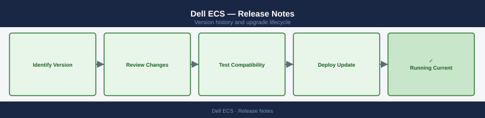

---
tags:
  - dell
---
# Dell ECS — Release Notes

Version history and release notes for Dell ECS.

## Version History

| Version | Released | Summary | Notes |
|---------|----------|---------|-------|
| 3.8 | 2024-Q2 | ECS 3.8 — HDFS connector v2, S3 object lock GA | [Release Notes](#) |
| 3.7 | 2023-Q3 | ECS 3.7 — IAM compatibility improvements | [Release Notes](#) |
| 3.6 | 2022-Q4 | ECS 3.6 — multi-region federation | [Release Notes](#) |
| 3.5 | 2022-Q1 | ECS 3.5 — NFS v4 protocol support | [Release Notes](#) |
| 3.4 | 2021-Q2 | ECS 3.4 — REST management API v3 | [Release Notes](#) |

## Key Terminology

**Major Version**
: A release containing significant new features or architectural changes; may require additional planning and testing.

**Patch Release**
: A targeted fix release that addresses bugs or security issues within a major/minor version.

**EOL (End of Life)**
: Date after which the vendor no longer provides updates, security patches, or technical support.

**Upgrade Path**
: The supported sequence of versions a system must traverse to reach a target version (some versions cannot be skipped).

## Upgrade Path

Review the vendor's official upgrade documentation and compatibility matrix before beginning any version change. Validate that all dependent components (OS, drivers, integration plugins) support the target version. Perform upgrades in a staged approach: dev/test environment first, then production. Capture a snapshot or backup immediately prior to the upgrade window. After the upgrade, run post-validation health checks and confirm all services are operating normally.
