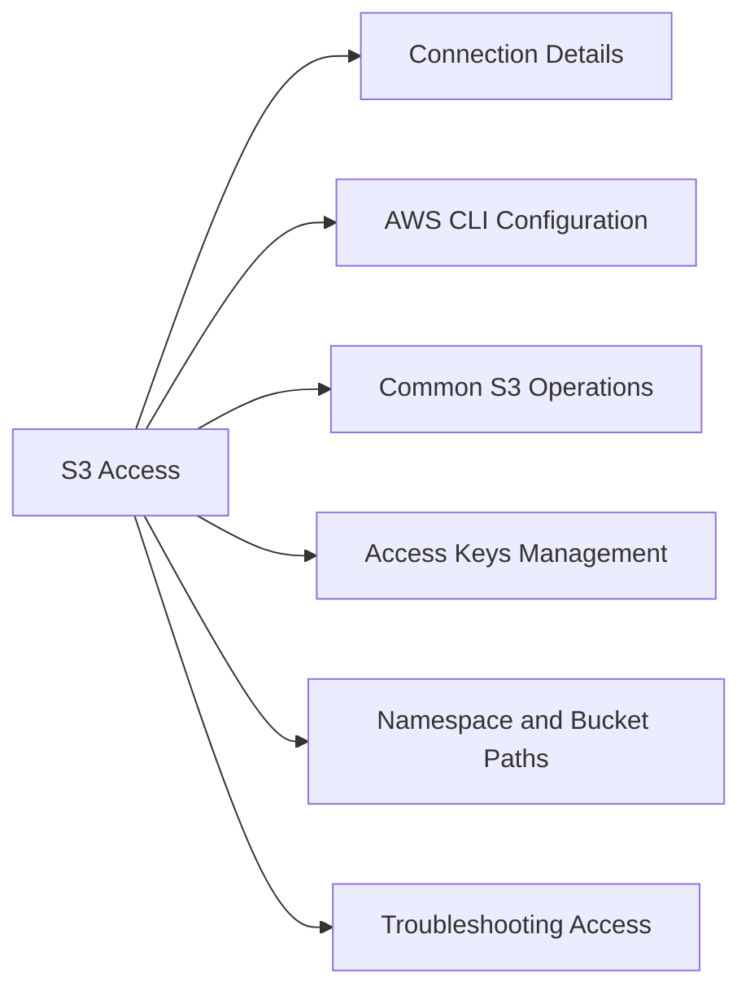

# S3 Access

ECS exposes an S3-compatible API endpoint. Any S3-compatible client (AWS CLI, boto3, s3cmd, rclone) can access ECS using its S3 endpoint.



## Connection Details

| Parameter | Value |
|---|---|
| S3 Endpoint | `https://<ecs_s3_vip>` or `https://<ecs_node_ip>` |
| Auth | Access Key / Secret Key (managed in ECS UI or API) |
| TLS | Self-signed cert by default — clients need `--no-verify-ssl` or trusted CA |
| Port | 9020 (HTTP), 9021 (HTTPS) |

## AWS CLI Configuration

```bash
# Configure AWS CLI profile for ECS
aws configure --profile ecs
# AWS Access Key ID: <ecs_access_key>
# AWS Secret Access Key: <ecs_secret_key>
# Default region: us-east-1 (ECS ignores region — use any value)

# Test connectivity
aws s3 ls --profile ecs --endpoint-url https://<ecs_endpoint> --no-verify-ssl
```

## Common S3 Operations

```bash
# List buckets
aws s3 ls \
    --profile ecs \
    --endpoint-url https://<ecs_endpoint> \
    --no-verify-ssl

# List objects in a bucket
aws s3 ls s3://<bucket_name>/ \
    --profile ecs \
    --endpoint-url https://<ecs_endpoint> \
    --no-verify-ssl

# Upload a file
aws s3 cp /local/file s3://<bucket_name>/key \
    --profile ecs \
    --endpoint-url https://<ecs_endpoint> \
    --no-verify-ssl

# Download a file
aws s3 cp s3://<bucket_name>/key /local/destination \
    --profile ecs \
    --endpoint-url https://<ecs_endpoint> \
    --no-verify-ssl

# Sync a directory
aws s3 sync /local/dir s3://<bucket_name>/ \
    --profile ecs \
    --endpoint-url https://<ecs_endpoint> \
    --no-verify-ssl
```

## Access Keys Management

Access keys are created in the ECS Management Console:

- **Manage** → **Users** → select user → **Generate Secret Key**
- Keys can also be created via the ECS REST API

## Namespace and Bucket Paths

ECS organises data into namespaces. Buckets belong to a namespace. The S3 endpoint path style is:

```
https://<ecs_endpoint>/<bucket_name>/<object_key>
```

Some clients support virtual-hosted style:
```
https://<bucket_name>.<ecs_endpoint>/<object_key>
```

## Troubleshooting Access

| Error | Likely Cause | Fix |
|---|---|---|
| `Connection refused` | S3 endpoint down or wrong port | Check port 9021 (HTTPS) or 9020 (HTTP) |
| `SSL certificate error` | Self-signed cert | Use `--no-verify-ssl` or install ECS CA cert |
| `Access Denied` | Wrong access key or bucket policy | Verify key and bucket policy |
| `NoSuchBucket` | Bucket doesn't exist or wrong namespace | Check bucket name and namespace |
| `403 Forbidden` | Bucket policy denies access | Review bucket policy in ECS console |
