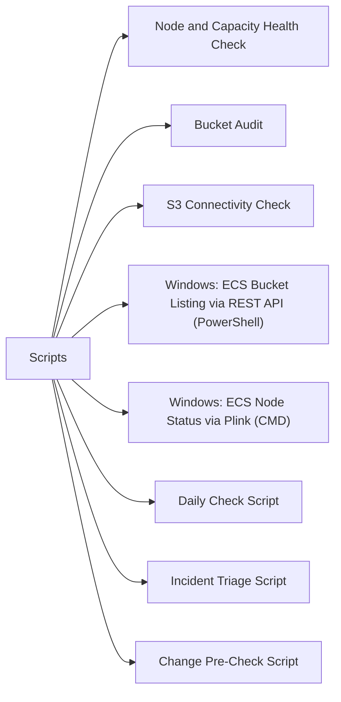

# Scripts

> Part of the [Dell ECS](../) reference.

---



## Node & Capacity Health Check

Queries the ECS Management REST API to check node status, cluster capacity utilisation, and active alerts. Warns if capacity exceeds 80% and goes critical above 90%.

~~~python
#!/usr/bin/env python3
# ecs_health_check.py — Node and capacity health check via ECS Management REST API
# Requirements: requests
# Usage: ECS_HOST=ecs01.example.com ECS_USER=sysadmin ECS_PASS=secret ./ecs_health_check.py

import os
import sys
import json
import requests
import urllib3

urllib3.disable_warnings(urllib3.exceptions.InsecureRequestWarning)

ECS_HOST = os.environ.get("ECS_HOST", "")
ECS_USER = os.environ.get("ECS_USER", "sysadmin")
ECS_PASS = os.environ.get("ECS_PASS", "")

WARN_PCT  = 80
CRIT_PCT  = 90
BASE_URL  = f"https://{ECS_HOST}:4443"

if not ECS_HOST or not ECS_PASS:
    print("ERROR: ECS_HOST and ECS_PASS must be set.", file=sys.stderr)
    sys.exit(1)


def authenticate(session):
    """Authenticate and return the auth token."""
    resp = session.get(f"{BASE_URL}/login", auth=(ECS_USER, ECS_PASS), verify=False)
    resp.raise_for_status()
    token = resp.headers.get("X-SDS-AUTH-TOKEN")
    if not token:
        raise RuntimeError("Authentication failed: no token in response headers.")
    return token


def api_get(session, token, path):
    """GET a JSON endpoint from the ECS Management API."""
    resp = session.get(
        f"{BASE_URL}{path}",
        headers={"X-SDS-AUTH-TOKEN": token, "Accept": "application/json"},
        verify=False,
    )
    resp.raise_for_status()
    return resp.json()


def main():
    exit_code = 0
    session = requests.Session()

    print("=" * 50)
    print("  ECS Health Check")
    print(f"  Host : {ECS_HOST}")
    print("=" * 50)

    # Authenticate
    try:
        token = authenticate(session)
        print("\n[AUTH] Login successful.\n")
    except Exception as e:
        print(f"[AUTH] FAILED: {e}")
        sys.exit(2)

    # --- Node health ---
    print("--- Node Status ---")
    try:
        nodes_data = api_get(session, token, "/vdc/nodes")
        nodes = nodes_data.get("node", [])
        for node in nodes:
            name  = node.get("nodename", node.get("ip", "unknown"))
            state = node.get("nodestatus", "UNKNOWN")
            marker = "" if state == "GOOD" else "  <<< DEGRADED"
            print(f"  {name:<30} {state}{marker}")
            if state != "GOOD":
                exit_code = max(exit_code, 2)
    except Exception as e:
        print(f"  ERROR fetching nodes: {e}")
        exit_code = max(exit_code, 2)

    # --- Capacity ---
    print("\n--- Capacity ---")
    try:
        cap = api_get(session, token, "/vdc/capacity")
        total_gb = int(cap.get("totalProvisioned_gb", 0))
        used_gb  = int(cap.get("usedCapacity_gb", 0))
        pct_used = (used_gb / total_gb * 100) if total_gb > 0 else 0
        print(f"  Total  : {total_gb:>8} GB")
        print(f"  Used   : {used_gb:>8} GB  ({pct_used:.1f}%)")
        if pct_used >= CRIT_PCT:
            print(f"  STATUS : CRITICAL — capacity at {pct_used:.1f}% (threshold {CRIT_PCT}%)")
            exit_code = max(exit_code, 2)
        elif pct_used >= WARN_PCT:
            print(f"  STATUS : WARNING  — capacity at {pct_used:.1f}% (threshold {WARN_PCT}%)")
            exit_code = max(exit_code, 1)
        else:
            print(f"  STATUS : OK")
    except Exception as e:
        print(f"  ERROR fetching capacity: {e}")
        exit_code = max(exit_code, 2)

    # --- Alerts ---
    print("\n--- Active Alerts ---")
    try:
        alerts_data = api_get(session, token, "/vdc/alerts")
        alerts = alerts_data.get("alert", [])
        if not alerts:
            print("  No active alerts.")
        for alert in alerts:
            severity = alert.get("severity", "UNKNOWN")
            desc     = alert.get("description", "no description")
            print(f"  [{severity}] {desc}")
            if severity in ("CRITICAL", "ERROR"):
                exit_code = max(exit_code, 2)
            elif severity in ("WARNING",):
                exit_code = max(exit_code, 1)
    except Exception as e:
        print(f"  ERROR fetching alerts: {e}")
        exit_code = max(exit_code, 2)

    # Logout
    try:
        session.get(
            f"{BASE_URL}/logout",
            headers={"X-SDS-AUTH-TOKEN": token},
            verify=False,
        )
    except Exception:
        pass

    print("\n" + "=" * 50)
    labels = {0: "OK", 1: "WARNING", 2: "CRITICAL"}
    print(f"  OVERALL STATUS: {labels.get(exit_code, 'UNKNOWN')}")
    print("=" * 50)
    sys.exit(exit_code)


if __name__ == "__main__":
    main()
~~~

#### How to run this script — step by step

**Before you start — what you need**
- Python 3.7 or newer installed on your computer (python.org)
- The `requests` library — install it by opening Command Prompt and running: `pip install requests`
- Network access to your ECS management interface on port 4443
- An ECS management username and password (typically `sysadmin`)

**Step 1 — Save the file**

1. Open **Notepad**
2. Copy the entire code block above
3. Click **File → Save As**
4. Change "Save as type" to **All Files**
5. Name it `ecs_health_check.py` and save it to your Desktop

**Step 2 — Fill in your details**

Open the saved file and change these values near the top (or pass them as environment variables):

| Variable | What to put | How to find it |
|---|---|---|
| `ECS_HOST` | IP address or hostname of your ECS management node | Ask your storage admin |
| `ECS_USER` | ECS management username | Default is `sysadmin` |
| `ECS_PASS` | Password | Ask your storage admin |

**Step 3 — Open a terminal**

- **For .py (Python):** Open Command Prompt. Install Python first from python.org if needed.

**Step 4 — Run the script**

```
cd C:\Users\YourName\Desktop
set ECS_HOST=192.168.10.50
set ECS_USER=sysadmin
set ECS_PASS=yourpassword
python ecs_health_check.py
```

**What you should see**

A report with three sections: Node Status (each node listed as GOOD or DEGRADED), Capacity (total GB, used GB, and percentage), and Active Alerts (list of any current alerts or "No active alerts"). The final line shows OVERALL STATUS: OK, WARNING, or CRITICAL.

---

## Bucket Audit

Authenticates to the ECS REST API, iterates all namespaces and their buckets, and prints a report of bucket name, owner, total size, and object count. Flags any bucket whose size exceeds a configurable threshold.

~~~python
#!/usr/bin/env python3
# ecs_bucket_audit.py — Audit all ECS namespaces and buckets via REST API
# Requirements: requests
# Usage: ECS_HOST=ecs01.example.com ECS_USER=sysadmin ECS_PASS=secret \
#        WARN_SIZE_GB=500 ./ecs_bucket_audit.py

import os
import sys
import requests
import urllib3

urllib3.disable_warnings(urllib3.exceptions.InsecureRequestWarning)

ECS_HOST    = os.environ.get("ECS_HOST", "")
ECS_USER    = os.environ.get("ECS_USER", "sysadmin")
ECS_PASS    = os.environ.get("ECS_PASS", "")
WARN_SIZE_GB = int(os.environ.get("WARN_SIZE_GB", "500"))
BASE_URL    = f"https://{ECS_HOST}:4443"

if not ECS_HOST or not ECS_PASS:
    print("ERROR: ECS_HOST and ECS_PASS must be set.", file=sys.stderr)
    sys.exit(1)


def authenticate(session):
    resp = session.get(f"{BASE_URL}/login", auth=(ECS_USER, ECS_PASS), verify=False)
    resp.raise_for_status()
    token = resp.headers.get("X-SDS-AUTH-TOKEN")
    if not token:
        raise RuntimeError("No auth token received.")
    return token


def api_get(session, token, path):
    resp = session.get(
        f"{BASE_URL}{path}",
        headers={"X-SDS-AUTH-TOKEN": token, "Accept": "application/json"},
        verify=False,
    )
    resp.raise_for_status()
    return resp.json()


def bytes_to_gb(b):
    try:
        return float(b) / (1024 ** 3)
    except (TypeError, ValueError):
        return 0.0


def main():
    session = requests.Session()

    print(f"{'NAMESPACE':<25}  {'BUCKET':<30}  {'OWNER':<20}  {'SIZE (GB)':>10}  {'OBJECTS':>10}  FLAG")
    print("-" * 110)

    token = authenticate(session)

    # List namespaces
    ns_data = api_get(session, token, "/object/namespaces")
    namespaces = ns_data.get("namespace", [])

    flagged = 0
    for ns in namespaces:
        ns_name = ns.get("name", "unknown")

        try:
            bucket_data = api_get(session, token, f"/object/bucket?namespace={ns_name}")
            buckets = bucket_data.get("object_bucket", [])
        except Exception as e:
            print(f"  ERROR listing buckets for namespace {ns_name}: {e}")
            continue

        for bucket in buckets:
            bname   = bucket.get("name", "unknown")
            owner   = bucket.get("owner", "unknown")
            size_b  = bucket.get("total_size", 0)
            obj_cnt = bucket.get("total_objects", 0)
            size_gb = bytes_to_gb(size_b)
            flag    = ""
            if size_gb >= WARN_SIZE_GB:
                flag = f"  <<< OVER {WARN_SIZE_GB} GB"
                flagged += 1
            print(f"{ns_name:<25}  {bname:<30}  {owner:<20}  {size_gb:>10.2f}  {obj_cnt:>10}  {flag}")

    # Logout
    try:
        session.get(f"{BASE_URL}/logout",
                    headers={"X-SDS-AUTH-TOKEN": token}, verify=False)
    except Exception:
        pass

    print("-" * 110)
    print(f"\nTotal buckets flagged over {WARN_SIZE_GB} GB threshold: {flagged}")
    sys.exit(0 if flagged == 0 else 1)


if __name__ == "__main__":
    main()
~~~

#### How to run this script — step by step

**Before you start — what you need**
- Python 3.7 or newer installed (python.org)
- The `requests` library: open Command Prompt and run `pip install requests`
- Network access to your ECS management interface on port 4443
- An ECS management username and password

**Step 1 — Save the file**

1. Open **Notepad**
2. Copy the entire code block above
3. Click **File → Save As**, change "Save as type" to **All Files**
4. Name it `ecs_bucket_audit.py` and save it to your Desktop

**Step 2 — Fill in your details**

| Variable | What to put | How to find it |
|---|---|---|
| `ECS_HOST` | IP or hostname of ECS management node | Ask your storage admin |
| `ECS_USER` | ECS management username | Default is `sysadmin` |
| `ECS_PASS` | Password | Ask your storage admin |
| `WARN_SIZE_GB` | Bucket size threshold in GB to flag | Default is `500` — change as needed |

**Step 3 — Open a terminal**

- **For .py (Python):** Open Command Prompt. Install Python first from python.org if needed.

**Step 4 — Run the script**

```
cd C:\Users\YourName\Desktop
set ECS_HOST=192.168.10.50
set ECS_USER=sysadmin
set ECS_PASS=yourpassword
python ecs_bucket_audit.py
```

**What you should see**

A wide table listing every bucket across all namespaces, with columns for namespace, bucket name, owner, size in GB, and object count. Any bucket over your threshold is flagged with `<<< OVER 500 GB`. The last line shows how many buckets were flagged.

---

## S3 Connectivity Check

Uses the AWS CLI with a custom `--endpoint-url` to test S3 connectivity to an ECS cluster. Performs list, put, get, and delete operations against a test bucket and prints PASS/FAIL for each step.

~~~bash
#!/bin/bash
# ecs_s3_check.sh — S3 connectivity check against Dell ECS using the AWS CLI
# Requirements: aws CLI installed and on PATH
# Usage:
#   ECS_S3_ENDPOINT=https://ecs01.example.com:9021
#   AWS_ACCESS_KEY_ID=mykey
#   AWS_SECRET_ACCESS_KEY=mysecret
#   TEST_BUCKET=s3-check-bucket
#   ./ecs_s3_check.sh

set -uo pipefail

ECS_S3_ENDPOINT="${ECS_S3_ENDPOINT:-}"
AWS_ACCESS_KEY_ID="${AWS_ACCESS_KEY_ID:-}"
AWS_SECRET_ACCESS_KEY="${AWS_SECRET_ACCESS_KEY:-}"
TEST_BUCKET="${TEST_BUCKET:-ecs-connectivity-test}"
TEST_KEY="ecs-check-$(date +%s).txt"
TEST_CONTENT="ECS S3 connectivity check object"
TMP_FILE=$(mktemp)
PASS=0
FAIL=0

export AWS_ACCESS_KEY_ID AWS_SECRET_ACCESS_KEY
# Prevent AWS CLI from looking for a region in config — ECS doesn't need it
export AWS_DEFAULT_REGION="us-east-1"

if [[ -z "$ECS_S3_ENDPOINT" || -z "$AWS_ACCESS_KEY_ID" || -z "$AWS_SECRET_ACCESS_KEY" ]]; then
  echo "ERROR: ECS_S3_ENDPOINT, AWS_ACCESS_KEY_ID, and AWS_SECRET_ACCESS_KEY must be set."
  exit 1
fi

S3_OPTS="--endpoint-url ${ECS_S3_ENDPOINT} --no-verify-ssl"

check() {
  local step="$1"
  local result="$2"
  if [[ "$result" -eq 0 ]]; then
    printf "  %-30s  PASS\n" "$step"
    PASS=$((PASS + 1))
  else
    printf "  %-30s  FAIL\n" "$step"
    FAIL=$((FAIL + 1))
  fi
}

echo "========================================"
echo "  ECS S3 Connectivity Check"
echo "  Endpoint : $ECS_S3_ENDPOINT"
echo "  Bucket   : $TEST_BUCKET"
echo "  $(date '+%Y-%m-%d %H:%M:%S')"
echo "========================================"
echo ""

# Step 1: List bucket
aws s3 ls "s3://${TEST_BUCKET}" $S3_OPTS > /dev/null 2>&1
check "List bucket" $?

# Step 2: Put test object
echo "$TEST_CONTENT" > "$TMP_FILE"
aws s3 cp "$TMP_FILE" "s3://${TEST_BUCKET}/${TEST_KEY}" $S3_OPTS > /dev/null 2>&1
check "Put test object" $?

# Step 3: Get test object back
GET_TMP=$(mktemp)
aws s3 cp "s3://${TEST_BUCKET}/${TEST_KEY}" "$GET_TMP" $S3_OPTS > /dev/null 2>&1
GET_RESULT=$?
if [[ $GET_RESULT -eq 0 ]]; then
  CONTENT=$(cat "$GET_TMP")
  if [[ "$CONTENT" == "$TEST_CONTENT" ]]; then
    check "Get test object (content match)" 0
  else
    check "Get test object (content match)" 1
  fi
else
  check "Get test object" $GET_RESULT
fi
rm -f "$GET_TMP"

# Step 4: Delete test object
aws s3 rm "s3://${TEST_BUCKET}/${TEST_KEY}" $S3_OPTS > /dev/null 2>&1
check "Delete test object" $?

# Cleanup
rm -f "$TMP_FILE"

echo ""
echo "========================================"
echo "  Results: $PASS passed, $FAIL failed"
echo "========================================"

[[ "$FAIL" -eq 0 ]] && exit 0 || exit 1
~~~

#### How to run this script — step by step

**Before you start — what you need**
- A Linux/macOS computer or Windows with Git Bash installed
- The AWS CLI installed — download from https://aws.amazon.com/cli/ (free, works on Windows)
- An ECS S3 access key and secret key (your storage admin creates these in the ECS portal)
- The name of a test bucket that already exists on ECS (or ask your admin to create one)

**Step 1 — Save the file**

1. Open **Notepad** or Git Bash editor
2. Copy the entire code block above
3. Save it as `ecs_s3_check.sh` on your Desktop

**Step 2 — Fill in your details**

| Variable | What to put | How to find it |
|---|---|---|
| `ECS_S3_ENDPOINT` | HTTPS URL and port for ECS S3, e.g. `https://192.168.10.50:9021` | Ask your storage admin |
| `AWS_ACCESS_KEY_ID` | Your ECS S3 access key | ECS portal under Object User management |
| `AWS_SECRET_ACCESS_KEY` | Your ECS S3 secret key | Shown once when the key is created |
| `TEST_BUCKET` | Name of an existing S3 bucket on ECS | Ask your storage admin |

**Step 3 — Open a terminal**

- **For .sh (Bash):** Install Git for Windows (gitforwindows.org) and open Git Bash.

**Step 4 — Run the script**

```
cd ~/Desktop
chmod +x ecs_s3_check.sh
export ECS_S3_ENDPOINT=https://192.168.10.50:9021
export AWS_ACCESS_KEY_ID=myaccesskey
export AWS_SECRET_ACCESS_KEY=mysecretkey
export TEST_BUCKET=my-test-bucket
./ecs_s3_check.sh
```

**What you should see**

Four lines, each showing PASS or FAIL: List bucket, Put test object, Get test object (content match), Delete test object. The final summary shows how many passed and failed. All four should be PASS for a healthy ECS S3 endpoint.

---

## Windows: ECS Bucket Listing via REST API (PowerShell)

Uses the ECS management REST API to authenticate and display zone statistics and a bucket listing — all from a PowerShell window. No Linux or SSH needed.

~~~powershell
# ecs_bucket_list.ps1 — ECS bucket listing via Management REST API (Windows PowerShell)
# Requires: PowerShell 5.1+ (built into Windows 10/11)
# Run: .\ecs_bucket_list.ps1

$EcsHost    = "192.168.1.100"   # Your ECS management node IP or hostname
$EcsMgmtUser = "sysadmin"       # ECS management username
$EcsMgmtPass = "yourpassword"   # ECS management password

# Trust self-signed certificates
if (-not ([System.Management.Automation.PSTypeName]'TrustAll').Type) {
    Add-Type @"
    using System.Net; using System.Security.Cryptography.X509Certificates;
    public class TrustAll : ICertificatePolicy {
        public bool CheckValidationResult(ServicePoint s, X509Certificate c, WebRequest r, int p) { return true; }
    }
"@
    [System.Net.ServicePointManager]::CertificatePolicy = New-Object TrustAll
}
[Net.ServicePointManager]::SecurityProtocol = [Net.SecurityProtocolType]::Tls12

$BaseUrl = "https://${EcsHost}:4443"

# Step 1: Authenticate and get token
Write-Host "Authenticating to ECS at $EcsHost ..."
try {
    $AuthResp = Invoke-WebRequest -Uri "$BaseUrl/login" `
        -Method GET `
        -Credential (New-Object System.Management.Automation.PSCredential($EcsMgmtUser, (ConvertTo-SecureString $EcsMgmtPass -AsPlainText -Force))) `
        -UseBasicParsing
    $Token = $AuthResp.Headers["X-SDS-AUTH-TOKEN"]
} catch {
    Write-Host "ERROR: Authentication failed - $($_.Exception.Message)"
    exit 1
}

if (-not $Token) {
    Write-Host "ERROR: No auth token received. Check credentials."
    exit 1
}
Write-Host "Authentication successful."
$Headers = @{ "X-SDS-AUTH-TOKEN" = $Token; "Accept" = "application/json" }

# Step 2: Get local zone stats
Write-Host ""
Write-Host "========================================"
Write-Host "  Local Zone Statistics"
Write-Host "========================================"
try {
    $ZoneResp = Invoke-RestMethod -Uri "$BaseUrl/dashboard/zones/localzone" -Headers $Headers
    Write-Host "  Zone Name      : $($ZoneResp.name)"
    Write-Host "  Node Count     : $($ZoneResp.numNodes)"
    Write-Host "  Total Capacity : $([math]::Round($ZoneResp.totalDiskSpace / 1GB, 2)) GB"
    Write-Host "  Used Capacity  : $([math]::Round($ZoneResp.usedDiskSpace / 1GB, 2)) GB"
} catch {
    Write-Host "  WARNING: Could not retrieve zone stats - $($_.Exception.Message)"
}

# Step 3: List namespaces and their buckets
Write-Host ""
Write-Host "========================================"
Write-Host "  Namespaces and Buckets"
Write-Host "========================================"
try {
    $NsResp = Invoke-RestMethod -Uri "$BaseUrl/object/namespaces" -Headers $Headers
    $Namespaces = $NsResp.namespace
    if (-not $Namespaces) {
        Write-Host "  No namespaces found."
    } else {
        foreach ($Ns in $Namespaces) {
            $NsName = $Ns.name
            Write-Host ""
            Write-Host "  Namespace: $NsName"
            try {
                $BktResp = Invoke-RestMethod -Uri "$BaseUrl/object/bucket?namespace=$NsName" -Headers $Headers
                $Buckets = $BktResp.object_bucket
                if (-not $Buckets) {
                    Write-Host "    (no buckets)"
                } else {
                    foreach ($Bkt in $Buckets) {
                        $SizeGb = [math]::Round($Bkt.total_size / 1GB, 2)
                        Write-Host "    - $($Bkt.name)  Owner: $($Bkt.owner)  Size: ${SizeGb} GB  Objects: $($Bkt.total_objects)"
                    }
                }
            } catch {
                Write-Host "    WARNING: Could not list buckets for $NsName"
            }
        }
    }
} catch {
    Write-Host "  ERROR: Could not retrieve namespaces - $($_.Exception.Message)"
}

Write-Host ""
Write-Host "========================================"
Write-Host "  Done."
Write-Host "========================================"
~~~

#### How to run this script — step by step

**Before you start — what you need**
- Windows 10 or 11 (PowerShell 5.1 is already installed)
- Network access to your ECS management node on port 4443
- An ECS management username and password

**Step 1 — Save the file**

1. Open **Notepad**
2. Copy the entire code block above
3. Click **File → Save As**
4. Change "Save as type" to **All Files**
5. Name it `ecs_bucket_list.ps1` and save it to your Desktop

**Step 2 — Fill in your details**

| Variable | What to put | How to find it |
|---|---|---|
| `$EcsHost` | IP address or hostname of your ECS management node | Ask your storage admin |
| `$EcsMgmtUser` | ECS management username | Default is `sysadmin` |
| `$EcsMgmtPass` | Password | Ask your storage admin |

**Step 3 — Open a terminal**

- **For .ps1 (PowerShell):** Press Windows key → type `PowerShell` → right-click → **Run as Administrator**

**Step 4 — Allow scripts to run (one-time)**

```
Set-ExecutionPolicy -Scope Process -ExecutionPolicy Bypass
```

**Step 5 — Run the script**

```
cd C:\Users\YourName\Desktop
.\ecs_bucket_list.ps1
```

**What you should see**

Local zone statistics showing total and used disk space, then a tree of each namespace with its buckets listed underneath. Each bucket line shows the bucket name, owner, size in GB, and object count.

---

## Windows: ECS Node Status via Plink (CMD)

Uses plink.exe to SSH into an ECS node and run disk and process checks to verify the node is healthy.

~~~batch
@echo off
REM ecs_node_check.bat — ECS node status check from Windows CMD
REM Uses plink.exe (PuTTY) to SSH into the ECS node.
REM Download PuTTY (includes plink.exe) from: https://www.putty.org
REM
REM FIRST TIME SETUP: Run this once to accept the host key:
REM   plink -ssh root@192.168.1.100
REM   Type 'y' when asked, then Ctrl+C.

set ECS_HOST=192.168.1.100
set SSH_USER=root
set PLINK=plink.exe

echo ========================================
echo   ECS Node Status Check
echo   Host: %ECS_HOST%
echo ========================================
echo.

echo --- Disk Usage (all filesystems) ---
%PLINK% -ssh -l %SSH_USER% -batch %ECS_HOST% "df -h"
if %ERRORLEVEL% neq 0 (
    echo ERROR: Could not connect to %ECS_HOST%. Check hostname and credentials.
    exit /b 1
)

echo.
echo --- ECS Data Directory Usage ---
%PLINK% -ssh -l %SSH_USER% -batch %ECS_HOST% "df -h /data/"

echo.
echo --- ECS Process Status ---
%PLINK% -ssh -l %SSH_USER% -batch %ECS_HOST% "viprexec -v"

echo.
echo ========================================
echo   Node check complete.
echo ========================================
~~~

#### How to run this script — step by step

**Before you start — what you need**
- A Windows PC with plink.exe installed (from the free PuTTY package at https://www.putty.org)
- SSH access to an ECS node — usually as `root` (ask your storage admin)
- Network access to the ECS node management IP

**Step 1 — Save the file**

1. Open **Notepad**
2. Copy the entire code block above
3. Click **File → Save As**, change "Save as type" to **All Files**
4. Name it `ecs_node_check.bat` and save it to your Desktop

**Step 2 — Fill in your details**

| Variable | What to put | How to find it |
|---|---|---|
| `ECS_HOST` | IP address of the ECS node to check | Ask your storage admin |
| `SSH_USER` | SSH username | Typically `root` for ECS nodes |
| `PLINK` | Full path to plink.exe if not in PATH | e.g. `C:\Program Files\PuTTY\plink.exe` |

**Step 3 — Accept the host key (one-time setup)**

Open Command Prompt and run:
```
plink -ssh root@192.168.10.50
```
Type `y` when prompted, then press Ctrl+C.

**Step 4 — Open a terminal**

- **For .bat (Command Prompt):** Open Command Prompt (Windows key → type `cmd`).

**Step 5 — Run the script**

```
cd C:\Users\YourName\Desktop
ecs_node_check.bat
```

**What you should see**

Three sections: overall disk usage for all filesystems (`df -h`), specific usage of the `/data/` directory where ECS stores object data, and the output of `viprexec -v` which shows the status of ECS services running on that node.

---

## Daily Check Script

Queries the ECS management API for zone health, counts buckets, checks data disk usage via SSH, and flags any node in an error state.

```bash
#!/bin/bash
# ecs_daily_check.sh — Daily operations check for Dell ECS
# Usage: ECS_HOST=ecs01.example.com SSH_USER=root \
#        ECS_MGMT_USER=sysadmin ECS_MGMT_PASS=secret ./ecs_daily_check.sh

set -uo pipefail

ECS_HOST="${ECS_HOST:-}"
SSH_USER="${SSH_USER:-root}"
ECS_MGMT_USER="${ECS_MGMT_USER:-sysadmin}"
ECS_MGMT_PASS="${ECS_MGMT_PASS:-}"

if [[ -z "$ECS_HOST" || -z "$ECS_MGMT_PASS" ]]; then
  echo "ERROR: ECS_HOST and ECS_MGMT_PASS must be set." >&2
  exit 1
fi

PASS=0
FAIL=0
MGMT_BASE="https://$ECS_HOST:4443"

check() {
  local label="$1"
  local rc="$2"
  if [[ "$rc" -eq 0 ]]; then
    printf "  %-50s  PASS\n" "$label"
    PASS=$((PASS + 1))
  else
    printf "  %-50s  FAIL\n" "$label"
    FAIL=$((FAIL + 1))
  fi
}

# Get auth token
TOKEN=$(curl -sk -u "$ECS_MGMT_USER:$ECS_MGMT_PASS" \
  -D - "$MGMT_BASE/login" | grep -i "X-SDS-AUTH-TOKEN" | awk '{print $2}' | tr -d '\r')

if [[ -z "$TOKEN" ]]; then
  echo "ERROR: Failed to authenticate to ECS management API." >&2
  exit 2
fi

echo "========================================"
echo "  ECS Daily Check — $ECS_HOST"
echo "  $(date '+%Y-%m-%d %H:%M:%S')"
echo "========================================"

# 1. Zone health
ZONE=$(curl -sk -H "X-SDS-AUTH-TOKEN: $TOKEN" -H "Accept: application/json" \
  "$MGMT_BASE/dashboard/zones/localzone")
echo "$ZONE" | grep -qi '"error"\|"FAILED"\|"unreachable"' \
  && check "zone health" 1 || check "zone health" 0

# 2. Node error state
NODES=$(curl -sk -H "X-SDS-AUTH-TOKEN: $TOKEN" -H "Accept: application/json" \
  "$MGMT_BASE/vdc/nodes")
ERROR_NODES=$(echo "$NODES" | grep -c '"nodestatus":"[^G]' || true)
[[ "$ERROR_NODES" -gt 0 ]] && check "nodes (no errors)" 1 || check "nodes (all GOOD)" 0

# 3. Bucket count
BUCKETS=$(curl -sk -u "$ECS_MGMT_USER:$ECS_MGMT_PASS" \
  --aws-sigv4 "" \
  "https://$ECS_HOST:9020" \
  -H "X-EMC-REST-CLIENT: true" \
  -H "X-SDS-AUTH-TOKEN: $TOKEN" 2>/dev/null || \
  aws s3api list-buckets --endpoint-url "https://$ECS_HOST:9020" \
    --no-verify-ssl 2>/dev/null | grep -c '"Name"' || echo "0")
echo "  [INFO] bucket count: $BUCKETS"
check "bucket listing reachable" $?

# 4. Data disk usage via SSH
DISK=$(ssh -o BatchMode=yes -o ConnectTimeout=10 "$SSH_USER@$ECS_HOST" "df -h /data/" 2>&1)
echo "$DISK"
HIGH=$(echo "$DISK" | awk 'NR>1 {gsub(/%/,"",$5); if($5+0 > 80) print $5}' | wc -l | tr -d ' ')
[[ "$HIGH" -gt 0 ]] && check "data disk usage (<80%)" 1 || check "data disk usage (<80%)" 0

# Logout
curl -sk -H "X-SDS-AUTH-TOKEN: $TOKEN" "$MGMT_BASE/logout" > /dev/null

echo "========================================"
echo "  PASS: $PASS   FAIL: $FAIL"
[[ "$FAIL" -eq 0 ]] && echo "  STATUS: OK" && exit 0 || echo "  STATUS: DEGRADED" && exit 1
```

---

## Incident Triage Script

Captures ECS zone status, disk usage, bucket count, and recent alerts from the management API to a timestamped file for support handoff.

```bash
#!/bin/bash
# ecs_triage.sh — Incident triage data capture for Dell ECS
# Usage: ECS_HOST=ecs01.example.com SSH_USER=root \
#        ECS_MGMT_USER=sysadmin ECS_MGMT_PASS=secret ./ecs_triage.sh

ECS_HOST="${ECS_HOST:-}"
SSH_USER="${SSH_USER:-root}"
ECS_MGMT_USER="${ECS_MGMT_USER:-sysadmin}"
ECS_MGMT_PASS="${ECS_MGMT_PASS:-}"

if [[ -z "$ECS_HOST" || -z "$ECS_MGMT_PASS" ]]; then
  echo "ERROR: ECS_HOST and ECS_MGMT_PASS must be set." >&2
  exit 1
fi

OUTFILE="ecs_triage_$(date '+%Y%m%d_%H%M%S').txt"
MGMT_BASE="https://$ECS_HOST:4443"

TOKEN=$(curl -sk -u "$ECS_MGMT_USER:$ECS_MGMT_PASS" \
  -D - "$MGMT_BASE/login" | grep -i "X-SDS-AUTH-TOKEN" | awk '{print $2}' | tr -d '\r')

if [[ -z "$TOKEN" ]]; then
  echo "ERROR: Authentication failed." >&2
  exit 2
fi

section() {
  echo "" >> "$OUTFILE"
  echo "========================================" >> "$OUTFILE"
  echo "  $1" >> "$OUTFILE"
  echo "========================================" >> "$OUTFILE"
}

apicall() {
  curl -sk -H "X-SDS-AUTH-TOKEN: $TOKEN" -H "Accept: application/json" "$MGMT_BASE$1"
}

{
  echo "ECS Triage Capture"
  echo "Host : $ECS_HOST"
  echo "Date : $(date '+%Y-%m-%d %H:%M:%S')"
} > "$OUTFILE"

section "ZONE STATUS";     apicall "/dashboard/zones/localzone" >> "$OUTFILE" 2>&1
section "NODES";           apicall "/vdc/nodes"                 >> "$OUTFILE" 2>&1
section "CAPACITY";        apicall "/vdc/capacity"              >> "$OUTFILE" 2>&1
section "ALERTS";          apicall "/vdc/alerts"                >> "$OUTFILE" 2>&1
section "NAMESPACES";      apicall "/object/namespaces"         >> "$OUTFILE" 2>&1

section "DISK USAGE (SSH)"
ssh -o BatchMode=yes -o ConnectTimeout=10 "$SSH_USER@$ECS_HOST" "df -h /data/" >> "$OUTFILE" 2>&1

# Logout
curl -sk -H "X-SDS-AUTH-TOKEN: $TOKEN" "$MGMT_BASE/logout" > /dev/null

echo "Triage data written to: $OUTFILE"
```

---

## Change Pre-Check Script

Confirms ECS zone is healthy, all nodes are up, data disk usage is below 80%, and no active alerts exist before a maintenance window — exits 2 on any failure.

```bash
#!/bin/bash
# ecs_precheck.sh — Pre-change validation for Dell ECS
# Usage: ECS_HOST=ecs01.example.com SSH_USER=root \
#        ECS_MGMT_USER=sysadmin ECS_MGMT_PASS=secret ./ecs_precheck.sh

set -uo pipefail

ECS_HOST="${ECS_HOST:-}"
SSH_USER="${SSH_USER:-root}"
ECS_MGMT_USER="${ECS_MGMT_USER:-sysadmin}"
ECS_MGMT_PASS="${ECS_MGMT_PASS:-}"

if [[ -z "$ECS_HOST" || -z "$ECS_MGMT_PASS" ]]; then
  echo "ERROR: ECS_HOST and ECS_MGMT_PASS must be set." >&2
  exit 1
fi

ISSUES=0
MGMT_BASE="https://$ECS_HOST:4443"

TOKEN=$(curl -sk -u "$ECS_MGMT_USER:$ECS_MGMT_PASS" \
  -D - "$MGMT_BASE/login" | grep -i "X-SDS-AUTH-TOKEN" | awk '{print $2}' | tr -d '\r')

[[ -z "$TOKEN" ]] && echo "ERROR: Authentication failed." >&2 && exit 2

apicall() {
  curl -sk -H "X-SDS-AUTH-TOKEN: $TOKEN" -H "Accept: application/json" "$MGMT_BASE$1"
}

fail() { echo "  FAIL: $1"; ISSUES=$((ISSUES + 1)); }
pass() { echo "  PASS: $1"; }

echo "========================================"
echo "  ECS Pre-Change Check — $ECS_HOST"
echo "  $(date '+%Y-%m-%d %H:%M:%S')"
echo "========================================"

# 1. Zone healthy
ZONE=$(apicall "/dashboard/zones/localzone")
echo "$ZONE" | grep -qi '"error"\|"FAILED"\|"unreachable"' \
  && fail "zone reports errors" || pass "zone healthy"

# 2. All nodes up
NODES=$(apicall "/vdc/nodes")
ERROR_NODES=$(echo "$NODES" | grep -c '"nodestatus":"[^G]' || true)
[[ "$ERROR_NODES" -gt 0 ]] && fail "$ERROR_NODES node(s) not GOOD" || pass "all nodes up"

# 3. No active alerts
ALERTS=$(apicall "/vdc/alerts")
ALERT_COUNT=$(echo "$ALERTS" | grep -c '"severity"' || true)
[[ "$ALERT_COUNT" -gt 0 ]] && fail "$ALERT_COUNT active alert(s)" || pass "no active alerts"

# 4. Disk usage < 80%
DISK=$(ssh -o BatchMode=yes -o ConnectTimeout=10 "$SSH_USER@$ECS_HOST" "df -h /data/" 2>&1)
HIGH=$(echo "$DISK" | awk 'NR>1 {gsub(/%/,"",$5); if($5+0 >= 80) print $5}' | wc -l | tr -d ' ')
[[ "$HIGH" -gt 0 ]] && fail "data disk usage >= 80%" || pass "data disk usage < 80%"

curl -sk -H "X-SDS-AUTH-TOKEN: $TOKEN" "$MGMT_BASE/logout" > /dev/null

echo "========================================"
if [[ "$ISSUES" -gt 0 ]]; then
  echo "  PRE-CHECK FAILED — $ISSUES issue(s). Do not proceed."
  exit 2
fi
echo "  PRE-CHECK PASSED — Safe to proceed."
exit 0
```

---

## Post-Change Validation Script

Runs the same checks as the pre-check after maintenance and additionally verifies the S3 endpoint responds and the bucket count is unchanged.

```bash
#!/bin/bash
# ecs_postcheck.sh — Post-change validation for Dell ECS
# Usage: ECS_HOST=ecs01.example.com SSH_USER=root \
#        ECS_MGMT_USER=sysadmin ECS_MGMT_PASS=secret \
#        BEFORE_BUCKET_COUNT=42 ./ecs_postcheck.sh

set -uo pipefail

ECS_HOST="${ECS_HOST:-}"
SSH_USER="${SSH_USER:-root}"
ECS_MGMT_USER="${ECS_MGMT_USER:-sysadmin}"
ECS_MGMT_PASS="${ECS_MGMT_PASS:-}"
BEFORE_BUCKET_COUNT="${BEFORE_BUCKET_COUNT:-}"

if [[ -z "$ECS_HOST" || -z "$ECS_MGMT_PASS" ]]; then
  echo "ERROR: ECS_HOST and ECS_MGMT_PASS must be set." >&2
  exit 1
fi

ISSUES=0
MGMT_BASE="https://$ECS_HOST:4443"

TOKEN=$(curl -sk -u "$ECS_MGMT_USER:$ECS_MGMT_PASS" \
  -D - "$MGMT_BASE/login" | grep -i "X-SDS-AUTH-TOKEN" | awk '{print $2}' | tr -d '\r')

[[ -z "$TOKEN" ]] && echo "ERROR: Authentication failed." >&2 && exit 2

apicall() {
  curl -sk -H "X-SDS-AUTH-TOKEN: $TOKEN" -H "Accept: application/json" "$MGMT_BASE$1"
}

fail() { echo "  FAIL: $1"; ISSUES=$((ISSUES + 1)); }
pass() { echo "  PASS: $1"; }

echo "========================================"
echo "  ECS Post-Change Validation — $ECS_HOST"
echo "  $(date '+%Y-%m-%d %H:%M:%S')"
echo "========================================"

# 1. Zone healthy
ZONE=$(apicall "/dashboard/zones/localzone")
echo "$ZONE" | grep -qi '"error"\|"FAILED"\|"unreachable"' \
  && fail "zone reports errors" || pass "zone healthy"

# 2. All nodes up
NODES=$(apicall "/vdc/nodes")
ERROR_NODES=$(echo "$NODES" | grep -c '"nodestatus":"[^G]' || true)
[[ "$ERROR_NODES" -gt 0 ]] && fail "$ERROR_NODES node(s) not GOOD" || pass "all nodes up"

# 3. No active alerts
ALERTS=$(apicall "/vdc/alerts")
ALERT_COUNT=$(echo "$ALERTS" | grep -c '"severity"' || true)
[[ "$ALERT_COUNT" -gt 0 ]] && fail "$ALERT_COUNT active alert(s)" || pass "no active alerts"

# 4. Disk usage < 80%
DISK=$(ssh -o BatchMode=yes -o ConnectTimeout=10 "$SSH_USER@$ECS_HOST" "df -h /data/" 2>&1)
HIGH=$(echo "$DISK" | awk 'NR>1 {gsub(/%/,"",$5); if($5+0 >= 80) print $5}' | wc -l | tr -d ' ')
[[ "$HIGH" -gt 0 ]] && fail "data disk usage >= 80%" || pass "data disk usage < 80%"

# 5. S3 endpoint responds
S3_RC=$(curl -sk -o /dev/null -w "%{http_code}" "https://$ECS_HOST:9020" 2>/dev/null || echo "000")
[[ "$S3_RC" =~ ^(200|403|400)$ ]] && pass "S3 endpoint responds (HTTP $S3_RC)" || fail "S3 endpoint not responding (HTTP $S3_RC)"

# 6. Bucket count unchanged
if [[ -n "$BEFORE_BUCKET_COUNT" ]]; then
  NS=$(apicall "/object/namespaces")
  FIRST_NS=$(echo "$NS" | grep -oP '"name"\s*:\s*"\K[^"]+' | head -1)
  AFTER_COUNT=$(apicall "/object/bucket?namespace=$FIRST_NS" | grep -c '"name"' || echo "unknown")
  echo "  bucket count: before=$BEFORE_BUCKET_COUNT after=$AFTER_COUNT"
  [[ "$AFTER_COUNT" == "$BEFORE_BUCKET_COUNT" ]] \
    && pass "bucket count unchanged" \
    || fail "bucket count changed (before=$BEFORE_BUCKET_COUNT after=$AFTER_COUNT)"
else
  echo "  INFO: BEFORE_BUCKET_COUNT not set — skipping bucket count check"
fi

curl -sk -H "X-SDS-AUTH-TOKEN: $TOKEN" "$MGMT_BASE/logout" > /dev/null

echo "========================================"
if [[ "$ISSUES" -gt 0 ]]; then
  echo "  POST-CHECK FAILED — $ISSUES issue(s). Investigate before closing change."
  exit 2
fi
echo "  POST-CHECK PASSED — All checks healthy."
exit 0
```

---

## Health Check Script

Cron-safe summary checking zone health, node count, data disk usage, and S3 API reachability — exits 0 for OK, 1 for WARN, 2 for CRIT.

```bash
#!/bin/bash
# ecs_health.sh — Cron-safe health check for Dell ECS
# Usage: ECS_HOST=ecs01.example.com SSH_USER=root \
#        ECS_MGMT_USER=sysadmin ECS_MGMT_PASS=secret ./ecs_health.sh
# Exit codes: 0=OK  1=WARN  2=CRIT

ECS_HOST="${ECS_HOST:-}"
SSH_USER="${SSH_USER:-root}"
ECS_MGMT_USER="${ECS_MGMT_USER:-sysadmin}"
ECS_MGMT_PASS="${ECS_MGMT_PASS:-}"

if [[ -z "$ECS_HOST" || -z "$ECS_MGMT_PASS" ]]; then
  echo "CRIT: ECS_HOST and ECS_MGMT_PASS must be set" >&2
  exit 2
fi

MGMT_BASE="https://$ECS_HOST:4443"
STATE=0

TOKEN=$(curl -sk -u "$ECS_MGMT_USER:$ECS_MGMT_PASS" \
  -D - "$MGMT_BASE/login" | grep -i "X-SDS-AUTH-TOKEN" | awk '{print $2}' | tr -d '\r')

if [[ -z "$TOKEN" ]]; then
  echo "CRIT: ECS authentication failed"
  exit 2
fi

apicall() {
  curl -sk -H "X-SDS-AUTH-TOKEN: $TOKEN" -H "Accept: application/json" "$MGMT_BASE$1"
}

flag() {
  local level="$1"; shift
  echo "  [$level] $*"
  case "$level" in
    CRIT) [[ "$STATE" -lt 2 ]] && STATE=2 ;;
    WARN) [[ "$STATE" -lt 1 ]] && STATE=1 ;;
  esac
}

echo "ECS Health — $ECS_HOST — $(date '+%Y-%m-%d %H:%M:%S')"

# Zone health
ZONE=$(apicall "/dashboard/zones/localzone")
echo "$ZONE" | grep -qi '"error"\|"FAILED"\|"unreachable"' \
  && flag CRIT "zone health error" \
  || echo "  [OK] zone healthy"

# Node count
NODES=$(apicall "/vdc/nodes")
NODE_COUNT=$(echo "$NODES" | grep -c '"nodename"' || true)
ERROR_NODES=$(echo "$NODES" | grep -c '"nodestatus":"[^G]' || true)
echo "  [INFO] nodes: $NODE_COUNT total, $ERROR_NODES not GOOD"
[[ "$ERROR_NODES" -gt 0 ]] && flag CRIT "$ERROR_NODES node(s) not GOOD"

# Disk usage
DISK=$(ssh -o BatchMode=yes -o ConnectTimeout=10 "$SSH_USER@$ECS_HOST" "df -h /data/" 2>&1)
HIGH=$(echo "$DISK" | awk 'NR>1 {gsub(/%/,"",$5); if($5+0 >= 85) print $5}' | wc -l | tr -d ' ')
WARN=$(echo "$DISK" | awk 'NR>1 {gsub(/%/,"",$5); if($5+0 >= 80 && $5+0 < 85) print $5}' | wc -l | tr -d ' ')
[[ "$HIGH" -gt 0 ]] && flag CRIT "data disk >= 85%"
[[ "$WARN" -gt 0 ]] && flag WARN "data disk >= 80%"
[[ "$HIGH" -eq 0 && "$WARN" -eq 0 ]] && echo "  [OK] data disk usage OK"

# S3 API reachability
S3_RC=$(curl -sk -o /dev/null -w "%{http_code}" "https://$ECS_HOST:9020" 2>/dev/null || echo "000")
[[ "$S3_RC" =~ ^(200|403|400)$ ]] \
  && echo "  [OK] S3 endpoint reachable (HTTP $S3_RC)" \
  || flag CRIT "S3 endpoint unreachable (HTTP $S3_RC)"

curl -sk -H "X-SDS-AUTH-TOKEN: $TOKEN" "$MGMT_BASE/logout" > /dev/null

LABELS=( OK WARN CRIT )
echo "OVERALL: ${LABELS[$STATE]}"
exit "$STATE"
```
