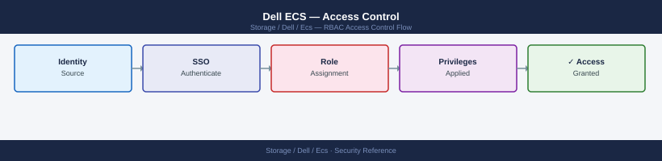
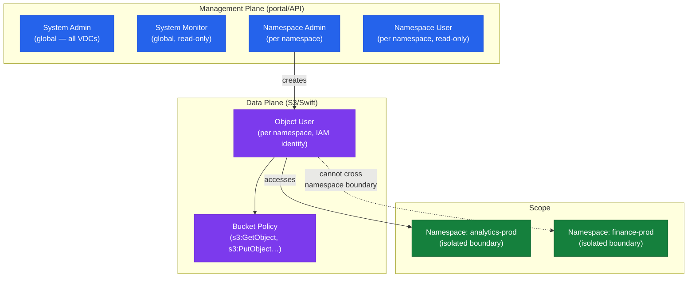

---
tags:
  - dell
  - security
---
# Dell ECS — Access Control


<div class="kb-summary">
Access Control reference covering RBAC, Namespace Isolation, Compliance, Access Review Procedure.

*Applies to: ECS 3.x*
</div>



## Before you begin

- **Access:** Storage admin credentials (cluster admin or equivalent)
- **Change management:** security changes require CAB approval in most environments
- **Rollback plan:** document current state before any security control change
- **Testing:** validate in a non-production environment first where possible

---

## RBAC

ECS implements role-based access at two levels: system management and object (data) access.



### System Management Roles

| Role | Scope | Permissions |
|---|---|---|
| System Admin | Global | Full system configuration, hardware management, VDC management, user management, software upgrades |
| System Monitor | Global | Read-only access to system health, capacity, alerts, and monitoring dashboards |
| Namespace Admin | Per namespace | Create and manage buckets, IAM users, and lifecycle policies within the assigned namespace |
| Namespace User | Per namespace | Read-only namespace management; cannot create, modify, or delete buckets or IAM users |

Management roles are assigned to users in ECS Portal → Users → Management Users. Local users or LDAP-mapped users can be assigned roles.

### Object (Data) Access via IAM Policies

ECS supports S3-style IAM bucket policies and object ACLs for controlling data-plane access. Object users authenticate with S3 access key / secret key pairs and are restricted by bucket policies and ACLs.

**S3 actions supported in bucket policies:**

| Action | Description |
|---|---|
| `s3:ListBucket` | List objects in a bucket |
| `s3:GetObject` | Download an object |
| `s3:PutObject` | Upload an object |
| `s3:DeleteObject` | Delete an object |
| `s3:GetBucketVersioning` | Read versioning configuration |
| `s3:PutBucketVersioning` | Modify versioning configuration |
| `s3:GetLifecycleConfiguration` | Read lifecycle policy |
| `s3:PutLifecycleConfiguration` | Create or modify lifecycle policy |
| `s3:GetBucketPolicy` | Read bucket policy |
| `s3:PutBucketPolicy` | Create or modify bucket policy |
| `s3:GetObjectRetention` | Read Object Lock retention on an object |
| `s3:PutObjectRetention` | Set Object Lock retention on an object |
| `s3:BypassGovernanceRetention` | Override Governance-mode Object Lock (privileged; never assign to app users) |

**Principle of least privilege — apply these rules:**

- Grant the minimum required S3 actions per application; never use `Action: "*"` on production buckets
- Prefer bucket policies over ACLs for maintainability and auditability
- Create one IAM object user per application or service; never share S3 credentials between applications
- Scope bucket policies to specific object user principals using `urn:ecs:iam::<namespace>:user/<username>` format

### Example Bucket Policies

**Read-only access for a reporting application:**

```json
{
  "Version": "2012-10-17",
  "Statement": [
    {
      "Sid": "ReadOnly",
      "Effect": "Allow",
      "Principal": {
        "AWS": "urn:ecs:iam::analytics-prod:user/svc-reports-prod"
      },
      "Action": [
        "s3:ListBucket",
        "s3:GetObject"
      ],
      "Resource": [
        "arn:aws:s3:::analytics-prod-raw",
        "arn:aws:s3:::analytics-prod-raw/*"
      ]
    }
  ]
}
```

**Read-write access for an application with lifecycle management:**

```json
{
  "Version": "2012-10-17",
  "Statement": [
    {
      "Sid": "AppReadWrite",
      "Effect": "Allow",
      "Principal": {
        "AWS": "urn:ecs:iam::analytics-prod:user/svc-spark-prod"
      },
      "Action": [
        "s3:ListBucket",
        "s3:GetObject",
        "s3:PutObject",
        "s3:DeleteObject",
        "s3:GetBucketVersioning",
        "s3:GetLifecycleConfiguration"
      ],
      "Resource": [
        "arn:aws:s3:::analytics-prod-raw",
        "arn:aws:s3:::analytics-prod-raw/*"
      ]
    }
  ]
}
```

**Deny all unless from a specific CIDR (network-based restriction):**

```json
{
  "Version": "2012-10-17",
  "Statement": [
    {
      "Sid": "DenyExternalAccess",
      "Effect": "Deny",
      "Principal": "*",
      "Action": "s3:*",
      "Resource": [
        "arn:aws:s3:::compliance-immutable",
        "arn:aws:s3:::compliance-immutable/*"
      ],
      "Condition": {
        "NotIpAddress": {
          "aws:SourceIp": ["10.10.0.0/16", "10.20.0.0/16"]
        }
      }
    }
  ]
}
```

### Applying and Reviewing Bucket Policies

```bash
# Apply a bucket policy from a local JSON file
aws s3api put-bucket-policy \
  --bucket analytics-prod-raw \
  --policy file://bucket-policy.json \
  --endpoint-url https://<ecs-s3-endpoint>:9021 \
  --no-verify-ssl \
  --profile ecs

# View the current bucket policy
aws s3api get-bucket-policy \
  --bucket analytics-prod-raw \
  --endpoint-url https://<ecs-s3-endpoint>:9021 \
  --no-verify-ssl \
  --profile ecs

# Delete a bucket policy (reverts to default — namespace-level IAM only)
aws s3api delete-bucket-policy \
  --bucket analytics-prod-raw \
  --endpoint-url https://<ecs-s3-endpoint>:9021 \
  --no-verify-ssl \
  --profile ecs

# View bucket ACL
aws s3api get-bucket-acl \
  --bucket analytics-prod-raw \
  --endpoint-url https://<ecs-s3-endpoint>:9021 \
  --no-verify-ssl \
  --profile ecs
```

## Namespace Isolation

Namespaces are the primary multi-tenancy isolation boundary in ECS. Each namespace has independent:

- IAM object users and S3 access keys
- Replication group assignment (data placement)
- Quota (capacity limit)
- Encryption-at-rest configuration
- LDAP/AD authentication domain
- Bucket collection

An object user in namespace `analytics-prod` cannot access buckets in namespace `finance-prod` regardless of bucket policy — namespace boundaries are enforced at the data service layer.

**Best practices for namespace design:**

| Practice | Rationale |
|---|---|
| One namespace per team or application | Prevents cross-team capacity contention and simplifies IAM auditing |
| Set a hard quota on every namespace | Prevents one tenant consuming cluster-wide capacity |
| Use separate IAM users per application | Enables per-application access revocation without impacting other apps |
| Do not place compliance and non-compliance data in the same namespace | Compliance namespaces have stricter controls that affect all buckets in the namespace |
| Document namespace-to-team ownership in CMDB | Required for capacity chargeback and access review processes |

## Compliance

| Framework | Relevant ECS Capability |
|---|---|
| WORM / SEC 17a-4 | S3 Object Lock in Compliance mode; immutable retention enforced at object level; cannot be shortened or removed even by sysadmin |
| GDPR | Object-level deletion capability for data subject requests; namespace-scoped data residency via VDC assignment; access logging for audit |
| PCI DSS | Encryption at rest (AES-256) and in transit (TLS 1.2+); audit logging; IAM least-privilege enforcement; network segmentation of management and data endpoints |
| HIPAA | Encryption at rest; access logging per bucket; RBAC namespace isolation; automatic retention via Object Lock |

For compliance deployments:

- Use **Compliance mode** Object Lock, not Governance mode — Governance mode can be overridden by a user with `s3:BypassGovernanceRetention`; Compliance mode cannot be shortened or deleted by any user
- Enable bucket-level access logging and forward logs to a SIEM
- Restrict namespace and bucket creation to authorized change records
- Review IAM user access quarterly; remove users that are no longer associated with active applications

## Access Review Procedure

Perform quarterly access reviews for all ECS namespaces:

```bash
# List all object users per namespace
ecscli user list-object-users --namespace <namespace>

# List access keys per user (key IDs only)
ecscli user secret-key list --namespace <namespace> --name <username>

# Check bucket policy for each bucket
aws s3api get-bucket-policy \
  --bucket <bucket> \
  --endpoint-url https://<ecs-endpoint>:9021 \
  --no-verify-ssl \
  --profile ecs

# List all namespaces
ecscli namespace list
```

For each access review:
1. Confirm each object user maps to an active application or service in the CMDB
2. Confirm bucket policies grant only the minimum required actions
3. Remove object users for decommissioned applications
4. Rotate any access keys that have not been rotated within 12 months
5. Verify no object user has wildcard `s3:*` permissions on production buckets

---

## See also

- [Ecs — Authentication](authentication/)
- [Ecs — Hardening](hardening/)
- [Ecs — Encryption](encryption/)
