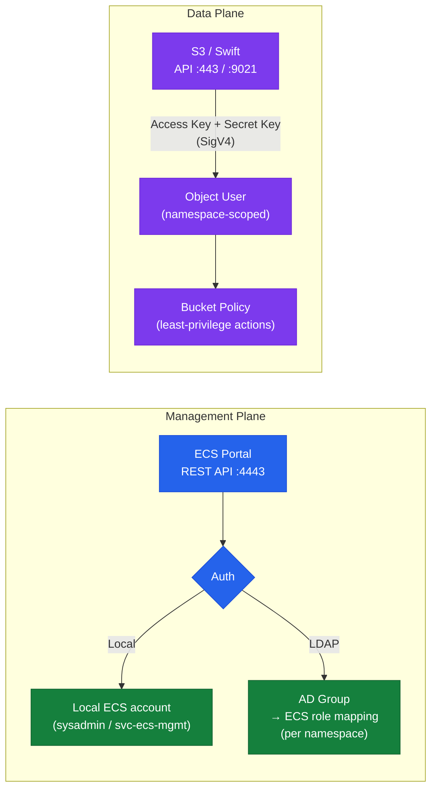

# Dell ECS — Authentication


<div class="kb-summary">
Authentication reference covering User Model Overview, Local Accounts, LDAP / Active Directory, S3 Object User Authentication, Audit Logging and 1 more sections.
</div>

## User Model Overview

ECS has two distinct authentication contexts: **management plane** (portal/API administration) and **data plane** (S3/Swift/CAS object access). These use different identity sources and credential types.



| Context | User Type | Credential Type | Identity Source |
|---|---|---|---|
| Management plane | System Admin, System Monitor | Username + password | Local ECS accounts or LDAP/AD |
| Namespace management | Namespace Admin, Namespace User | Username + password | Local ECS accounts or LDAP/AD (per namespace) |
| Data plane (S3/Swift) | Object User | Access Key + Secret Key | Local ECS only (S3 sigv4) |

## Local Accounts

ECS provides built-in local management accounts:

- **sysadmin**: Default system administrator account. Change the default password immediately after deployment and restrict use to break-glass scenarios only. Do not embed `sysadmin` credentials in automation scripts.
- **Management service accounts**: Create named service accounts (e.g., `svc-ecs-mgmt`) for automation and API access via ECS Portal → Users → Management Users → Add User.

**Password policy recommendations:**

| Setting | Recommendation |
|---|---|
| Minimum length | 16 characters |
| Complexity | Mixed case, digits, symbols |
| Rotation | Every 90 days for management accounts |
| Break-glass accounts | `sysadmin` stored in a physical vault or privileged access workstation (PAW); audited on each use |

```bash
# Authenticate to the Management REST API with a named service account
TOKEN=$(curl -sk -u "svc-ecs-mgmt:<password>" \
  -D - "https://<ecs-node>:4443/login" \
  | grep "X-SDS-AUTH-TOKEN" | awk '{print $2}' | tr -d '\r')

# Verify which user the token belongs to
curl -s -k -H "X-SDS-AUTH-TOKEN: $TOKEN" \
  "https://<ecs-node>:4443/user/whoami" | python3 -m json.tool

# Invalidate the session token when done
curl -s -k -H "X-SDS-AUTH-TOKEN: $TOKEN" \
  "https://<ecs-node>:4443/logout"
```

## LDAP / Active Directory

ECS can delegate management user authentication to an external LDAP or Active Directory service for namespace-level access. This is configured per namespace and enables existing AD groups to be mapped to ECS roles without creating individual local accounts.

**Key facts:**
- LDAP integration applies to management console users only — S3 object users always authenticate with local access keys
- LDAP is configured independently per namespace; different namespaces can reference different LDAP domains
- Supported protocols: LDAP (TCP 389) and LDAPS (TCP 636)
- Group-to-role mapping is defined per namespace: AD groups map to Namespace Admin or Namespace User roles

**Configuration steps:**

1. Navigate to ECS Portal → Manage → Namespaces → select namespace → Edit
2. Open the **Authentication Domain** section
3. Enter the LDAP server address and port (use LDAPS port 636 for encrypted LDAP)
4. Enter the Base DN for the user search (e.g., `OU=ECS-Users,DC=corp,DC=example,DC=com`)
5. Enter bind credentials (a read-only service account in AD with permission to search the OU)
6. Map AD group names to ECS namespace roles:
   - `ECS-Namespace-Admins` → Namespace Admin
   - `ECS-Namespace-Viewers` → Namespace User
7. Use the **Test** button to validate authentication before saving

**LDAP configuration parameters:**

| Parameter | Description | Example |
|---|---|---|
| Server URL | LDAP/LDAPS endpoint | `ldaps://dc01.corp.example.com:636` |
| Base DN | Root of the user search | `OU=ServiceAccounts,DC=corp,DC=example,DC=com` |
| Bind DN | Service account for LDAP queries | `CN=svc-ecs-ldap,OU=ServiceAccounts,DC=corp,DC=example,DC=com` |
| Bind password | Password for the bind account | Stored in ECS (encrypted at rest) |
| Group attribute | Attribute containing group membership | `memberOf` |
| Name attribute | Attribute containing the username | `sAMAccountName` |

## S3 Object User Authentication

S3 access to ECS is authenticated using AWS Signature Version 4 (SigV4) with access key / secret key pairs (IAM-style):

- Object users and their keys are managed per namespace in ECS Portal → Manage → Users → Object Users
- Each application or service should have its own dedicated object user — do not share S3 credentials
- Secret keys are shown only once at creation; store them immediately in a secrets manager (HashiCorp Vault, AWS Secrets Manager, or equivalent)
- Rotate secret keys every 12 months per policy, or immediately upon suspected compromise

**Key lifecycle procedure:**

```bash
# Step 1: Create a new secret key alongside the existing one
ecscli user secret-key create \
  --namespace analytics-prod \
  --name svc-spark-prod
# Record the new access key and secret key from the output

# Step 2: Update the application or secrets manager with the new key
# Step 3: Verify the application is successfully using the new key (check S3 access logs)

# Step 4: Delete the old key (replace <old-key-id> with the key ID from list output)
ecscli user secret-key list \
  --namespace analytics-prod \
  --name svc-spark-prod
ecscli user secret-key delete \
  --namespace analytics-prod \
  --name svc-spark-prod \
  --secret-key <old-key-id>
```

**Object user restrictions:**

| Restriction | Detail |
|---|---|
| Namespace scope | Object users exist within a single namespace; they cannot cross namespace boundaries |
| Bucket policies | Use bucket policies to restrict which buckets and actions an object user can access |
| Maximum keys per user | ECS supports up to 2 active access keys per object user — enables zero-downtime key rotation |
| No console access | Object users cannot log in to the ECS Portal; they are data-plane only |

## Audit Logging

ECS generates audit logs for all administrative actions and optionally for object access.

**Management audit log:**
- Location: ECS Portal → Monitoring → Audit
- Covers: namespace/bucket create/modify/delete, IAM changes, user login/logout, system configuration changes
- Export as CSV or JSON for compliance reviews
- Forward via syslog to SIEM for real-time alerting on privileged actions

**Object access log:**
- Enable per-bucket: ECS Portal → Manage → Buckets → select bucket → Edit → Access Logging
- Access log records are written to a designated audit bucket (must exist before enabling)
- Log format: S3-compatible access log format (compatible with standard log parsing tools)
- Retention: ECS does not enforce audit log retention — configure lifecycle policies on the audit bucket

**Syslog forwarding:**

```yaml
ECS Portal → Settings → Syslog
  - Syslog server: <SIEM-IP-or-FQDN>
  - Port: 514 (UDP) or 514/TCP
  - Protocol: UDP or TCP
  - Severity filter: INFO and above (for all events); WARNING and above (for alerts only)
```

**Key events to alert on in the SIEM:**

| Event | Severity | Alert Action |
|---|---|---|
| `sysadmin` login | WARNING | Verify break-glass access; investigate if unexpected |
| IAM user created or deleted | INFO | Validate against change record |
| Bucket policy modified | INFO | Validate against change record |
| Node status change to DEGRADED | ERROR | Immediate investigation |
| Certificate expiry warning | WARNING | Schedule certificate renewal |
| Namespace quota exceeded | WARNING | Increase quota or expire data |
---

## Related Reference

- [Standard LDAP Integration](../../../../../security/ldap-integration/index.md) — field reference, service account standards, TLS requirements, and connectivity testing
