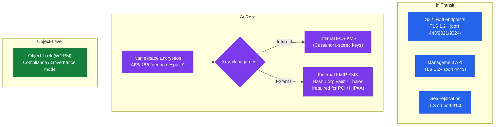

# Dell ECS — Encryption


<div class="kb-summary">
Encryption reference covering Encryption Layers, TLS Configuration, Data at Rest Encryption, Certificate Expiry Monitoring.
</div>
```
┌──────────────────────────────────────── Dell ECS — Encryption ────────────────────────────────────────┐
│                                                                                                       │
│   ┌───────────────────────────────────────────────────────────────────────────────────────────────┐   │
│   │           ECS encryption: data at rest and in transit encryption for all stored data          │   │
│   │          At rest: AES-256 encryption using controller-managed or external key manager         │   │
│   │          In transit: TLS 1.2+ for management; protocol encryption for data in flight          │   │
│   │         Key management: external KMIP-compatible KMS or built-in key lifecycle manager        │   │
│   └───────────────────────────────────────────────────────────────────────────────────────────────┘   │
│                                                                                                       │
│    Enable encryption → configure KMS → verify → audit → rotate keys                                   │
│                                                                                                       │
│                  ▼                                ▼                                ▼                  │
│                                                                                                       │
│   ┌─────────────────────────────┐  ┌─────────────────────────────┐  ┌─────────────────────────────┐   │
│   │            Layer            │  │          Component          │  │            Notes            │   │
│   │             Node            │  │        x86 appliance        │  │        Shared-nothing       │   │
│   │         Storage pool        │  │          Node group         │  │        Erasure coded        │   │
│   │             VDC             │  │          Virtual DC         │  │        Per-site unit        │   │
│   │          Rep. group         │  │          Multi-VDC          │  │        Geo redundancy       │   │
│   │            Bucket           │  │       Object container      │  │        S3/Swift/Blob        │   │
│   └─────────────────────────────┘  └─────────────────────────────┘  └─────────────────────────────┘   │
│                                                                                                       │
│                          ▼                                                 ▼                          │
│                                                                                                       │
│   ┌───────────────────────────────────────────────────────────────────────────────────────────────┐   │
│   │      Layer       │     Standard     │     Key source    │       KMS        │      Notes       │   │
│   │     At rest      │     AES-256      │     Controller    │  Internal/KMIP   │    Always on     │   │
│   │    In transit    │     TLS 1.2+     │      PKI cert     │   Internal CA    │   Mgmt + data    │   │
│   │   Key rotation   │      Annual      │     KMS policy    │   External KMS   │    Automated     │   │
│   │    Key escrow    │     Required     │     KMS vault     │   External KMS   │    DR access     │   │
│   └───────────────────────────────────────────────────────────────────────────────────────────────┘   │
│                                                                                                       │
│    Physical: ECS appliance nodes · 10/25 GbE backend network · commodity SAS drives                   │
│                                                                                                       │
│    Key terms:                                                                                         │
│                                                                                                       │
│    ECS                = Elastic Cloud Storage; Dell S3-compatible object store for unstructured data  │
│    VDC                = Virtual Data Center; group of ECS nodes at a single geographic site           │
│    Storage pool       = collection of nodes within a VDC; defines the erasure coding domain           │
│    Replication group  = links VDCs for geo-redundant object storage; 3-way replication                │
│    Bucket             = top-level S3 namespace; equivalent to S3 bucket or Azure container            │
│    Erasure coding     = data protection scheme; default 12+4 provides 4-drive fault tolerance         │
│    Namespace          = tenant-level isolation; multiple tenants share a single ECS cluster           │
│    CAS                = Content Addressed Storage; fixed-content object storage with WORM support     │
│    Replication factor = number of VDC copies; 3-way geo-replication for maximum durability            │
│    Atmos API          = legacy Dell Atmos-compatible API; supported for migration from Atmos systems  │
│    HDFS connector     = ECS Hadoop connector; ECS appears as HDFS namespace for analytics jobs        │
│    Quota              = per-namespace or per-bucket storage quota; enforced as hard or soft limit     │
│                                                                                                       │
└───────────────────────────────────────────────────────────────────────────────────────────────────────┘
```


## Encryption Layers



| Layer | Method | Notes |
|---|---|---|
| Data in transit | TLS 1.2+ | Enforced on S3 (443/9021), Swift (9024), Management API (4443); configure minimum TLS version in ECS Portal → Settings → Security |
| Data at rest | Software AES-256 (ECS encryption at rest) | Enable per-namespace in ECS Portal → Namespace → Edit → Encryption; key management via internal or external KMIP KMS |
| Key management | Internal ECS KMS or external KMIP server | For compliance, use an external KMIP-compatible KMS (e.g., HashiCorp Vault, Thales CipherTrust) |

Enable encryption at rest on namespaces that hold regulated data (PCI, HIPAA, GDPR). Note that enabling encryption on an existing namespace does not retroactively encrypt already-stored objects — only objects written after encryption is enabled are encrypted.

## TLS Configuration

### Certificate Management

ECS ships with self-signed certificates for both the Management API (port 4443) and the S3 endpoint (port 443/9021). Replace these with certificates signed by your corporate CA before go-live.

**Certificate locations in ECS Portal:**
- ECS Portal → Settings → Certificates → Management Certificate (for port 4443)
- ECS Portal → Settings → Certificates → Object Virtual Pool Certificate (for S3 endpoint)

**Certificate requirements:**

| Field | Requirement |
|---|---|
| Key type | RSA 2048-bit minimum; RSA 4096-bit or ECDSA P-256 recommended |
| Signature algorithm | SHA-256 or stronger |
| Subject Alternative Names | Must include all node FQDNs and the load balancer FQDN / VIP |
| Validity period | Maximum 2 years recommended (1 year preferred for compliance) |
| Key Usage | Digital Signature, Key Encipherment |
| Extended Key Usage | TLS Web Server Authentication |

**Certificate renewal procedure:**

1. Generate a CSR from ECS Portal → Settings → Certificates → Generate CSR
2. Submit the CSR to your corporate CA and obtain a signed certificate
3. Upload the signed certificate to ECS Portal → Settings → Certificates → Upload Certificate
4. ECS applies the certificate to the endpoint; no service restart required for certificate updates in ECS 3.8+
5. Verify the new certificate is served on the endpoint:
   ```bash
   openssl s_client -connect <ecs-node>:4443 -showcerts </dev/null 2>/dev/null \
     | openssl x509 -noout -dates -subject -issuer
   
   openssl s_client -connect <ecs-s3-endpoint>:9021 -showcerts </dev/null 2>/dev/null \
     | openssl x509 -noout -dates -subject -issuer
   ```
6. Confirm consuming applications can connect without SSL errors
7. Update monitoring to track the new certificate expiry date

### TLS Version and Cipher Configuration

```yaml
ECS Portal → Settings → Security → SSL/TLS Settings
  - Minimum TLS version: TLS 1.2 (disable TLS 1.0 and 1.1)
  - Cipher suites: Remove RC4, DES, 3DES, and NULL ciphers
  - Prefer: TLS_ECDHE_RSA_WITH_AES_256_GCM_SHA384, TLS_ECDHE_RSA_WITH_AES_128_GCM_SHA256
```

Verify cipher configuration from a Linux host:

```bash
# Check which TLS versions and ciphers the endpoint accepts
nmap --script ssl-enum-ciphers -p 9021 <ecs-node>

# Verify TLS 1.0 is rejected
openssl s_client -connect <ecs-node>:9021 -tls1 </dev/null 2>&1 | grep -E "CONNECTED|handshake failure"

# Verify TLS 1.2 succeeds
openssl s_client -connect <ecs-node>:9021 -tls1_2 </dev/null 2>&1 | grep -E "CONNECTED|Protocol"
```

### HTTP Disablement

Disable HTTP (port 9021 plain HTTP) in production. Only HTTPS should be accessible for S3 clients.

```text
ECS Portal → Settings → Security → Object Access
  - Disable HTTP access: enabled
  - Force HTTPS only: enabled
```

Verify port 9021 (plain HTTP) is not responding externally. The HTTPS port remains 9021 for S3 when using the non-standard S3 port; ensure firewall rules allow only 443 or 9021 from authorised source networks.

## Data at Rest Encryption

### Enabling Encryption on a Namespace

Encryption at rest is configured per namespace. Enable it at namespace creation for new namespaces; enabling it on existing namespaces only encrypts objects written after the change.

**Via ECS Portal:**
1. Navigate to ECS Portal → Manage → Namespaces → New Namespace (or select existing → Edit)
2. Enable **Encryption** in the namespace configuration
3. Select the key management type: **Internal ECS KMS** or **External KMIP**
4. Save; new objects written to buckets in this namespace will be encrypted with AES-256

**Via Management REST API:**

```bash
# Enable encryption on a new namespace
curl -s -k -X POST \
  -H "X-SDS-AUTH-TOKEN: $TOKEN" \
  -H "Content-Type: application/json" \
  "https://<ecs-node>:4443/object/namespaces/namespace" \
  -d '{
    "id": "compliance-data",
    "default_data_services_vpool": "<replication-group-id>",
    "is_encryption_enabled": true,
    "is_compliance_enabled": true
  }' | python3 -m json.tool
```

### Key Management

**Internal ECS KMS:**
- Default key management built into the ECS cluster
- Encryption keys are stored within the ECS metadata store (Cassandra)
- Suitable for environments without a regulatory requirement for external key management
- Risk: if all ECS nodes are simultaneously compromised or destroyed, keys may be unrecoverable — acceptable for most enterprise environments

**External KMIP KMS:**
- Required for PCI DSS, HIPAA, and other regulated environments that mandate external key custody
- ECS communicates with the KMIP server to retrieve encryption keys at object read/write time
- Supported KMIP-compatible servers:
  - HashiCorp Vault (with KMIP Secrets Engine)
  - Thales CipherTrust Manager
  - Entrust KeyControl
  - Dell PowerProtect Data Manager
  - Unbound CORE (formerly Unbound Tech)

**External KMIP configuration:**

```yaml
ECS Portal → Settings → Key Management
  - KMIP server hostname/IP: <kmip-server-fqdn>
  - KMIP port: 5696 (standard KMIP port)
  - Client certificate: <ECS-KMIP-client-cert.pem>
  - Client key: <ECS-KMIP-client-key.pem>
  - CA certificate: <KMIP-server-CA.pem> (for server validation)
  - Test connection before saving
```

**Key management operational considerations:**

| Consideration | Detail |
|---|---|
| KMIP availability | The KMIP server must be reachable for ECS to read encrypted objects; KMIP unavailability blocks reads on encrypted namespaces |
| Key backup | Back up KMIP server data and encryption key material independently; key loss makes encrypted objects unrecoverable |
| Network path | Dedicate a low-latency, reliable network path between ECS nodes and the KMIP server; KMIP latency adds to every object I/O on encrypted namespaces |
| Certificate rotation | KMIP client certificates (ECS-to-KMIP TLS) must be rotated before expiry; certificate expiry causes KMIP communication failure |

## Certificate Expiry Monitoring

Track all ECS certificate expiry dates in your monitoring system. Certificates should be renewed at least 30 days before expiry.

| Certificate | Location | Typical Validity | Renewal Lead Time |
|---|---|---|---|
| Management API TLS cert | ECS Portal → Settings → Certificates | 1–2 years | 30 days |
| S3 endpoint TLS cert | ECS Portal → Settings → Certificates | 1–2 years | 30 days |
| KMIP client cert (if used) | KMIP KMS and ECS key management config | 1–3 years | 60 days |
| LDAP/LDAPS CA cert (if used) | ECS namespace LDAP config | 1–10 years | 60 days |

```bash
# Check certificate expiry on the Management API endpoint
openssl s_client -connect <ecs-node>:4443 -servername <ecs-node> </dev/null 2>/dev/null \
  | openssl x509 -noout -enddate

# Check certificate expiry on the S3 endpoint
openssl s_client -connect <ecs-node>:9021 -servername <ecs-node> </dev/null 2>/dev/null \
  | openssl x509 -noout -enddate

# Alert if certificate expires within 30 days (for use in monitoring scripts)
EXPIRY=$(openssl s_client -connect <ecs-node>:4443 </dev/null 2>/dev/null \
  | openssl x509 -noout -enddate | cut -d= -f2)
EXPIRY_EPOCH=$(date -d "$EXPIRY" +%s)
NOW_EPOCH=$(date +%s)
DAYS_LEFT=$(( (EXPIRY_EPOCH - NOW_EPOCH) / 86400 ))
echo "Certificate expires in $DAYS_LEFT days"
[[ $DAYS_LEFT -lt 30 ]] && echo "WARNING: Certificate renewal required"
```
