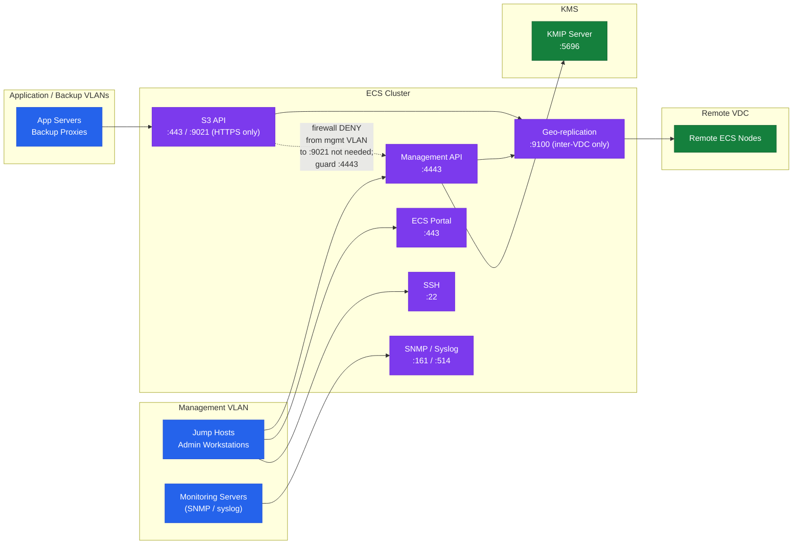

---
tags:
  - dell
  - security
---
# Dell ECS — Hardening


<div class="kb-summary">
Hardening reference covering Hardening Checklist, Network Segmentation, Operating System Hardening (Node-Level), Object Lock (WORM) Hardening, Secrets Management Integration and 1 more sections.
</div>
```text
┌──────────────────────────────────── Dell ECS — Security Hardening ────────────────────────────────────┐
│                                                                                                       │
│   ┌───────────────────────────────────────────────────────────────────────────────────────────────┐   │
│   │          ECS hardening: disable unused protocols, enforce encryption, restrict access         │   │
│   │         Network: dedicated storage VLAN; restrict management access to jump hosts only        │   │
│   │        Auth: disable default accounts; enforce password complexity and rotation policy        │   │
│   │         Audit: forward syslog to SIEM; alert on privilege escalation and failed logins        │   │
│   └───────────────────────────────────────────────────────────────────────────────────────────────┘   │
│                                                                                                       │
│    Baseline config → disable unused → enforce MFA → enable logging → audit                            │
│                                                                                                       │
│                  ▼                                ▼                                ▼                  │
│                                                                                                       │
│   ┌─────────────────────────────┐  ┌─────────────────────────────┐  ┌─────────────────────────────┐   │
│   │            Layer            │  │          Component          │  │            Notes            │   │
│   │             Node            │  │        x86 appliance        │  │        Shared-nothing       │   │
│   │         Storage pool        │  │          Node group         │  │        Erasure coded        │   │
│   │             VDC             │  │          Virtual DC         │  │        Per-site unit        │   │
│   │          Rep. group         │  │          Multi-VDC          │  │        Geo redundancy       │   │
│   │            Bucket           │  │       Object container      │  │        S3/Swift/Blob        │   │
│   └─────────────────────────────┘  └─────────────────────────────┘  └─────────────────────────────┘   │
│                                                                                                       │
│                          ▼                                                 ▼                          │
│                                                                                                       │
│   ┌───────────────────────────────────────────────────────────────────────────────────────────────┐   │
│   │       Area       │     Control      │      Standard     │      Verify      │    Frequency     │   │
│   │     Accounts     │ Disable defaults │  No default creds │   Login audit    │      Deploy      │   │
│   │    Protocols     │  Disable unused  │   TLS 1.2+ only   │    Port scan     │     Monthly      │   │
│   │       MFA        │ Enforce all admi │   TOTP/hardware   │    Auth logs     │    Continuous    │   │
│   │     Logging      │ SIEM forwarding  │  All admin events │   SIEM alerts    │      Daily       │   │
│   └───────────────────────────────────────────────────────────────────────────────────────────────┘   │
│                                                                                                       │
│    Physical: ECS appliance nodes · 10/25 GbE backend network · commodity SAS drives                   │
│                                                                                                       │
│    Key terms:                                                                                         │
│                                                                                                       │
│    ECS                = Elastic Cloud Storage; Dell S3-compatible object store for unstructured data  │
│    VDC                = Virtual Data Center; group of ECS nodes at a single geographic site           │
│    Storage pool       = collection of nodes within a VDC; defines the erasure coding domain           │
│    Replication group  = links VDCs for geo-redundant object storage; 3-way replication                │
│    Bucket             = top-level S3 namespace; equivalent to S3 bucket or Azure container            │
│    Erasure coding     = data protection scheme; default 12+4 provides 4-drive fault tolerance         │
│    Namespace          = tenant-level isolation; multiple tenants share a single ECS cluster           │
│    CAS                = Content Addressed Storage; fixed-content object storage with WORM support     │
│    Replication factor = number of VDC copies; 3-way geo-replication for maximum durability            │
│    Atmos API          = legacy Dell Atmos-compatible API; supported for migration from Atmos systems  │
│    HDFS connector     = ECS Hadoop connector; ECS appears as HDFS namespace for analytics jobs        │
│    Quota              = per-namespace or per-bucket storage quota; enforced as hard or soft limit     │
│                                                                                                       │
└───────────────────────────────────────────────────────────────────────────────────────────────────────┘
```


## Hardening Checklist

Apply these controls at initial deployment and validate at each quarterly security review.

- [ ] Change the default `sysadmin` password immediately after initial deployment; use a strong password (24+ characters, stored in a vault)
- [ ] Replace self-signed TLS certificates on the Management API (4443) and S3 endpoint (443/9021) with certificates signed by the corporate CA
- [ ] Disable HTTP (port 9021 plain HTTP) in production; require HTTPS for all S3 access
- [ ] Enable TLS 1.2 minimum on all endpoints; disable TLS 1.0 and 1.1
- [ ] Remove weak cipher suites (RC4, DES, 3DES, NULL) from the TLS configuration
- [ ] Create named management service accounts for all automation and API access; do not use `sysadmin` in scripts or CI/CD pipelines
- [ ] Restrict `sysadmin` to break-glass access only; log and alert on each `sysadmin` login via syslog/SIEM
- [ ] Apply namespace quotas to all production namespaces; do not allow unconstrained namespaces
- [ ] Set hard quotas on high-growth buckets (Veeam offload, analytics ingest) to prevent runaway capacity consumption
- [ ] Enable bucket-level access logging for all namespaces with compliance or audit requirements
- [ ] Configure syslog forwarding to the SIEM for all ECS management and access events
- [ ] Enable Object Lock (WORM) on buckets designated for compliance or immutable backup data — use Compliance mode, not Governance mode
- [ ] Restrict ECS Portal (port 443) and Management API (port 4443) access to management network VLANs via firewall ACLs; block access from data network VLANs
- [ ] Restrict S3 API access (port 443/9021) to authorised application and backup network VLANs only
- [ ] Disable unused API protocols (Swift, Atmos, CAS) on namespaces that only require S3
- [ ] Rotate object user secret keys every 12 months; update consuming applications and secrets manager entries
- [ ] Enable encryption at rest on namespaces holding regulated data (PCI, HIPAA, GDPR)
- [ ] For encryption at rest: use an external KMIP KMS for regulated compliance environments; do not rely on the internal ECS KMS for PCI or HIPAA data
- [ ] Configure NTP on all nodes to a consistent authoritative time source; clock drift > 5 minutes can cause geo-replication and S3 signature validation failures
- [ ] Disable password-based SSH login to ECS nodes; use SSH key authentication only
- [ ] Apply the principle of least privilege to all IAM bucket policies; never assign `Action: "*"` to application object users
- [ ] Perform a quarterly access review: remove object users for decommissioned applications; rotate keys older than 12 months

## Network Segmentation



| Traffic Type | Source Networks | Destination Port | Action |
|---|---|---|---|
| S3 API | Application VLANs, Backup VLANs | 443 or 9021 (HTTPS) | Allow |
| Swift API | OpenStack compute VLANs | 9024 | Allow (only if Swift is in use) |
| Management API | Management VLAN, jump hosts only | 4443 | Allow |
| ECS Portal | Management VLAN, jump hosts only | 443 | Allow |
| SSH | Jump hosts, management VLAN only | 22 | Allow |
| SNMP | Monitoring VLANs only | 161 (UDP) | Allow |
| Syslog | ECS nodes to SIEM | 514 (UDP/TCP) | Allow |
| Geo-replication | ECS data VLANs, remote site | 9100 | Allow between VDC sites only |
| KMIP | ECS nodes to KMS server | 5696 | Allow |
| All other | Any | Any | Deny |

Configure inter-VLAN firewall rules to enforce this segmentation. ECS does not enforce network-level source IP restrictions natively (except via bucket policies with `aws:SourceIp` conditions).

## Operating System Hardening (Node-Level)

ECS nodes run a hardened Linux OS managed by Dell. Avoid making manual OS-level changes outside of the ECS-supported procedures, as unsupported changes may break the ECS software stack.

- Do not install third-party software or agents on ECS nodes unless explicitly validated by Dell Support
- Do not modify kernel parameters, network settings, or disk mounts manually — use ECS Portal procedures
- SSH access to nodes should be restricted to jump hosts and management workstations
- Disable direct `root` SSH login where possible; use `admin` and escalate with `sudo`
- Review `/etc/sudoers` and SSH `authorized_keys` periodically; remove stale entries

```bash
# Check who has SSH access on an ECS node
ssh admin@<ecs-node> "cat /home/admin/.ssh/authorized_keys"

# Verify root direct login is disabled in sshd_config
ssh admin@<ecs-node> "grep PermitRootLogin /etc/ssh/sshd_config"
# Expected: PermitRootLogin no
```

## Object Lock (WORM) Hardening

| Control | Compliance Mode | Governance Mode |
|---|---|---|
| Can the retention period be shortened? | No — not by any user, including sysadmin | Yes — by a user with `s3:BypassGovernanceRetention` |
| Can the object be deleted before expiry? | No | Yes — by a user with `s3:BypassGovernanceRetention` |
| Suitable for SEC 17a-4, FINRA compliance? | Yes | No |
| Suitable for backup immutability (anti-ransomware)? | Yes | Conditionally — protect the bypass permission carefully |

For regulated compliance workloads, always use Compliance mode. For backup immutability against ransomware, Compliance mode is preferred; Governance mode is acceptable only if `s3:BypassGovernanceRetention` is restricted to a privileged break-glass account and not granted to backup service accounts.

```bash
# Set Object Lock retention in Compliance mode on an existing bucket
# (Note: the bucket must have been created with Object Lock enabled)
aws s3api put-object-lock-configuration \
  --bucket compliance-immutable \
  --object-lock-configuration '{
    "ObjectLockEnabled": "Enabled",
    "Rule": {
      "DefaultRetention": {
        "Mode": "COMPLIANCE",
        "Days": 2557
      }
    }
  }' \
  --endpoint-url https://<ecs-endpoint>:9021 \
  --no-verify-ssl \
  --profile ecs

# Verify the Object Lock configuration
aws s3api get-object-lock-configuration \
  --bucket compliance-immutable \
  --endpoint-url https://<ecs-endpoint>:9021 \
  --no-verify-ssl \
  --profile ecs
```

## Secrets Management Integration

Do not embed ECS credentials (management passwords, S3 access keys/secret keys, KMIP certificates) in configuration files, scripts, or source code.

**Recommended secrets management approaches:**

| Secret Type | Recommended Storage | Retrieval Method |
|---|---|---|
| `sysadmin` password | Physical vault or PAM (CyberArk, BeyondTrust) | Manual break-glass checkout |
| Management service account password | HashiCorp Vault or PAM | API retrieval at runtime in automation scripts |
| S3 access key / secret key | HashiCorp Vault (KV secrets engine) or secrets manager | Application retrieves at startup; never embedded in code |
| TLS certificate private key | HashiCorp Vault (PKI secrets engine) | Vault-managed PKI rotation |
| KMIP client certificate | HashiCorp Vault (PKI secrets engine) | Vault-managed; auto-rotated before expiry |

```bash
# Example: retrieve ECS S3 credentials from HashiCorp Vault at runtime
export AWS_ACCESS_KEY_ID=$(vault kv get -field=access_key secret/ecs/svc-spark-prod)
export AWS_SECRET_ACCESS_KEY=$(vault kv get -field=secret_key secret/ecs/svc-spark-prod)

# Use immediately; do not persist to disk or shell history
aws s3 ls s3://analytics-prod-raw \
  --endpoint-url https://<ecs-endpoint>:9021 \
  --no-verify-ssl
```

## Security Validation

Run these checks at each quarterly security review and after any security-relevant configuration change:

```bash
# Confirm TLS version on S3 endpoint (should reject TLS 1.0 and 1.1)
openssl s_client -connect <ecs-node>:9021 -tls1 </dev/null 2>&1 \
  | grep -E "handshake failure|alert"  # Should show failure

openssl s_client -connect <ecs-node>:9021 -tls1_2 </dev/null 2>&1 \
  | grep "Protocol"  # Should show TLSv1.2 or TLSv1.3

# Confirm self-signed certs have been replaced (issuer should be the corporate CA)
openssl s_client -connect <ecs-node>:4443 </dev/null 2>/dev/null \
  | openssl x509 -noout -issuer

openssl s_client -connect <ecs-node>:9021 </dev/null 2>/dev/null \
  | openssl x509 -noout -issuer

# Confirm certificate is not expiring within 30 days
openssl s_client -connect <ecs-node>:9021 </dev/null 2>/dev/null \
  | openssl x509 -noout -enddate

# Confirm management API is not accessible from outside the management network
# (Run this from an application VLAN host — should time out or be refused)
curl --max-time 5 https://<ecs-node>:4443/login && echo "ACCESSIBLE — REMEDIATE" || echo "Blocked — OK"

# List all namespaces and verify quotas are set
ecscli namespace list
# Review each namespace output for quota values — alert on any with no quota

# Review active management users
curl -s -k -H "X-SDS-AUTH-TOKEN: $TOKEN" \
  "https://<ecs-node>:4443/user/users.json" | python3 -m json.tool
```
