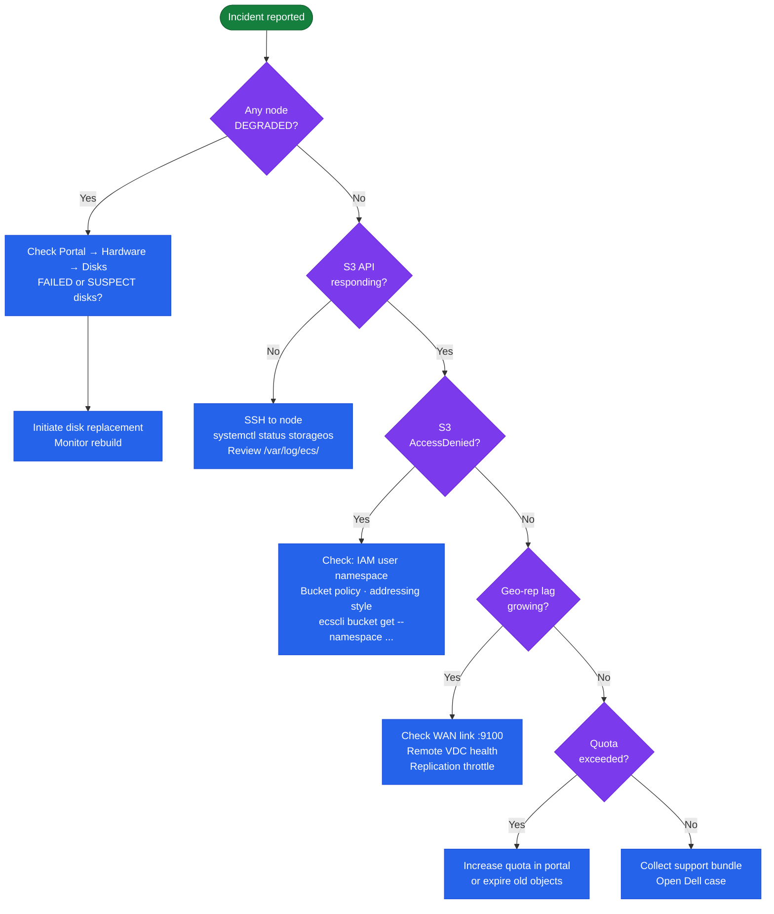

---
tags:
  - dell
  - troubleshooting
---
# Dell ECS — Common Issues


<div class="kb-summary">
Common Issues reference covering Incident Triage, Common Symptoms and Resolutions.
</div>
```text
┌────────────────────────────────────── Dell ECS — Common Issues ───────────────────────────────────────┐
│                                                                                                       │
│   ┌───────────────────────────────────────────────────────────────────────────────────────────────┐   │
│   │             ECS common issues: quick-reference for frequently encountered problems            │   │
│   │         Issues: path failures, connectivity errors, capacity alerts, and auth failures        │   │
│   │         For each issue: symptoms, root cause, diagnostic steps, and resolution actions        │   │
│   │           Escalate to vendor support if the issue persists after standard procedures          │   │
│   └───────────────────────────────────────────────────────────────────────────────────────────────┘   │
│                                                                                                       │
│    Identify symptom → check logs → diagnose root cause → resolve → verify                             │
│                                                                                                       │
│                  ▼                                ▼                                ▼                  │
│                                                                                                       │
│   ┌─────────────────────────────┐  ┌─────────────────────────────┐  ┌─────────────────────────────┐   │
│   │            Layer            │  │          Component          │  │            Notes            │   │
│   │             Node            │  │        x86 appliance        │  │        Shared-nothing       │   │
│   │         Storage pool        │  │          Node group         │  │        Erasure coded        │   │
│   │             VDC             │  │          Virtual DC         │  │        Per-site unit        │   │
│   │          Rep. group         │  │          Multi-VDC          │  │        Geo redundancy       │   │
│   │            Bucket           │  │       Object container      │  │        S3/Swift/Blob        │   │
│   └─────────────────────────────┘  └─────────────────────────────┘  └─────────────────────────────┘   │
│                                                                                                       │
│                          ▼                                                 ▼                          │
│                                                                                                       │
│   ┌───────────────────────────────────────────────────────────────────────────────────────────────┐   │
│   │    Component     │     Purpose      │      Protocol     │       Auth       │      Notes       │   │
│   │   Storage pool   │ Drive aggregatio │      Internal     │       N/A        │   Erasure 12+4   │   │
│   │       VDC        │  Site grouping   │      Internal     │       N/A        │   HA per site    │   │
│   │      Bucket      │ Object namespace │   S3/Swift/Blob   │   S3 keys/IAM    │    Per tenant    │   │
│   │ Replication grp  │ Geo replication  │    ECS protocol   │   Certificate    │    3-way geo     │   │
│   └───────────────────────────────────────────────────────────────────────────────────────────────┘   │
│                                                                                                       │
│    Physical: ECS appliance nodes · 10/25 GbE backend network · commodity SAS drives                   │
│                                                                                                       │
│    Key terms:                                                                                         │
│                                                                                                       │
│    ECS                = Elastic Cloud Storage; Dell S3-compatible object store for unstructured data  │
│    VDC                = Virtual Data Center; group of ECS nodes at a single geographic site           │
│    Storage pool       = collection of nodes within a VDC; defines the erasure coding domain           │
│    Replication group  = links VDCs for geo-redundant object storage; 3-way replication                │
│    Bucket             = top-level S3 namespace; equivalent to S3 bucket or Azure container            │
│    Erasure coding     = data protection scheme; default 12+4 provides 4-drive fault tolerance         │
│    Namespace          = tenant-level isolation; multiple tenants share a single ECS cluster           │
│    CAS                = Content Addressed Storage; fixed-content object storage with WORM support     │
│    Replication factor = number of VDC copies; 3-way geo-replication for maximum durability            │
│    Atmos API          = legacy Dell Atmos-compatible API; supported for migration from Atmos systems  │
│    HDFS connector     = ECS Hadoop connector; ECS appears as HDFS namespace for analytics jobs        │
│    Quota              = per-namespace or per-bucket storage quota; enforced as hard or soft limit     │
│                                                                                                       │
└───────────────────────────────────────────────────────────────────────────────────────────────────────┘
```


## Before you begin

- **Access:** Storage admin credentials (cluster admin or equivalent)
- **Gather first:** recent error message text, event timestamps, and affected object names
- **Scope:** confirm whether the issue affects a single object, host, cluster, or site
- **Escalation:** open a vendor support ticket before running any destructive step
- **Logging:** document each command and output — required if escalation is needed

---

## Incident Triage

When S3 writes fail, geo-replication falls behind, or a node goes offline, work through this sequence first.



- [ ] Check ECS Portal → Hardware → Nodes immediately — identify any node that has moved to `DEGRADED` or offline state; note when the state change occurred
- [ ] Query `GET /vdc/alerts` — retrieve the active alert list and identify alerts timestamped near the start of the incident
- [ ] Check geo-replication lag: ECS Portal → Geo Monitoring — growing lag between VDCs can indicate a WAN link issue or a remote VDC node problem
- [ ] Test S3 API availability: send a `HeadBucket` request to the S3 endpoint — a non-200 response or timeout confirms S3 API impact
- [ ] Check ECS Portal → Hardware → Disks for `FAILED` or `SUSPECT` disks on the affected node — disk failures trigger node rebalancing that can cause temporary capacity or performance impact
- [ ] If geo-replication lag is growing: check WAN bandwidth utilisation between sites and confirm the remote VDC is healthy; review replication group configuration with `ecscli bucket get`
- [ ] For S3 authentication failures: confirm the IAM user and access key are correct; check bucket policies with `ecscli bucket get --namespace <ns> --name <bucket>`
- [ ] If the node is unresponsive to the REST API: SSH to the node and check the ECS service status; open a Dell support case for hardware faults

| Question | Answer |
|---|---|
| Which nodes are DEGRADED or offline? | |
| What active alerts does GET /vdc/alerts return? | |
| Is geo-replication lag growing between VDCs? | |
| Is the S3 API endpoint responding? | |
| Are there FAILED or SUSPECT disks on the affected node? | |

## Common Symptoms and Resolutions

| Symptom | Cause | Action |
|---|---|---|
| Node shows `DEGRADED` or offline in ECS Portal | Disk failure, NIC fault, or node OS crash | Check ECS Portal → Hardware for disk state; SSH to the node and check OS logs; replace failed disk via the guided procedure in the portal |
| Geo-replication lag growing between VDCs | WAN link saturation, remote VDC node issue, or replication group misconfiguration | Check ECS Portal → Geo Monitoring; review inter-site bandwidth utilisation; verify the remote VDC has healthy nodes |
| S3 `AccessDenied` despite correct credentials | IAM policy misconfiguration, wrong namespace, or bucket policy conflict | Confirm IAM user is assigned to the correct namespace; check bucket policy with `ecscli bucket get`; verify path-style vs virtual-hosted-style addressing |
| Capacity growing unexpectedly | Bucket versioning accumulating old versions, incomplete multipart uploads, or no lifecycle policy | Check versioning on buckets; list and abort incomplete MPUs via S3 API; add lifecycle policies to expire non-current versions |
| ECS Portal login fails (HTTP 503 or timeout) | Portal service down or certificate expired | SSH to node and restart ECS portal service; check TLS certificate expiry via ECS Portal → Settings → Certificates |
| Bucket quota exceeded — writes failing with `QuotaExceeded` | Bucket or namespace hard quota reached | Increase quota via ECS Portal → Buckets → Edit or expire old objects; review lifecycle rules |
| Object read returns `404` for a recently written object | Replication lag: object written to one VDC not yet visible on the reading VDC | Wait for replication to complete; check replication lag in Geo Monitoring; verify replication group consistency setting |
| `503 Service Unavailable` on S3 endpoint during steady state | Data service process down on some nodes, or cluster is in degraded mode | Check node health in portal; review ECS data service logs on affected nodes |
| WORM/CAS object deletion blocked | Object is within its retention period | This is expected behaviour; confirm retention period setting on the bucket; escalate to data owner to confirm |

---

## Verify resolution

- Confirm the original symptom no longer occurs
- Check logs for any residual errors related to the issue
- Monitor for 10–15 minutes to confirm the fix is stable
