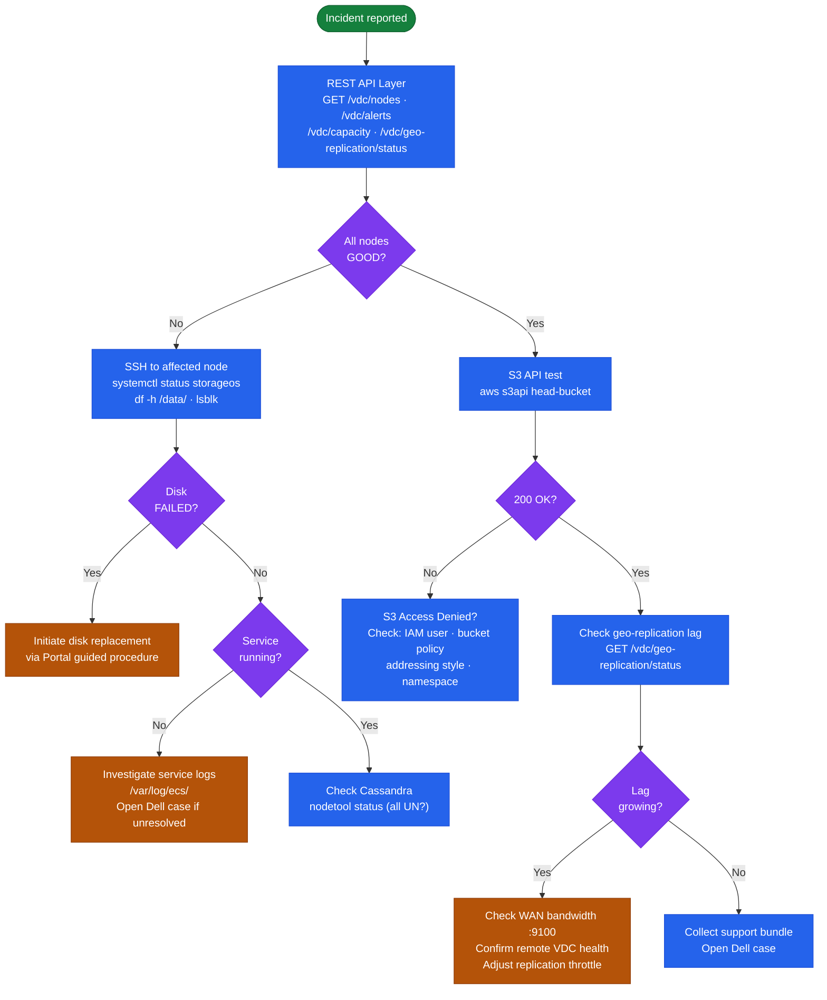
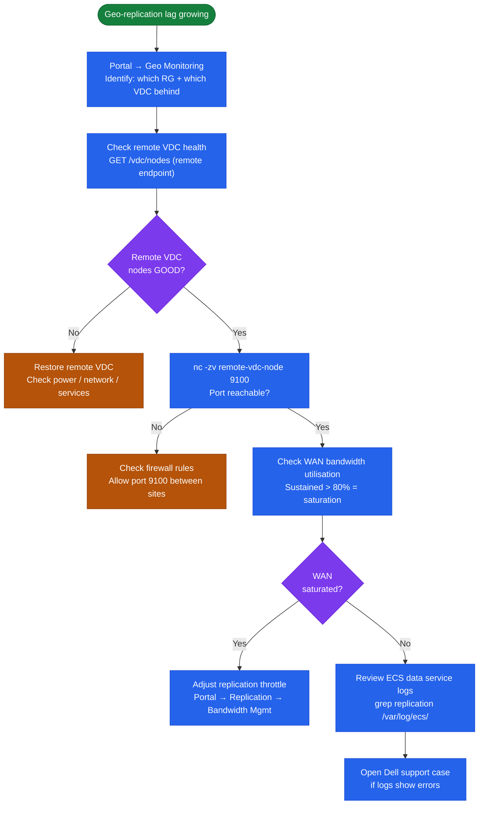

---
tags:
  - dell
  - troubleshooting
---
# Dell ECS — Diagnostics


<div class="kb-summary">
Diagnostics reference covering Diagnostic Overview, Management API Diagnostics, S3 API Diagnostics, Node-Level SSH Diagnostics, Log Locations and 2 more sections.
</div>
```text
┌─────────────────────────────────────── Dell ECS — Diagnostics ────────────────────────────────────────┐
│                                                                                                       │
│   ┌───────────────────────────────────────────────────────────────────────────────────────────────┐   │
│   │            ECS diagnostics: log collection, health checks, and performance analysis           │   │
│   │          Tools: management CLI, REST API, vendor support bundle, and system event log         │   │
│   │          Performance: check I/O latency, throughput, queue depth, and cache hit rate          │   │
│   │       Collect support bundle before contacting vendor support to reduce time-to-resolve       │   │
│   └───────────────────────────────────────────────────────────────────────────────────────────────┘   │
│                                                                                                       │
│    Identify issue → collect logs → run diagnostics → analyse → resolve                                │
│                                                                                                       │
│                  ▼                                ▼                                ▼                  │
│                                                                                                       │
│   ┌─────────────────────────────┐  ┌─────────────────────────────┐  ┌─────────────────────────────┐   │
│   │            Layer            │  │          Component          │  │            Notes            │   │
│   │             Node            │  │        x86 appliance        │  │        Shared-nothing       │   │
│   │         Storage pool        │  │          Node group         │  │        Erasure coded        │   │
│   │             VDC             │  │          Virtual DC         │  │        Per-site unit        │   │
│   │          Rep. group         │  │          Multi-VDC          │  │        Geo redundancy       │   │
│   │            Bucket           │  │       Object container      │  │        S3/Swift/Blob        │   │
│   └─────────────────────────────┘  └─────────────────────────────┘  └─────────────────────────────┘   │
│                                                                                                       │
│                          ▼                                                 ▼                          │
│                                                                                                       │
│   ┌───────────────────────────────────────────────────────────────────────────────────────────────┐   │
│   │    Component     │     Purpose      │      Protocol     │       Auth       │      Notes       │   │
│   │   Storage pool   │ Drive aggregatio │      Internal     │       N/A        │   Erasure 12+4   │   │
│   │       VDC        │  Site grouping   │      Internal     │       N/A        │   HA per site    │   │
│   │      Bucket      │ Object namespace │   S3/Swift/Blob   │   S3 keys/IAM    │    Per tenant    │   │
│   │ Replication grp  │ Geo replication  │    ECS protocol   │   Certificate    │    3-way geo     │   │
│   └───────────────────────────────────────────────────────────────────────────────────────────────┘   │
│                                                                                                       │
│    Physical: ECS appliance nodes · 10/25 GbE backend network · commodity SAS drives                   │
│                                                                                                       │
│    Key terms:                                                                                         │
│                                                                                                       │
│    ECS                = Elastic Cloud Storage; Dell S3-compatible object store for unstructured data  │
│    VDC                = Virtual Data Center; group of ECS nodes at a single geographic site           │
│    Storage pool       = collection of nodes within a VDC; defines the erasure coding domain           │
│    Replication group  = links VDCs for geo-redundant object storage; 3-way replication                │
│    Bucket             = top-level S3 namespace; equivalent to S3 bucket or Azure container            │
│    Erasure coding     = data protection scheme; default 12+4 provides 4-drive fault tolerance         │
│    Namespace          = tenant-level isolation; multiple tenants share a single ECS cluster           │
│    CAS                = Content Addressed Storage; fixed-content object storage with WORM support     │
│    Replication factor = number of VDC copies; 3-way geo-replication for maximum durability            │
│    Atmos API          = legacy Dell Atmos-compatible API; supported for migration from Atmos systems  │
│    HDFS connector     = ECS Hadoop connector; ECS appears as HDFS namespace for analytics jobs        │
│    Quota              = per-namespace or per-bucket storage quota; enforced as hard or soft limit     │
│                                                                                                       │
└───────────────────────────────────────────────────────────────────────────────────────────────────────┘
```


## Before you begin

- **Access:** Storage admin credentials (cluster admin or equivalent)
- **Gather first:** recent error message text, event timestamps, and affected object names
- **Scope:** confirm whether the issue affects a single object, host, cluster, or site
- **Escalation:** open a vendor support ticket before running any destructive step
- **Logging:** document each command and output — required if escalation is needed

---

## Diagnostic Overview

ECS diagnostics span three layers: the Management REST API (cluster-level health and configuration), node-level SSH access (OS and service health), and the S3 API (data path functional testing). Start with the REST API — it provides the fastest cluster-wide view — then drill into SSH-level diagnostics for specific node or service issues.



## Management API Diagnostics

```bash
# --- Authenticate to the ECS Management REST API ---
TOKEN=$(curl -sk -u "sysadmin:<password>" \
  -D - "https://<ecs-node>:4443/login" \
  | grep "X-SDS-AUTH-TOKEN" | awk '{print $2}' | tr -d '\r')

ECS="https://<ecs-node>:4443"

# --- VDC capacity ---
# Fields: totalProvisioned_gb, usedCapacity_gb, availableCapacity_gb
curl -s -k -H "X-SDS-AUTH-TOKEN: $TOKEN" \
  "$ECS/vdc/capacity" | python3 -m json.tool

# --- Node health ---
# nodestatus: GOOD | DEGRADED | UNKNOWN
# All nodes must show GOOD before any planned change
curl -s -k -H "X-SDS-AUTH-TOKEN: $TOKEN" \
  "$ECS/vdc/nodes" | python3 -m json.tool

# --- Specific node details ---
curl -s -k -H "X-SDS-AUTH-TOKEN: $TOKEN" \
  "$ECS/vdc/nodes/<node-id>" | python3 -m json.tool

# --- Active alerts ---
curl -s -k -H "X-SDS-AUTH-TOKEN: $TOKEN" \
  "$ECS/vdc/alerts" | python3 -m json.tool

# --- ECS software version ---
curl -s -k -H "X-SDS-AUTH-TOKEN: $TOKEN" \
  "$ECS/vdc/version" | python3 -m json.tool

# --- Geo-replication status ---
curl -s -k -H "X-SDS-AUTH-TOKEN: $TOKEN" \
  "$ECS/vdc/geo-replication/status" | python3 -m json.tool

# --- Replication groups (vpools) ---
curl -s -k -H "X-SDS-AUTH-TOKEN: $TOKEN" \
  "$ECS/vdc/data-service/vpools" | python3 -m json.tool

# --- Dashboard zone health ---
curl -s -k -H "X-SDS-AUTH-TOKEN: $TOKEN" \
  "$ECS/dashboard/zones/localzone" | python3 -m json.tool

# --- Namespace list ---
curl -s -k -H "X-SDS-AUTH-TOKEN: $TOKEN" \
  "$ECS/object/namespaces" | python3 -m json.tool

# --- Bucket list for a namespace ---
curl -s -k -H "X-SDS-AUTH-TOKEN: $TOKEN" \
  "$ECS/object/bucket?namespace=<namespace>" | python3 -m json.tool

# --- Bucket details ---
curl -s -k -H "X-SDS-AUTH-TOKEN: $TOKEN" \
  "$ECS/object/bucket/<bucket>/info?namespace=<namespace>" | python3 -m json.tool

# --- Invalidate session ---
curl -sk -H "X-SDS-AUTH-TOKEN: $TOKEN" "$ECS/logout" > /dev/null
```

## S3 API Diagnostics

```bash
S3_EP="https://<ecs-s3-endpoint>:9021"
PROFILE="--profile ecs --endpoint-url $S3_EP --no-verify-ssl"

# --- Test S3 connectivity (list buckets) ---
aws s3 ls $PROFILE

# --- Head a specific bucket (tests auth and bucket existence) ---
aws s3api head-bucket --bucket <bucket> $PROFILE

# --- Head a specific object (tests object existence and access) ---
aws s3api head-object --bucket <bucket> --key <object-key> $PROFILE

# --- List objects in a bucket ---
aws s3 ls s3://<bucket>/ $PROFILE

# --- List incomplete multipart uploads ---
aws s3api list-multipart-uploads --bucket <bucket> $PROFILE

# --- List object versions (for versioned buckets) ---
aws s3api list-object-versions --bucket <bucket> --prefix <key-prefix> $PROFILE

# --- Get bucket versioning state ---
aws s3api get-bucket-versioning --bucket <bucket> $PROFILE

# --- Get lifecycle configuration ---
aws s3api get-bucket-lifecycle-configuration --bucket <bucket> $PROFILE

# --- Get bucket policy ---
aws s3api get-bucket-policy --bucket <bucket> $PROFILE

# --- Get object lock configuration ---
aws s3api get-object-lock-configuration --bucket <bucket> $PROFILE

# --- TLS certificate check on S3 endpoint ---
openssl s_client -connect <ecs-s3-endpoint>:9021 -servername <ecs-s3-endpoint> \
  </dev/null 2>/dev/null | openssl x509 -noout -dates -subject -issuer

# --- Test raw HTTP connectivity to S3 endpoint ---
curl -sv --max-time 10 "https://<ecs-s3-endpoint>:9021/" \
  --resolve "<ecs-s3-endpoint>:9021:<ecs-node-ip>" \
  --insecure 2>&1 | grep -E "< HTTP|Connected|SSL|certificate"
```

## Node-Level SSH Diagnostics

```bash
# SSH to an ECS node
ssh admin@<ecs-node>

# --- ECS service health ---
systemctl status storageos          # Main ECS data service
systemctl status caspian            # ECS fabric agent

# Check across all nodes simultaneously
viprexec -v -cmd "systemctl is-active storageos"
viprexec -v -cmd "systemctl is-active caspian"

# --- Disk diagnostics ---
# Data partition usage
df -h /data/
# All disk mounts
df -h
# Disk layout (type, size, mount, state)
lsblk -o NAME,SIZE,FSTYPE,MOUNTPOINT,STATE
# Check disk usage across all cluster nodes
viprexec -v -cmd "df -h /data/"

# --- Cassandra (metadata store) ---
# Ring status: UN = Up/Normal | DN = Down | UJ = Joining | UL = Leaving
/opt/storageos/tools/nodetool status

# Cassandra compaction activity (high compaction = elevated metadata latency)
/opt/storageos/tools/nodetool compactionstats

# Cassandra heap usage (heap pressure = GC pauses = slow metadata responses)
/opt/storageos/tools/nodetool info | grep -iE "heap|load"

# Flush Cassandra memtables (can help if writes are stalled)
/opt/storageos/tools/nodetool flush

# Cassandra node info (token, DC, rack, load)
/opt/storageos/tools/nodetool ring

# --- ZooKeeper (cluster coordination) ---
# Mode should be 'leader' on one node and 'follower' on all others
echo "srvr" | nc localhost 2181 | grep Mode
# Outstanding requests should be near zero during steady state
echo "stat" | nc localhost 2181 | grep outstanding
# Connection count (elevated connections may indicate a stuck client)
echo "stat" | nc localhost 2181 | grep connections
# List all ZK nodes in the ensemble
echo "conf" | nc localhost 2181

# --- NTP / clock sync ---
chronyc tracking
timedatectl status
# All nodes should agree on time within 100ms; mismatched clocks cause geo-replication errors
viprexec -v -cmd "date"

# --- System resources ---
# CPU usage
uptime
# Memory usage (ECS is memory-intensive; check for low free memory)
free -h
# Memory usage across all nodes
viprexec -v -cmd "free -h"
# Process list — confirm key ECS processes are running
ps aux | grep -E "storageos|caspian|java" | grep -v grep

# --- Network connectivity ---
# Test inter-node connectivity on the data network (EC and replication traffic)
ping -c 4 <other-ecs-node-data-ip>
# Test WAN connectivity to remote VDC nodes (geo-replication port)
nc -zv <remote-vdc-node> 9100
# Test KMIP connectivity (if encryption at rest with external KMS is configured)
nc -zv <kmip-server> 5696
```

## Log Locations

| Log | Location | Content |
|---|---|---|
| ECS data service log | `/var/log/ecs/` on each node | Object I/O, erasure coding, replication errors, chunk placement |
| ECS portal / management log | `/var/log/ecs-portal/` or `journalctl -u ecs-portal` | API requests, portal events, authentication failures |
| ECS fabric agent log | `/opt/emc/caspian/fabric/agent/logs/agent.log` | Node lifecycle, upgrade, and fabric events |
| OS system log | `/var/log/messages` or `journalctl -xe` | Node OS events, hardware errors, kernel messages |
| Cassandra log | `/opt/storageos/db/logs/system.log` | Metadata store events, compaction, GC events |
| ZooKeeper log | `/opt/storageos/zookeeper/logs/zookeeper.log` | Cluster coordination events |
| Geo-replication log | ECS Portal → Logs → Geo Replication | Replication job status and per-object replication errors |
| Audit log | ECS Portal → Monitoring → Audit | Administrative actions (create/modify/delete namespace, bucket, IAM) |

```bash
# Tail ECS data service log for real-time error monitoring
tail -f /var/log/ecs/*.log | grep -iE "error|exception|failed|degraded"

# Tail fabric agent log
tail -f /opt/emc/caspian/fabric/agent/logs/agent.log

# Journalctl for ECS services
journalctl -u storageos -f --no-pager
journalctl -u caspian -f --no-pager

# Search Cassandra log for errors in the last hour
journalctl -u cassandra --since "1 hour ago" | grep -iE "error|exception|heap"

# Search for geo-replication errors
grep -r "replication" /var/log/ecs/ | grep -iE "error|failed|timeout" | tail -50
```

## Before Calling Support

Gather the following before opening a Dell Support case. This information is mandatory for Severity 1 and 2 cases.

```bash
# ECS software version
curl -s -k -H "X-SDS-AUTH-TOKEN: $TOKEN" \
  "$ECS/vdc/version" | python3 -m json.tool

# Node list and health status
curl -s -k -H "X-SDS-AUTH-TOKEN: $TOKEN" \
  "$ECS/vdc/nodes" | python3 -m json.tool

# Active alerts
curl -s -k -H "X-SDS-AUTH-TOKEN: $TOKEN" \
  "$ECS/vdc/alerts" | python3 -m json.tool

# VDC capacity
curl -s -k -H "X-SDS-AUTH-TOKEN: $TOKEN" \
  "$ECS/vdc/capacity" | python3 -m json.tool

# Replication group status
curl -s -k -H "X-SDS-AUTH-TOKEN: $TOKEN" \
  "$ECS/vdc/data-service/vpools" | python3 -m json.tool

# Namespace and bucket inventory
ecscli namespace list
ecscli bucket list --namespace <affected-namespace>
ecscli bucket get --namespace <affected-namespace> --name <affected-bucket>

# Generate support bundle (mandatory for Sev1/Sev2)
# Trigger from Management API — generates a diagnostics bundle on each node
curl -s -k -X POST \
  -H "X-SDS-AUTH-TOKEN: $TOKEN" \
  "$ECS/vdc/support-bundle" | python3 -m json.tool
# Alternatively: ECS Portal → Support → Collect Logs
```

**Information to prepare before the call:**

| Item | Detail |
|---|---|
| ECS software version | From `GET /vdc/version` |
| Number of VDCs and nodes per VDC | Topology description |
| Replication group configuration | Mode (sync/async), VDC pairing |
| Approximate time the issue started | As precise as possible |
| Recent changes | Upgrades, network changes, new buckets, IAM changes in the 48h before the issue |
| Error messages | From ECS Portal, S3 client logs, and application logs |
| Impact | Which namespaces/buckets/applications are affected |
| Support case number | Obtain at case creation; communicate to on-call team |

## Common Diagnostic Workflows

### Workflow: Node Marked DEGRADED

1. `GET /vdc/nodes` — identify which node is DEGRADED and its node ID
2. `GET /vdc/alerts` — check for disk or NIC failure alerts correlated with the node
3. SSH to the affected node: `ssh admin@<ecs-node>`
4. `systemctl status storageos` — confirm whether the ECS service is running
5. `df -h /data/` — check if the data partition is full or unmounted
6. `lsblk` — identify any disks showing error state in the OS
7. Check system log: `journalctl -xe | grep -iE "disk|error|fault" | tail -50`
8. If a disk failure is confirmed: initiate disk replacement via ECS Portal → Hardware → Disks → Replace Disk
9. Monitor rebuild progress in ECS Portal → Hardware → Disks until the new disk shows `GOOD`

### Workflow: Geo-Replication Lag Growing



1. ECS Portal → Geo Monitoring — identify which replication group has growing lag and which VDC is behind
2. Confirm the remote VDC is healthy: `GET /vdc/nodes` against the remote VDC endpoint
3. Check WAN bandwidth utilisation on the inter-site link at the time lag started growing
4. Confirm port 9100 is reachable between VDCs: `nc -zv <remote-vdc-node> 9100`
5. Check for alerts on the remote VDC: `GET /vdc/alerts` against the remote VDC endpoint
6. If the remote VDC is healthy and WAN is not saturated: check ECS data service logs for replication-specific errors
7. If the WAN link is saturated: adjust replication group bandwidth throttle in ECS Portal → Replication → Bandwidth Management

### Workflow: S3 Access Denied

1. Confirm the access key and secret key are correct (note: secret keys cannot be retrieved from ECS — if lost, rotate)
2. Confirm the object user exists in the correct namespace: `ecscli user list-object-users --namespace <ns>`
3. Check the bucket policy: `aws s3api get-bucket-policy --bucket <bucket> ...`
4. Check the bucket ACL: `aws s3api get-bucket-acl --bucket <bucket> ...`
5. Verify the S3 request is using the correct addressing style (path-style vs virtual-hosted-style)
6. Check that the bucket exists in the expected namespace: `ecscli bucket get --namespace <ns> --name <bucket>`
7. Review ECS access logs for the bucket (if access logging is enabled) for the specific denial reason

---

## Verify resolution

- Confirm the original symptom no longer occurs
- Check logs for any residual errors related to the issue
- Monitor for 10–15 minutes to confirm the fix is stable
