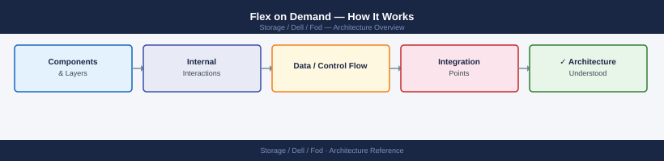
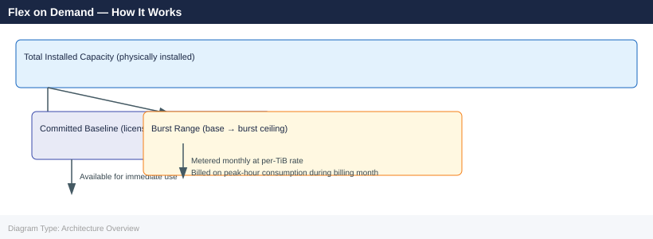

---
tags:
  - architecture
  - dell
---
# Flex on Demand — How It Works

<div class="kb-summary">
How It Works reference covering Overview, Metering Model, Supported Platforms, Use Cases, Best Practices.

*Applies to: Dell FOD*
</div>


## Overview

Dell Flex on Demand (FOD) is a consumption-based capacity model in which additional storage capacity is pre-installed in the array but metered — you pay only for what you use above the committed baseline. Usage is reported monthly via the CloudIQ telemetry pipeline, and burst consumption above the committed tier is billed at a per-TiB rate. FOD is available on PowerMax, PowerStore, and PowerScale platforms.

## FOD Licence Lifecycle

```d2
direction: right

PORTAL: "Dell Portal\n(licensing.dell.com)\nPurchase FOD licence" {shape: rectangle}
KEY: "Activation Key\n(emailed to customer)\nalphanumeric string" {shape: rectangle}
CMD: "Customer applies key\n`symcfg -auth activate`\nor Unisphere GUI" {shape: rectangle}
ARRAY: "PowerMax Array\nFeature enabled\nExpiry date set" {shape: rectangle}
MONITOR: "Monitor\nUnisphere dashboard\nor SYMCLI audit report" {shape: rectangle}
RENEW: "Renewal\n(before expiry)\nor Deactivation" {shape: rectangle}

PORTAL -> KEY
KEY -> CMD
CMD -> ARRAY
ARRAY -> MONITOR
MONITOR -> RENEW
RENEW -> PORTAL
```

## Metering Model



FOD contracts define a **base** commitment and a **burst ceiling**. Usage between base and ceiling is billed monthly. Usage above the burst ceiling may trigger over-usage charges or require an immediate license upgrade.

Metering is based on the **maximum capacity used in any hour** during the billing month (peak-hour metering).

## Supported Platforms

| Platform | FOD Availability |
|---|---|
| PowerMax | Yes — pre-installed drives, metered via CloudIQ |
| PowerStore | Yes — block and file capacity |
| PowerScale | Yes — node-based metering |

## Use Cases

| Use Case |
|---|
| Variable workload patterns where paying for peak capacity all the time is wasteful |
| Dev/test environments needing burst capacity periodically with a low committed baseline |
| Businesses wanting to avoid capital expenditure on storage while remaining on-premises |
| Organisations running APEX Flex on Demand subscriptions as part of a broader APEX agreement |
| Situations where procurement lead times are too long to meet workload growth demands |

## Best Practices

| Recommendation | Detail |
|---|---|
| Set committed baseline conservatively at contract start | Easier to raise baseline at renewal than recover overbilled burst charges |
| Monitor CloudIQ capacity trends weekly | Burst events are visible before the end-of-month bill |
| Ensure Secure Connect Gateway redundancy | A single SCG failure causing telemetry gaps can complicate billing disputes |
| Automate monthly usage extraction via CloudIQ API | Feed into finance reporting to eliminate manual reconciliation |

---

## See also

- [Fod — Design Standards](../design-standards/)
- [Fod — Integrations](../integrations/)
