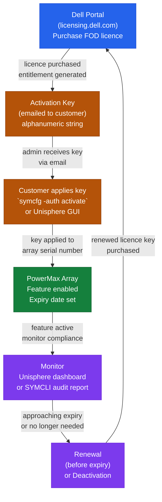

# Flex on Demand — How It Works


<div class="kb-summary">
How It Works reference covering Overview, Metering Model, Supported Platforms, Use Cases, Best Practices.
</div>
```text
┌─────────────────────────────────────── Dell FoD — How It Works ───────────────────────────────────────┐
│                                                                                                       │
│   ┌───────────────────────────────────────────────────────────────────────────────────────────────┐   │
│   │        FoD operational flow: request → controller → data service → host acknowledgement       │   │
│   │            Data path: host I/O → FoD controller → storage media → persistent write            │   │
│   │ Management: Dell License Manager / array CLI provides unified control for all operational fun │   │
│   │           Protection: snapshots, replication, and redundancy ensure data durability           │   │
│   └───────────────────────────────────────────────────────────────────────────────────────────────┘   │
│                                                                                                       │
│    Host I/O → FoD controller → storage media → acknowledge → replicate                                │
│                                                                                                       │
│                  ▼                                ▼                                ▼                  │
│                                                                                                       │
│   ┌─────────────────────────────┐  ┌─────────────────────────────┐  ┌─────────────────────────────┐   │
│   │            Layer            │  │          Component          │  │            Notes            │   │
│   │         License type        │  │        Permanent/Term       │  │       Feature-specific      │   │
│   │          Activation         │  │         Key → array         │  │        Instant unlock       │   │
│   │            Scope            │  │         Per-array SN        │  │       Non-transferable      │   │
│   │           Features          │  │       Replication/Tier      │  │       Product-defined       │   │
│   │            Audit            │  │        License report       │  │          Compliance         │   │
│   └─────────────────────────────┘  └─────────────────────────────┘  └─────────────────────────────┘   │
│                                                                                                       │
│                          ▼                                                 ▼                          │
│                                                                                                       │
│   ┌───────────────────────────────────────────────────────────────────────────────────────────────┐   │
│   │    Component     │     Purpose      │       Access      │       Auth       │      Notes       │   │
│   │   FoD license    │  Feature unlock  │  Portal download  │   Entitlement    │   Array-bound    │   │
│   │  License portal  │  Purchase/track  │       HTTPS       │    SSO login     │ licensing.dell.  │   │
│   │  Array firmware  │ FoD enforcement  │     Array mgmt    │    Admin role    │  Validates key   │   │
│   │   Audit report   │ Compliance check │     DDMC/array    │    Read-only     │  Monthly review  │   │
│   └───────────────────────────────────────────────────────────────────────────────────────────────┘   │
│                                                                                                       │
│    Physical: Dell array with FoD-capable firmware · Dell licensing portal · array management          │
│                                                                                                       │
│    Key terms:                                                                                         │
│                                                                                                       │
│    FoD                = Feature on Demand; software capabilities locked in firmware, unlocked by li...│
│    License key        = alphanumeric string generated at purchase; applied via GUI, CLI, or REST API  │
│    Permanent license  = perpetual feature unlock; tied to specific array serial number                │
│    Term license       = time-limited feature unlock; expires unless renewed through Dell portal       │
│    Entitlement        = purchased right to use a feature; tracked in Dell software licensing portal   │
│    License transfer   = FoD licenses are non-transferable between different array serial numbers      │
│    Replication FoD    = unlocks synchronous or asynchronous array replication features                │
│    Tier FoD           = unlocks FAST VP or cloud tiering between performance and capacity tiers       │
│    License audit      = periodic reconciliation of active features versus licensed entitlements       │
│    LicenseManager     = Dell tool for bulk license management across multiple array systems           │
│    Array serial       = unique array identifier; FoD licenses are cryptographically bound to it       │
│    FoD portal         = licensing.dell.com; purchase, download, and track all FoD license keys        │
│                                                                                                       │
└───────────────────────────────────────────────────────────────────────────────────────────────────────┘
```


## Overview

Dell Flex on Demand (FOD) is a consumption-based capacity model in which additional storage capacity is pre-installed in the array but metered — you pay only for what you use above the committed baseline. Usage is reported monthly via the CloudIQ telemetry pipeline, and burst consumption above the committed tier is billed at a per-TiB rate. FOD is available on PowerMax, PowerStore, and PowerScale platforms.

## FOD Licence Lifecycle



## Metering Model

```text
Total Installed Capacity (physically installed)
    │
    ├── Committed Baseline (licensed, always billed)
    │       └── Available for immediate use
    │
    └── Burst Range (base → burst ceiling)
            └── Metered monthly at per-TiB rate
                Billed on peak-hour consumption during billing month
```

FOD contracts define a **base** commitment and a **burst ceiling**. Usage between base and ceiling is billed monthly. Usage above the burst ceiling may trigger over-usage charges or require an immediate license upgrade.

Metering is based on the **maximum capacity used in any hour** during the billing month (peak-hour metering).

## Supported Platforms

| Platform | FOD Availability |
|---|---|
| PowerMax | Yes — pre-installed drives, metered via CloudIQ |
| PowerStore | Yes — block and file capacity |
| PowerScale | Yes — node-based metering |

## Use Cases

| Use Case |
|---|
| Variable workload patterns where paying for peak capacity all the time is wasteful |
| Dev/test environments needing burst capacity periodically with a low committed baseline |
| Businesses wanting to avoid capital expenditure on storage while remaining on-premises |
| Organisations running APEX Flex on Demand subscriptions as part of a broader APEX agreement |
| Situations where procurement lead times are too long to meet workload growth demands |

## Best Practices

| Recommendation | Detail |
|---|---|
| Set committed baseline conservatively at contract start | Easier to raise baseline at renewal than recover overbilled burst charges |
| Monitor CloudIQ capacity trends weekly | Burst events are visible before the end-of-month bill |
| Ensure Secure Connect Gateway redundancy | A single SCG failure causing telemetry gaps can complicate billing disputes |
| Automate monthly usage extraction via CloudIQ API | Feed into finance reporting to eliminate manual reconciliation |
