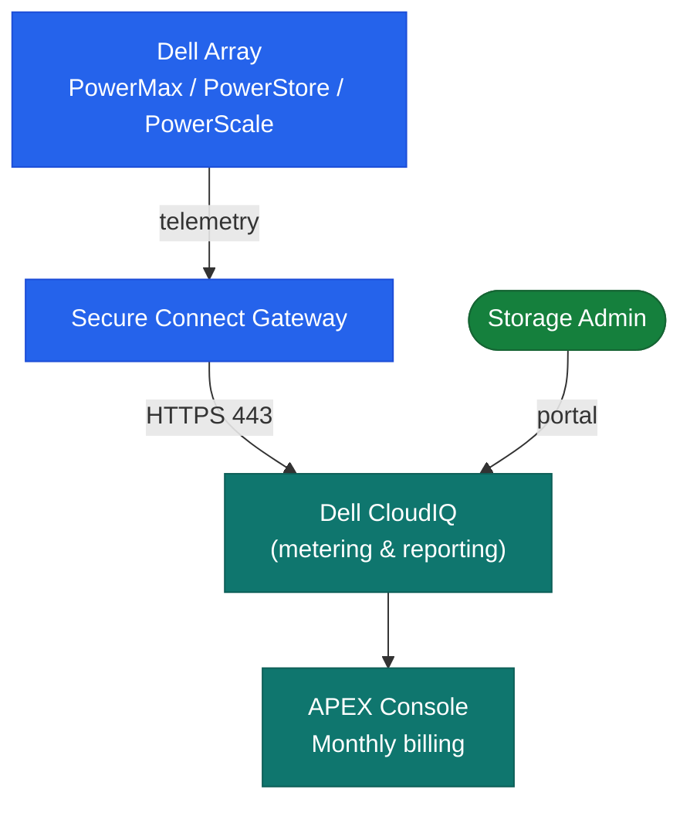

# Flex on Demand — Architecture

<div class="kb-summary">
Consumption-based capacity model on PowerMax, PowerStore, and PowerScale. Additional capacity is pre-installed in the array and metered monthly — billing is based on peak-hour consumption above the committed baseline, not physical installation.
</div>
```
┌─────────────────────────────────────── Dell FoD — Architecture ───────────────────────────────────────┐
│                                                                                                       │
│   ┌───────────────────────────────────────────────────────────────────────────────────────────────┐   │
│   │   FoD architecture overview: Feature on Demand — software features unlocked via license keys  │   │
│   │               Protocols: REST API · HTTPS (license portal) · array management UI              │   │
│   │          Key components: FoD license, Array firmware, License portal, Feature module          │   │
│   │          Design principles: HA, scalability, non-disruptive operations, and security          │   │
│   └───────────────────────────────────────────────────────────────────────────────────────────────┘   │
│                                                                                                       │
│    Design → deploy → configure → validate → monitor → optimise                                        │
│                                                                                                       │
│                  ▼                                ▼                                ▼                  │
│                                                                                                       │
│   ┌─────────────────────────────┐  ┌─────────────────────────────┐  ┌─────────────────────────────┐   │
│   │            Layer            │  │          Component          │  │            Notes            │   │
│   │         License type        │  │        Permanent/Term       │  │       Feature-specific      │   │
│   │          Activation         │  │         Key → array         │  │        Instant unlock       │   │
│   │            Scope            │  │         Per-array SN        │  │       Non-transferable      │   │
│   │           Features          │  │       Replication/Tier      │  │       Product-defined       │   │
│   │            Audit            │  │        License report       │  │          Compliance         │   │
│   └─────────────────────────────┘  └─────────────────────────────┘  └─────────────────────────────┘   │
│                                                                                                       │
│                          ▼                                                 ▼                          │
│                                                                                                       │
│   ┌───────────────────────────────────────────────────────────────────────────────────────────────┐   │
│   │    Component     │     Purpose      │       Access      │       Auth       │      Notes       │   │
│   │   FoD license    │  Feature unlock  │  Portal download  │   Entitlement    │   Array-bound    │   │
│   │  License portal  │  Purchase/track  │       HTTPS       │    SSO login     │ licensing.dell.  │   │
│   │  Array firmware  │ FoD enforcement  │     Array mgmt    │    Admin role    │  Validates key   │   │
│   │   Audit report   │ Compliance check │     DDMC/array    │    Read-only     │  Monthly review  │   │
│   └───────────────────────────────────────────────────────────────────────────────────────────────┘   │
│                                                                                                       │
│    Physical: Dell array with FoD-capable firmware · Dell licensing portal · array management          │
│                                                                                                       │
│    Key terms:                                                                                         │
│                                                                                                       │
│    FoD                = Feature on Demand; software capabilities locked in firmware, unlocked by li...│
│    License key        = alphanumeric string generated at purchase; applied via GUI, CLI, or REST API  │
│    Permanent license  = perpetual feature unlock; tied to specific array serial number                │
│    Term license       = time-limited feature unlock; expires unless renewed through Dell portal       │
│    Entitlement        = purchased right to use a feature; tracked in Dell software licensing portal   │
│    License transfer   = FoD licenses are non-transferable between different array serial numbers      │
│    Replication FoD    = unlocks synchronous or asynchronous array replication features                │
│    Tier FoD           = unlocks FAST VP or cloud tiering between performance and capacity tiers       │
│    License audit      = periodic reconciliation of active features versus licensed entitlements       │
│    LicenseManager     = Dell tool for bulk license management across multiple array systems           │
│    Array serial       = unique array identifier; FoD licenses are cryptographically bound to it       │
│    FoD portal         = licensing.dell.com; purchase, download, and track all FoD license keys        │
│                                                                                                       │
└───────────────────────────────────────────────────────────────────────────────────────────────────────┘
```


<div class="kb-grid kb-grid-3">
<a class="kb-card" href="how-it-works/"><strong>How It Works</strong><span>How it works, integrations, and design standards.</span></a>
<a class="kb-card" href="integrations/"><strong>Integrations</strong><span>Integration with CloudIQ, Secure Connect Gateway, and APEX billing.</span></a>
<a class="kb-card" href="design-standards/"><strong>Design Standards</strong><span>Baseline configuration, burst monitoring, and SCG redundancy practices.</span></a>
</div>

## Metering Model

| Tier | Description |
|---|---|
| Committed baseline | Licensed outright — always billed; immediately usable |
| Burst range | Pre-installed; metered monthly at per-TiB rate above baseline |
| Burst ceiling | Maximum metered capacity; over-ceiling usage may incur over-usage charges |

Billing is based on the **maximum capacity used in any single hour** during the billing month (peak-hour metering).

## FOD Data Flow


