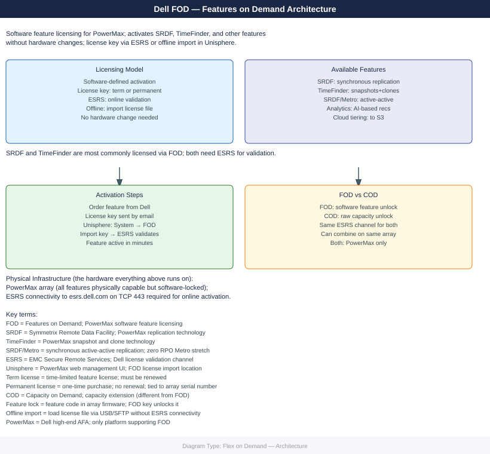
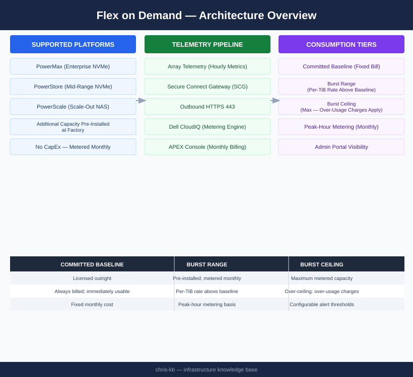

---
tags:
  - architecture
  - dell
---
# Flex on Demand — Architecture

Consumption-based capacity model on PowerMax, PowerStore, and PowerScale. Additional capacity is pre-installed in the array and metered monthly — billing is based on peak-hour consumption above the committed baseline, not physical installation.

*Applies to: Dell FOD*

<a class="kb-card" href="how-it-works/"><strong>How It Works</strong>How it works, integrations, and design standards.</a>
<a class="kb-card" href="integrations/"><strong>Integrations</strong>Integration with CloudIQ, Secure Connect Gateway, and APEX billing.</a>
<a class="kb-card" href="design-standards/"><strong>Design Standards</strong>Baseline configuration, burst monitoring, and SCG redundancy practices.</a>

## Metering Model

| Tier | Description |
|---|---|
| Committed baseline | Licensed outright — always billed; immediately usable |
| Burst range | Pre-installed; metered monthly at per-TiB rate above baseline |
| Burst ceiling | Maximum metered capacity; over-ceiling usage may incur over-usage charges |

Billing is based on the **maximum capacity used in any single hour** during the billing month (peak-hour metering).

## FOD Data Flow

