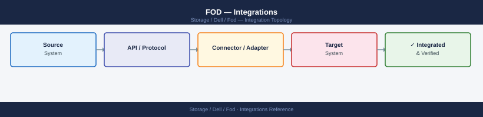

---
tags:
  - architecture
  - dell
---
# FOD — Integrations


<div class="kb-summary">
Features on Demand integration with PowerMax/Unity management platforms and storage orchestration tools.

*Applies to: Dell FOD*
</div>



> Part of the [Flex on Demand](../index.md) reference.

---

| Integration | Notes |
|---|---|
| CloudIQ | Metering telemetry pipeline; capacity trends drive billing; SCG must stay connected |
| Secure Connect Gateway (SCG) | Forwards capacity telemetry from the array to CloudIQ; SCG outage causes telemetry gaps |
| Dell APEX Console | Billing and consumption reporting; committed baseline adjustments |
| Unisphere REST API | Capacity queries (`/system_capacity`, `/srp`) for burst monitoring |
| SYMCLI | Local capacity and license queries for PowerMax/VMAX arrays |
| Finance / chargeback tools | Automated monthly usage export via CloudIQ API for internal reporting |

---

```d2
direction: right

center: "Flex On Demand" {shape: hexagon}
component_a: "Component A" {shape: rectangle}
component_b: "Component B" {shape: rectangle}
component_c: "Component C" {shape: rectangle}

center -> component_a
center -> component_b
center -> component_c
```

## See also

- [Fod — How It Works](how-it-works/)
- [Fod — Design Standards](design-standards/)
