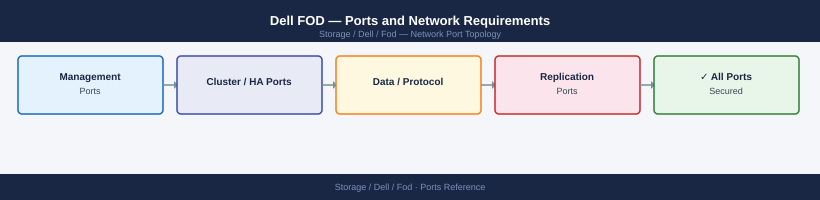

---
tags:
  - fod
  - dell
  - feature-on-demand
  - networking
  - firewall
  - ports
---
# Dell FOD — Ports and Network Requirements

<div class="kb-summary">
Firewall port reference for Dell FOD (Feature on Demand). FOD enables software features on Dell arrays via license keys downloaded from Dell or activated via ESRS. Port requirements are the same as call-home / ESRS.

*Applies to: Dell FOD for PowerStore, PowerMax, Unity*
</div>



```d2
direction: right

center: "Flex On Demand" {shape: hexagon}
feature_activation_esrs_dell_support: "Feature Activation (ESRS / Dell Support Portal)" {shape: rectangle}
array_management_ui_license_activati: "Array Management UI (License Activation)" {shape: rectangle}
firewall_summary: "Firewall Summary" {shape: rectangle}

center -> feature_activation_esrs_dell_support
center -> array_management_ui_license_activati
center -> firewall_summary
```

## Feature Activation (ESRS / Dell Support Portal)

| Port | Protocol | Source | Destination | Purpose |
|---|---|---|---|---|
| 443 | TCP | Array management IP | esrs.dell.com, licensing.dell.com | FOD license key validation and download |
| 443 | TCP | Admin workstation | my.dell.com | Admin downloads license key from Dell portal |

## Array Management UI (License Activation)

| Port | Protocol | Source | Purpose |
|---|---|---|---|
| 443 | TCP | Admin workstations | Unisphere / PowerStore Manager — apply FOD license |
| 8443 | TCP | Admin workstations | Unisphere for PowerMax — apply FOD license |

## Firewall Summary

| From | To | Ports | Notes |
|---|---|---|---|
| Array mgmt IP | esrs.dell.com | 443 | License key pull from Dell |
| Admin workstation | my.dell.com | 443 | Portal download (optional — can transfer offline) |

## See also

- [Dell FOD — Architecture](how-it-works/)
- [Dell COD — Ports](../../cod/architecture/ports.md)
- [Dell PowerStore — Ports](../../powerstore/architecture/ports.md)
