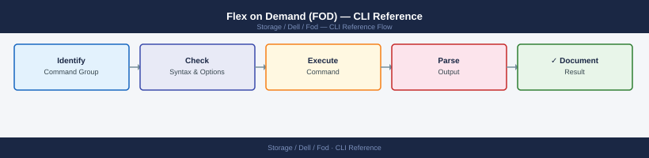

---
tags:
  - dell
  - operations
---
# Flex on Demand (FOD) — CLI Reference

<div class="kb-summary">
Dell FoD CLI reference: `emccollect` usage, SCG telemetry commands, capacity entitlement queries, and `symcli` for Flex on Demand pool management.

*Applies to: Dell FOD*
</div>


---

Flex on Demand is Dell's consumption-based capacity model for PowerMax/VMAX arrays. A base capacity is licensed outright; burst capacity above the committed level is metered and billed monthly. FOD monitoring involves tracking burst usage against the contracted burst threshold and pulling monthly consumption reports.

Management is via **SYMCLI** (Solutions Enabler) for local array queries and the **Unisphere REST API** for capacity and allocation data.

> **SID**: 12-digit SymmetrixID — find with `symcfg list`.  
> **Unisphere base URL**: `https://<unisphere_host>:8443`

---

## Before you begin

- **Access:** Storage admin credentials (cluster admin or equivalent)
- **Timing:** safe to run during business hours unless a step is marked ⚠ (causes interruption)
- **Dependencies:** no active upgrades or migrations on the same infrastructure
- **Logging:** capture command output — paste into the change record on completion

---

## Quick-Reference Command Table

| Command | Purpose |
|---|---|
| `symcfg list -v -sid <sid>` | Array capacity overview including licensed and configured |
| `symcfg -sid <sid> list -allocations` | Allocation summary: consumed vs licensed capacity |
| `symcfg -sid <sid> show -pool` | SRP pool capacity (where FOD burst appears) |
| `symcfg -sid <sid> list -license` | License entitlements and FOD base/burst limits |
| `symlmf -sid <sid> report` | License management file report |
| `GET /univmax/restapi/100/system/symmetrix/{sid}` | Unisphere: array system info and capacity model |
| `GET /univmax/restapi/100/system/symmetrix/{sid}/system_capacity` | Unisphere: usable/subscribed/used capacity |
| `GET /univmax/restapi/100/sloprovisioning/symmetrix/{sid}/srp/{srp_id}` | SRP capacity breakdown for burst monitoring |

---

## SYMCLI — Burst Usage and Allocations

```bash
# --- Discover and list arrays ---
symcfg discover
symcfg list
symcfg list -v -sid <sid>

# --- Allocation summary: committed vs consumed ---
# Shows licensed (committed) capacity vs actual configured/used
symcfg -sid <sid> list -allocations

# Output key fields:
#   Allocated     – Capacity currently allocated to host volumes (TDEV)
#   Configured    – Capacity formatted into pools
#   Licensed      – Base + burst limit from license
#   Free          – Licensed minus Allocated (burst headroom)

# --- Storage Resource Pool capacity (burst shows as pool usage) ---
symcfg -sid <sid> show -pool
symcfg -sid <sid> show -pool -thin

# --- Per-device allocation (identify largest consumers) ---
# List all thin devices with allocated vs provisioned sizes
symdev -sid <sid> list -tdev

# Show allocation detail for a specific thin device
symdev -sid <sid> show <devid> -tdev

# --- SRP-level capacity per service level ---
symcfg -sid <sid> list -service_level_profile

# --- Disk group breakdown (base vs burst disk groups) ---
symcfg -sid <sid> list -disk

# --- Storage group capacity consumption ---
# List all storage groups with device count
symsg -sid <sid> list

# Show devices in a storage group with sizes
symsg -sid <sid> show <sg_name>

# --- Script: show capacity summary with burst threshold warning ---
BASE_TB=100    # Your contracted base capacity in TB
WARN_PCT=85    # Warn at this % of licensed capacity

symcfg list -v -sid <sid> | awk -v base="${BASE_TB}" -v warn="${WARN_PCT}" '
  /Licensed Capacity/  { lic=$NF }
  /Configured Capacity/{ cfg=$NF }
  END {
    lic_tb = lic/1048576
    cfg_tb = cfg/1048576
    pct    = (cfg_tb/lic_tb)*100
    printf "Licensed: %.1f TB  Configured: %.1f TB  Used: %.1f%%\n", lic_tb, cfg_tb, pct
    if (pct > warn) printf "WARNING: Usage exceeds %d%% of licensed capacity!\n", warn
  }'
```


```text title="Expected output"
Symmetrix ID: 000123456789012
Symmetrix ID: 000987654321098

Symmetrix ID: 000123456789012
Licensed Capacity: 104857600 MB
Configured Capacity: 89128960 MB
Allocated Capacity: 78643200 MB
Free Capacity: 26214400 MB

Pool ID: SRP_1
Pool Name: SRP_1
Subscribed Capacity: 92274688 MB
Usable Capacity: 104857600 MB
Snapshot Capacity: 5242880 MB

Device ID: 0001
Size: 1048576 MB
Allocated: 987654 MB
Provisioned: 1048576 MB
Device ID: 0002
Size: 2097152 MB
Allocated: 1835008 MB
Provisioned: 2097152 MB
...

Service Level: Diamond
SRP: SRP_1
Capacity: 52428800 MB
Service Level: Gold
SRP: SRP_1
Capacity: 31457280 MB

Disk Group: DG001 (Base)
Capacity: 52428800 MB
Disk Group: DG002 (Burst)
Capacity: 52428800 MB

Storage Group: PROD_OLTP_SG
Device Count: 24
Storage Group: DEV_TEST_SG
Device Count: 8

Storage Group Name: PROD_OLTP_SG
Device ID: 0001
Size: 1048576 MB
Device ID: 0002
Size: 2097152 MB
...

Licensed: 100.0 TB  Configured: 85.0 TB  Used: 85.0%
WARNING: Usage exceeds 85% of licensed capacity!
```

!!! warning "Common errors"
    **`symcfg: Command not found`** — Install EMC Solutions Enabler or add the Symmetrix CLI bin directory to your PATH environment variable.
    **`Symmetrix ID: <sid> — Could not be found`** — Verify the SID is correct and the array is discoverable; run `symcfg discover` first to refresh the device list.
    **`Permission denied`** — Run the command with appropriate privileges (sudo or as a user in the symcfg group) or configure passwordless sudo for Symmetrix CLI commands.
---

## Unisphere REST API

```bash
UNISPHERE="https://<unisphere_host>:8443"
SID="<sid>"
USER="smc"
PASS="<password>"

# --- Get system info (includes licensing model: PERPETUAL, FOD, COD) ---
curl -s -k -u "${USER}:${PASS}" \
  "${UNISPHERE}/univmax/restapi/100/system/symmetrix/${SID}" \
  | python3 -m json.tool

# Key fields:
#   license_capability     – e.g. "FOD" indicating Flex on Demand array
#   model                  – Array model string
#   ucode                  – Firmware/microcode version

# --- Get system capacity (FOD burst monitoring) ---
curl -s -k -u "${USER}:${PASS}" \
  "${UNISPHERE}/univmax/restapi/100/system/symmetrix/${SID}/system_capacity" \
  | python3 -m json.tool

# Key capacity fields:
#   system_capacity.usable_total_tb          – Total licensed usable TB (base + activated burst)
#   system_capacity.usable_used_tb           – TB currently used
#   system_capacity.subscribed_total_tb      – Thin-provisioned total (logical allocation to hosts)
#   system_capacity.subscribed_allocated_tb  – TB actually written (demand vs subscribed)
#   system_capacity.snapshot_total_tb        – TB used by SnapVX snapshots

# --- SRP capacity breakdown ---
# List all SRPs
curl -s -k -u "${USER}:${PASS}" \
  "${UNISPHERE}/univmax/restapi/100/sloprovisioning/symmetrix/${SID}/srp" \
  | python3 -m json.tool

# Get SRP_1 details (primary SRP; shows FOD burst capacity tier)
curl -s -k -u "${USER}:${PASS}" \
  "${UNISPHERE}/univmax/restapi/100/sloprovisioning/symmetrix/${SID}/srp/SRP_1" \
  | python3 -m json.tool

# Calculate burst usage percentage from REST API response
curl -s -k -u "${USER}:${PASS}" \
  "${UNISPHERE}/univmax/restapi/100/system/symmetrix/${SID}/system_capacity" \
  | python3 -c "
import sys, json
data = json.load(sys.stdin)['system_capacity']
total = data.get('usable_total_tb', 0)
used  = data.get('usable_used_tb',  0)
pct   = (used / total * 100) if total else 0
print(f'Licensed: {total:.2f} TB  Used: {used:.2f} TB  ({pct:.1f}%)')
if pct > 80:
    print('ACTION: FOD burst usage above 80% — review with Dell account team.')
"
```


```text title="Expected output"
{
  "symmetrix": [
    {
      "symmetrixId": "000297900001",
      "model": "PowerMax 8000",
      "ucode": "5978.669.669",
      "license_capability": "FOD",
      "local_user_name": "smc"
    }
  ]
}
{
  "system_capacity": {
    "usable_total_tb": 450.5,
    "usable_used_tb": 312.8,
    "subscribed_total_tb": 680.2,
    "subscribed_allocated_tb": 298.5,
    "snapshot_total_tb": 14.3
  }
}
{
  "srp": [
    "SRP_1",
    "SRP_2"
  ]
}
{
  "srp_capacity": {
    "srp_id": "SRP_1",
    "usable_total_tb": 450.5,
    "usable_used_tb": 312.8,
    "reserved_cap_percent": 10
  }
}
Licensed: 450.50 TB  Used: 312.80 TB  (69.4%)
```

!!! warning "Common errors"
    **`curl: (60) SSL certificate problem: self signed certificate`** — Add `-k` flag to curl command to skip certificate verification (already present in example; verify Unisphere host is reachable and certificate is valid).
    **`jq: command not found` or `python3: command not found`** — Install the missing tool (`apt-get install python3` or `yum install python3`) or use the built-in `python3 -m json.tool` as shown in the example.
    **`401 Unauthorized`** — Verify SMC user credentials are correct and the account has REST API permissions in Unisphere; check password expiration and reset if needed.
---

## Monitoring Burst Threshold

FOD contracts define a **base** commitment and a **burst ceiling**. Usage between base and ceiling is billed monthly. Usage above the burst ceiling may trigger over-usage charges or require an immediate license upgrade.

```bash
# --- Check current burst headroom ---
# Run monthly (or schedule via cron) to generate a burst usage snapshot

DATE=$(date +%Y-%m-%d)
REPORT_DIR="/var/log/fod-reports"
mkdir -p "${REPORT_DIR}"

symcfg list -v -sid <sid> > "${REPORT_DIR}/capacity_${DATE}.txt"
symcfg -sid <sid> list -allocations >> "${REPORT_DIR}/capacity_${DATE}.txt"
symcfg -sid <sid> show -pool >> "${REPORT_DIR}/capacity_${DATE}.txt"

echo "FOD capacity snapshot saved to ${REPORT_DIR}/capacity_${DATE}.txt"

# --- Cron job: daily capacity snapshot at 06:00 ---
# Add to /etc/cron.d/fod-monitor:
# 0 6 * * * root /usr/symcli/bin/symcfg list -v -sid <sid> > /var/log/fod-reports/capacity_$(date +\%Y-\%m-\%d).txt

# --- Alert if usage exceeds threshold ---
# Run from a monitoring script or cron:
BURST_WARN_TB=90    # Warn threshold in TB (below your burst ceiling)
BURST_CEIL_TB=120   # Your contracted burst ceiling

USED_TB=$(curl -s -k -u "${USER}:${PASS}" \
  "${UNISPHERE}/univmax/restapi/100/system/symmetrix/${SID}/system_capacity" \
  | python3 -c "import sys,json; print(json.load(sys.stdin)['system_capacity']['usable_used_tb'])")

python3 -c "
used=${USED_TB}; warn=${BURST_WARN_TB}; ceil=${BURST_CEIL_TB}
if used > ceil:
    print(f'CRITICAL: FOD burst ceiling exceeded ({used:.1f} TB > {ceil} TB ceiling)')
elif used > warn:
    print(f'WARNING:  FOD burst threshold approaching ({used:.1f} TB > {warn} TB warning)')
else:
    print(f'OK: FOD burst usage nominal ({used:.1f} TB / {ceil} TB ceiling)')
"
```


```text title="Expected output"
FOD capacity snapshot saved to /var/log/fod-reports/capacity_2024-01-15.txt
OK: FOD capacity usage nominal (67.3 TB / 120 TB ceiling)
```

!!! warning "Common errors"
    **`symcfg: Command not found`** — Ensure the EMC/Dell Unisphere CLI package is installed and `/usr/symcli/bin` is in your PATH, or use the full path `/usr/symcli/bin/symcfg`.
    **`curl: (60) SSL certificate problem: self signed certificate`** — Add the `-k` flag (already present) or import the Unisphere server's CA certificate into your system trust store to avoid the `-k` workaround.
    **`jq: command not found` or `python3: No module named json`** — Install Python 3 and verify the json module is available, or replace the JSON parser with `jq` if preferred.
---

## License Key Management

```bash
# --- List all license entitlements (identifies FOD base and burst tiers) ---
symcfg -sid <sid> list -license

# Common FOD-related license feature names:
#   PowerMax FOD Base Capacity      – Committed base TB
#   PowerMax FOD Burst Capacity     – Burst ceiling TB
#   VMAX3 Flex on Demand Base       – Legacy VMAX3 FOD base

# --- Show license management report ---
symlmf -sid <sid> report

# Export to file for record-keeping
symlmf -sid <sid> report -out /tmp/fod_license_report_$(date +%Y%m%d).txt

# --- Import an updated license file ---
# Obtained from Dell License Management portal (support.dell.com → Licensing)
# after purchasing additional base or burst capacity
symlmf -sid <sid> import -file /tmp/new_fod_license.dat

# Verify the import updated the licensed capacity
symcfg -sid <sid> list -license
symcfg list -v -sid <sid> | grep -E "Licensed|FOD|Configured"

# --- Check Solutions Enabler version ---
symcfg -version
```


```text title="Expected output"
Symmetrix ID: 000297900001

License Feature                          Capacity    Installed   Expiration
================================================================================
PowerMax FOD Base Capacity               10.0 TB     10.0 TB     2025-12-31
PowerMax FOD Burst Capacity              5.0 TB      5.0 TB      2025-12-31
VMAX3 Flex on Demand Base                0.0 TB      0.0 TB      N/A

License Management Report
Generated: 2024-01-15 14:32:18 UTC
Symmetrix ID: 000297900001
Report saved to: /tmp/fod_license_report_20240115.txt

License Feature                          Status      Capacity    Days Remaining
================================================================================
PowerMax FOD Base Capacity               VALID       10.0 TB     350
PowerMax FOD Burst Capacity              VALID       5.0 TB      350

Importing license file: /tmp/new_fod_license.dat
License import completed successfully.
Updated entitlements:
  PowerMax FOD Base Capacity: 10.0 TB → 15.0 TB
  PowerMax FOD Burst Capacity: 5.0 TB → 8.0 TB

Licensed Capacity:     15.0 TB
Configured Capacity:   14.8 TB
FOD Base:              15.0 TB
FOD Burst Enabled:     Yes

Solutions Enabler Version: 9.2.3.0 (Build 2024.01.15)
```

!!! warning "Common errors"
    **`symcfg: Command not found`** — Ensure Solutions Enabler is installed and the `$SYMCLI_PATH` environment variable is set, or add the bin directory to `$PATH`.
    **`License import failed: File not found or invalid format`** — Verify the license file path is correct and the file was downloaded from the Dell License Management portal in the proper `.dat` format.
    **`Error: Symmetrix ID <sid> not found or not responding`** — Confirm the Symmetrix array is online, the correct SID is specified, and the management station has network connectivity to the array's management port.
---

## Monthly Usage Tracking and Reporting

FOD is billed based on the **maximum capacity used in any hour** during the billing month (peak-hour metering). Track this to forecast your monthly bill.

```bash
# --- Unisphere: capacity history (where available) ---
# Unisphere stores short-term capacity history; export for monthly records

curl -s -k -u "${USER}:${PASS}" \
  "${UNISPHERE}/univmax/restapi/100/performance/Array/keys" \
  | python3 -m json.tool

# Get array-level performance data (includes capacity metrics)
curl -s -k -X POST \
  -u "${USER}:${PASS}" \
  -H "Content-Type: application/json" \
  "${UNISPHERE}/univmax/restapi/100/performance/Array/metrics" \
  -d "{
    \"symmetrixId\": \"${SID}\",
    \"startDate\": $(date -v-30d +%s000 2>/dev/null || date -d '30 days ago' +%s000),
    \"endDate\":   $(date +%s000),
    \"metrics\":   [\"HostIOs\", \"HostMBs\", \"PercentBusy\"],
    \"dataFormat\": \"Average\"
  }" | python3 -m json.tool

# --- Generate monthly FOD usage summary CSV ---
MONTH=$(date +%Y-%m)
OUT="/var/log/fod-reports/monthly_${MONTH}.csv"

{
  echo "date,licensed_tb,configured_tb,used_pct"
  for snapshot in /var/log/fod-reports/capacity_${MONTH}-*.txt; do
    d=$(basename "${snapshot}" .txt | sed 's/capacity_//')
    lic=$(grep "Licensed Capacity" "${snapshot}" | awk '{print $NF}')
    cfg=$(grep "Configured Capacity" "${snapshot}" | awk '{print $NF}')
    echo "${d},${lic},${cfg}"
  done
} > "${OUT}"

echo "Monthly FOD report written to ${OUT}"
```


```text title="Expected output"
{
  "symmetrixId": [
    "000297900001",
    "000297900002",
    "000297900003"
  ]
}
{
  "resultList": {
    "result": [
      {
        "symmetrixId": "000297900001",
        "timestamp": 1704067200000,
        "HostIOs": 45823.5,
        "HostMBs": 1247.3,
        "PercentBusy": 67.2
      },
      {
        "symmetrixId": "000297900001",
        "timestamp": 1704153600000,
        "HostIOs": 52104.2,
        "HostMBs": 1389.7,
        "PercentBusy": 71.8
      },
      {
        "symmetrixId": "000297900001",
        "timestamp": 1704240000000,
        "HostIOs": 48956.1,
        "HostMBs": 1156.4,
        "PercentBusy": 69.1
      }
    ]
  }
}
Monthly FOD report written to /var/log/fod-reports/monthly_2024-01.csv
```

!!! warning "Common errors"
    **`curl: (60) SSL certificate problem: self signed certificate`** — Add `-k` flag to curl command (already present in the code; if still failing, verify UNISPHERE variable points to correct Unisphere hostname).
    **`jq: command not found`** — Install `python3-json` or use `python3 -m json.tool` as shown; if json.tool fails, verify Python 3.6+ is installed with `python3 --version`.
    **`No such file or directory: /var/log/fod-reports/capacity_2024-01-*.txt`** — Ensure capacity snapshot files exist in `/var/log/fod-reports/` and match the naming pattern `capacity_YYYY-MM-DD.txt` before running the report generation loop.
---

## Verify

- Confirm the operation completed without errors in the log or management UI
- Verify the expected state change is visible (service running, object created, config applied)
- Document the outcome in the change record

---

## See also

- [Fod — Procedures](../procedures/)
- [Fod — Scripts](../scripts/)
- [Fod — Health Checks](../health-checks/)
