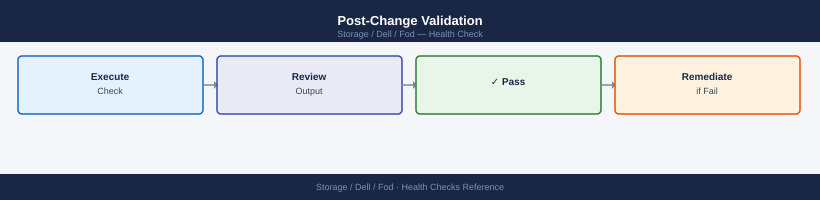

---
tags:
  - dell
  - operations
---
# FOD — Health Checks


<div class="kb-summary">
Dell FoD health checks: SCG connectivity status, entitlement consumption review in CloudIQ, capacity threshold alerts, and monthly usage validation.

*Applies to: Dell FOD*
</div>


## Before you begin

- **Access:** Storage admin credentials (cluster admin or equivalent)
- **Timing:** safe to run during business hours unless a step is marked ⚠ (causes interruption)
- **Dependencies:** no active upgrades or migrations on the same infrastructure
- **Logging:** capture command output — paste into the change record on completion

---

## Run This Routine

1. **Enabled features:** `symcfg -sid <sid> list -fod` — review all enabled FOD features
2. **Feature licence expiry:** check FOD licence expiry dates — flag any expiring in <90 days
3. **Feature utilisation:** verify FOD-enabled features are actually in use (to justify renewal)
4. **Licence compliance:** confirm number of licensed features does not exceed entitlement
5. **Renew pending:** check for FOD features with upcoming renewal dates in Unisphere
6. **Audit log:** review FOD activation/deactivation log for unauthorised changes

---

## Daily Checks


| Check | Command | Notes |
|---|---|---|
| [ ] Check if FOD burst is currently active on any array | | burst should only be active if a planned workload increase justified it |
| [ ] Review what percentage of the burst ceiling is consumed | | flag if above 80% of the burst allowance |
| [ ] Confirm whether the current month's consumption report is available | | |
| [ ] Check that base capacity allocation has not changed unexpectedly | | |

## Health Check Commands


```bash
# Authenticate to Unisphere REST API
TOKEN=$(curl -s -k -X POST \
  "https://<unisphere_ip>:8443/univmax/restapi/version/system/login" \
  -H "Content-Type: application/json" \
  -d '{"username":"<user>","password":"<password>"}' | jq -r '.token')

# Get FOD/flex capacity status for the array
curl -s -k \
  -H "Authorization: ${TOKEN}" \
  -H "Content-Type: application/json" \
  "https://<unisphere_ip>:8443/univmax/restapi/100/sloprovisioning/symmetrix/<sid>" | \
  jq '{sid: .symmetrixId, total_usable_cap_gb: .total_usable_cap_gb, total_subscribed_cap_gb: .total_subscribed_cap_gb}'

# Get SRP details to review burst and allocated capacity
curl -s -k \
  -H "Authorization: ${TOKEN}" \
  -H "Content-Type: application/json" \
  "https://<unisphere_ip>:8443/univmax/restapi/100/sloprovisioning/symmetrix/<sid>/srp/<srp_id>" | \
  jq '{srp: .srpId, reserved_cap_percent: .reserved_cap_percent, total_usable_cap_gb: .srp_capacity.usable_total_tb}'
```

## Change Readiness

- [ ] Estimate expected capacity growth from the planned workload increase (in TB)
- [ ] Confirm the FOD burst ceiling is sufficient to cover the planned increase without being exceeded
- [ ] If the planned increase is expected to be sustained (not a temporary burst), notify the Dell account team to discuss adjusting the base contracted capacity
- [ ] Confirm the billing implications are understood — sustained burst usage is charged at the burst rate
- [ ] Document the current base and burst consumption figures before the workload change

## Post-Change Validation



- [ ] FOD burst consumption returns to the pre-change baseline after any temporary workload increase
- [ ] Burst is not active where it was not expected to be
- [ ] Monthly consumption report updated to reflect any intentional capacity changes
- [ ] Dell account team notified if sustained capacity increase is expected to exceed the contracted base
- [ ] Capacity planning records updated with new baseline figures

---

## Verify

- Confirm the operation completed without errors in the log or management UI
- Verify the expected state change is visible (service running, object created, config applied)
- Document the outcome in the change record

---

## See also

- [Fod — Procedures](procedures/)
- [Fod — CLI Reference](cli-reference/)
- [Fod — Common Issues](../troubleshooting/common-issues/)
