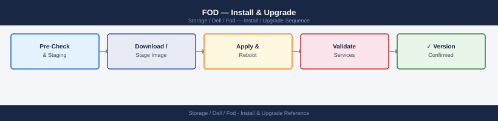

---
tags:
  - dell
  - operations
---
# FOD — Install & Upgrade

<div class="kb-summary">
Dell FoD install and upgrade: SCG registration for automatic telemetry, FoD licence activation procedure, and upgrade path for capacity tier changes.

*Applies to: Dell FOD*
</div>


---

FOD billing is managed by Dell — there is no on-premises software upgrade for the FOD metering system itself. Lifecycle tasks focus on:

| Step | Action |
|---|---|
| 1 | FOD billing is unaffected by firmware upgrades, but confirm CloudIQ telemetry resumes promptly after any maintenance that takes the array offline |
| 2 | After adding physical burst capacity under a FOD agreement, confirm CloudIQ reflects the new total installed capacity |
| 3 | If the array is migrated or replaced, work with Dell to transfer the FOD contract to the new system SID |

## Before you begin

- **Access:** Storage admin credentials (cluster admin or equivalent)
- **Timing:** safe to run during business hours unless a step is marked ⚠ (causes interruption)
- **Dependencies:** no active upgrades or migrations on the same infrastructure
- **Logging:** capture command output — paste into the change record on completion

---

## License Key Management

```bash
# --- List all license entitlements (identifies FOD base and burst tiers) ---
symcfg -sid <sid> list -license

# Common FOD-related license feature names:
#   PowerMax FOD Base Capacity      – Committed base TB
#   PowerMax FOD Burst Capacity     – Burst ceiling TB
#   VMAX3 Flex on Demand Base       – Legacy VMAX3 FOD base

# --- Import an updated license file ---
symlmf -sid <sid> import -file /tmp/new_fod_license.dat

# Verify the import updated the licensed capacity
symcfg -sid <sid> list -license
```

---

## Verify

- Confirm the operation completed without errors in the log or management UI
- Verify the expected state change is visible (service running, object created, config applied)
- Document the outcome in the change record

---

## See also

- [Fod — Procedures](../procedures/)
- [Fod — Health Checks](../health-checks/)
