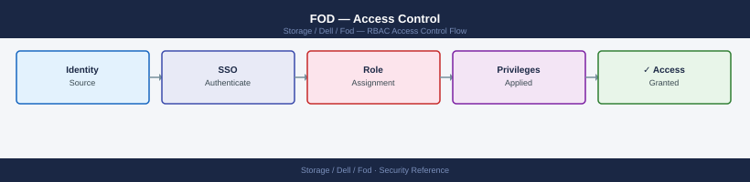

---
tags:
  - dell
  - security
---
# FOD — Access Control

Access Control reference covering APEX Console RBAC Roles, API Service Account Configuration, SCG Access Controls, CloudIQ User Roles, General Controls.

*Applies to: Dell FOD*

> Part of the [Flex on Demand](../index.md) reference.

---

## Before you begin

- **Access:** Storage admin credentials (cluster admin or equivalent)
- **Change management:** security changes require CAB approval in most environments
- **Rollback plan:** document current state before any security control change
- **Testing:** validate in a non-production environment first where possible

---

## APEX Console RBAC Roles

| Role | Capabilities | Recommended Use |
|---|---|---|
| **Account Admin** | Full subscription management, user provisioning, raise and manage service requests | One or two named storage leads per account |
| **Storage Admin** | View and manage storage resources, view consumption dashboards, acknowledge alerts | Day-to-day storage operations team |
| **Viewer / Monitor** | Read-only access to dashboards, consumption reports, and capacity trends | Capacity monitoring automation accounts, finance teams, auditors |

Assign the Viewer role to any integration or service account that only needs to pull capacity metrics. Write-level access is not required for FOD reporting or chargeback automation.

## API Service Account Configuration

| Control | Detail |
|---|---|
| **One account per integration** | Create a dedicated APEX API service account for each consuming system (e.g., one for CloudIQ, one for chargeback scripts, one for monitoring tooling). Do not share credentials between integrations. |
| **Scope to minimum role** | Bind each service account to the Viewer role unless a specific integration requires write operations. Document any exception. |
| **Credential rotation** | Rotate API client secrets every 90 days. Store credentials in a secrets vault (HashiCorp Vault, AWS Secrets Manager, or equivalent) — never in source code or configuration files. |
| **Token lifetime** | APEX API access tokens are short-lived. Ensure integrations use the OAuth client credentials flow to refresh tokens automatically rather than caching a long-lived token. |

## SCG Access Controls

| Control | Detail |
|---|---|
| **Local admin accounts** | The SCG appliance has a local admin account used during initial registration. Change the default password at deployment and rotate it on the same schedule as other privileged credentials. |
| **Management network access** | Restrict SSH and the SCG management interface to the storage management VLAN. Block access from general-purpose server VLANs. |
| **No inbound connectivity required** | The SCG initiates all outbound connections to Dell's cloud. No inbound firewall rule from the internet to the SCG is needed or should be opened. |
| **Audit log access** | SCG activity is visible in CloudIQ under the gateway events log. Review this log monthly to confirm telemetry delivery and detect unexpected registration or deregistration events. |

## CloudIQ User Roles

| Role | Capabilities |
|---|---|
| **Admin** | Manage users, configure alert policies, view all objects across all registered arrays |
| **Operator** | Acknowledge and manage alerts, view all objects |
| **Read Only** | View dashboards, capacity reports, and health scores; cannot modify any configuration |

Apply the Read Only role to all non-operational accounts. Audit CloudIQ user membership quarterly and remove accounts for personnel who have changed roles or left the organisation.

## General Controls

- Restrict Unisphere access to named storage administrators; do not use shared admin credentials.
- Enforce MFA on the APEX Console for all human users — this is configurable under the account's identity settings.
- Review APEX Console user access quarterly and revoke stale accounts promptly.

---

## See also

- [Fod — Authentication](authentication/)
- [Fod — Hardening](hardening/)
- [Fod — Encryption](encryption/)
