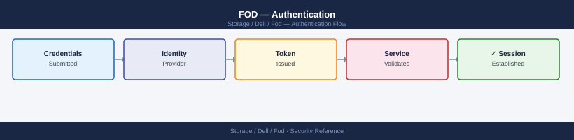

---
tags:
  - dell
  - security
---
# FOD — Authentication

Dell FoD authentication: SCG service account management, CloudIQ SSO configuration, API token rotation, and audit trail review for capacity entitlement changes.

*Applies to: Dell FOD*

> Part of the [Flex on Demand](../index.md) reference.

---

FOD metering access is managed through the underlying array management interfaces (Unisphere for PowerMax, PowerStore Manager) and the Dell APEX Console. Authentication follows the same model as those platforms.

- **Unisphere**: local accounts or LDAP/AD integration. Use a dedicated read-only service account for FOD capacity monitoring automation.
- **APEX Console**: Dell account-based authentication with optional SSO/federation via Azure AD or Okta.
- **CloudIQ API**: OAuth2 client credentials for programmatic access to metered usage data.
---

## Before you begin

- **Access:** Storage admin credentials (cluster admin or equivalent)
- **Change management:** security changes require CAB approval in most environments
- **Rollback plan:** document current state before any security control change
- **Testing:** validate in a non-production environment first where possible

---

## Related Reference

- [Standard LDAP Integration](../../../../security/ldap-integration/index.md) — field reference, service account standards, TLS requirements, and connectivity testing
- [Standard SAML Configuration](../../../../security/saml-configuration/index.md) — SP/IdP setup, Azure AD and Okta steps, attribute mapping, and security requirements

---

## See also

- [Fod — Access Control](access-control/)
- [Fod — Hardening](hardening/)
- [Fod — Encryption](encryption/)
