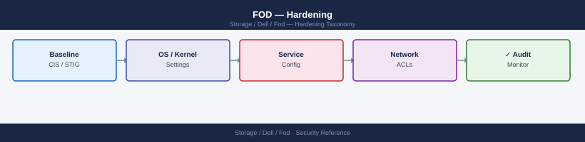

---
tags:
  - dell
  - security
---
# FOD — Hardening


<div class="kb-summary">
Hardening reference covering Hardening Checklist, Network Requirements Summary.

*Applies to: Dell FOD*
</div>



> Part of the [Flex on Demand](../index.md) reference.

---

```d2
direction: down

external: External / Untrusted {shape: rectangle}
hardening_checklist: "Hardening Checklist" {shape: rectangle}
network_requirements_summary: "Network Requirements Summary" {shape: rectangle}
core: "Flex On Demand Core" {shape: hexagon}

external -> hardening_checklist: traffic in
hardening_checklist -> network_requirements_summary
network_requirements_summary -> core: secured path
```

## Before you begin

- **Access:** Storage admin credentials (cluster admin or equivalent)
- **Change management:** security changes require CAB approval in most environments
- **Rollback plan:** document current state before any security control change
- **Testing:** validate in a non-production environment first where possible

---

## Hardening Checklist

| Control | Standard | Action |
|---|---|---|
| **SCG software version** | Current GA release | Update the SCG appliance whenever Dell releases a new version. Outdated SCG versions may break telemetry delivery, causing metering gaps that require manual correction. Check the SCG admin console for available updates at least monthly. |
| **SCG redundancy** | Two SCG appliances per site | Deploy two SCG appliances and register each monitored array to both. A single SCG is a metering single point of failure. Both appliances should be on separate physical hosts. |
| **SCG network isolation** | Management VLAN only | Place SCG appliances on the storage management VLAN. Block access from general server VLANs. The SCG needs outbound HTTPS (443) to Dell cloud endpoints only — no inbound connections are required. |
| **SCG outbound allowlist** | Dell cloud endpoints only | Permit SCG outbound TCP 443 to `esrs.dell.com`, `cloudiq.dell.com`, and `api.dell.com` (or the regional equivalents listed in the SCG deployment guide). Deny all other outbound destinations at the perimeter. |
| **API service accounts** | One per integration | Create a dedicated APEX API service account for each consuming system. Assign the Viewer role unless write access is explicitly required. Document any account with elevated permissions and justify quarterly. |
| **API credential rotation** | Every 90 days | Rotate all API client secrets on a 90-day cycle. Automate rotation where possible. Store credentials in a secrets vault — never in config files or version control. |
| **APEX Console MFA** | Enforced for all human users | Enable MFA on the APEX Console account. This is configured under account identity settings and applies to all users in the tenancy. |
| **APEX Console IP allowlisting** | Corporate egress IPs only | If the APEX Console supports IP allowlisting for the account (check under account security settings), restrict access to known corporate egress IP ranges or VPN exit nodes. |
| **Least-privilege Unisphere accounts** | Named accounts, Viewer role for automation | Automation scripts querying FOD capacity metrics do not require StorageAdmin write access. Use Unisphere Monitor or Viewer roles for all read-only integrations. |
| **Audit log review** | Monthly | Review the CloudIQ audit log monthly for unexpected API access patterns, failed authentication attempts, and unscheduled gateway registration or deregistration events. |
| **Default credential changes** | At deployment | Change all default passwords on SCG appliances and associated service accounts immediately after deployment. Document that this step was completed in the CMDB entry for each SCG. |
| **Certificate validation** | SCG certificate pinning enabled | Do not deploy a TLS-inspecting proxy between the SCG and Dell cloud endpoints. Certificate pinning on the SCG will reject inspected connections, silently breaking telemetry delivery. |

## Network Requirements Summary

| Destination | Port | Direction | Purpose |
|---|---|---|---|
| `esrs.dell.com` | TCP 443 | Outbound from SCG | Secure Connect Gateway telemetry upload |
| `cloudiq.dell.com` | TCP 443 | Outbound from SCG | CloudIQ metric ingestion |
| `api.dell.com` | TCP 443 | Outbound from management hosts | APEX API access |
| Array management interface | TCP 443 / 8443 | SCG to array | Array registration and metric collection |

All other inbound connections to the SCG should be denied by default.

---

## See also

- [Fod — Authentication](authentication/)
- [Fod — Access Control](access-control/)
- [Fod — Encryption](encryption/)
