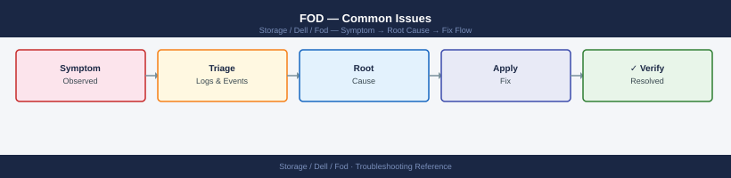

---
tags:
  - dell
  - troubleshooting
search:
  boost: 1.5
---
# FOD — Common Issues

<div class="kb-summary">
Common FOD activation errors, feature entitlement failures, and troubleshooting unlicensed features.

*Applies to: Dell FOD*
</div>


> Part of the [Flex on Demand](../index.md) reference.

---

| Symptom | Likely Cause | Action |
|---|---|---|
| Unexpected burst charges on FOD bill | Workload spike or snapshot/backup growth pushed usage above committed baseline | Review CloudIQ capacity trend for the billing period; identify the growth driver; adjust committed baseline if sustained |
| CloudIQ reports no telemetry for a FOD-enrolled system | Secure Connect Gateway offline or CloudIQ agent not running | Check SCG appliance health; verify outbound HTTPS connectivity to Dell CloudIQ endpoints |
| FOD capacity ceiling reached (no more burst available) | All pre-installed burst capacity is consumed | Contact Dell account team to install additional physical capacity under the FOD agreement |
| Committed baseline appears incorrect in APEX Console | Baseline was set at contract time and workload changed | Submit a baseline adjustment request through APEX Console or Dell account team |

```d2
direction: down

symptom: Identify Symptom {shape: diamond}
diagnostic_flow: "Diagnostic Flow" {shape: rectangle}
verify_resolution: "Verify resolution" {shape: rectangle}
resolution: Resolve or Escalate {shape: oval}

symptom -> diagnostic_flow: investigate
symptom -> verify_resolution: investigate
diagnostic_flow -> resolution
verify_resolution -> resolution
```

## Diagnostic Flow

```d2
direction: right

D1: "D1" {shape: rectangle}
R1: "See Issue Reference —\nKey rejected: verify SN then re-download" {shape: rectangle}
R2: "See Issue Reference —\nKey duplicate: harmless; check event log" {shape: rectangle}
D2: "D2" {shape: rectangle}
R3: "See Issue Reference —\nFW too old: upgrade firmware first" {shape: rectangle}
R4: "See Issue Reference —\nFeature hidden: check Settings > Features" {shape: rectangle}
D3: "D3" {shape: rectangle}
R5: "See Issue Reference —\nAccount link: link SN to support account" {shape: rectangle}
R6: "See Issue Reference —\nWrong feature: verify key description before buy" {shape: rectangle}
S: "What is the symptom?" {shape: rectangle}
B1: "B1" {shape: rectangle}
B2: "B2" {shape: rectangle}
B3: "B3" {shape: rectangle}

D1 -> R1
D1 -> R2
D2 -> R3
D2 -> R4
D3 -> R5
D3 -> R6
```

---

## Before you begin

- **Access:** Storage admin credentials (cluster admin or equivalent)
- **Gather first:** recent error message text, event timestamps, and affected object names
- **Scope:** confirm whether the issue affects a single object, host, cluster, or site
- **Escalation:** open a vendor support ticket before running any destructive step
- **Logging:** document each command and output — required if escalation is needed

---

---

## Verify resolution

- Confirm the original symptom no longer occurs
- Check logs for any residual errors related to the issue
- Monitor for 10–15 minutes to confirm the fix is stable

---

## See also

- [Fod — Diagnostics](../diagnostics/)
- [Fod — Escalation](../escalation/)
- [Fod — Health Checks](../../operations/health-checks/)
