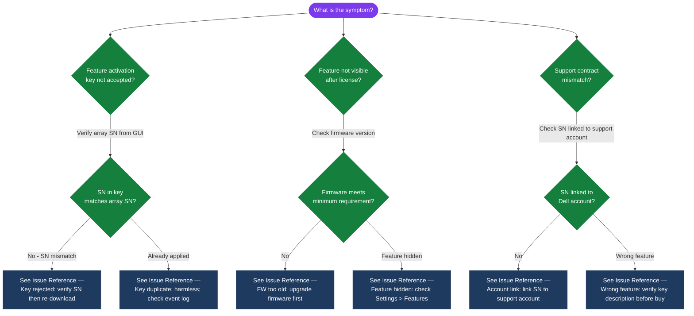

---
tags:
  - dell
  - troubleshooting
search:
  boost: 1.5
---
# FOD — Common Issues

Common FOD activation errors, feature entitlement failures, and troubleshooting unlicensed features.

*Applies to: Dell FOD*

> Part of the [Flex on Demand](../index.md) reference.

---

| Symptom | Likely Cause | Action |
|---|---|---|
| Unexpected burst charges on FOD bill | Workload spike or snapshot/backup growth pushed usage above committed baseline | Review CloudIQ capacity trend for the billing period; identify the growth driver; adjust committed baseline if sustained |
| CloudIQ reports no telemetry for a FOD-enrolled system | Secure Connect Gateway offline or CloudIQ agent not running | Check SCG appliance health; verify outbound HTTPS connectivity to Dell CloudIQ endpoints |
| FOD capacity ceiling reached (no more burst available) | All pre-installed burst capacity is consumed | Contact Dell account team to install additional physical capacity under the FOD agreement |
| Committed baseline appears incorrect in APEX Console | Baseline was set at contract time and workload changed | Submit a baseline adjustment request through APEX Console or Dell account team |

## Diagnostic Flow

---

## Before you begin

- **Access:** Storage admin credentials (cluster admin or equivalent)
- **Gather first:** recent error message text, event timestamps, and affected object names
- **Scope:** confirm whether the issue affects a single object, host, cluster, or site
- **Escalation:** open a vendor support ticket before running any destructive step
- **Logging:** document each command and output — required if escalation is needed

---

---

## Verify resolution

- Confirm the original symptom no longer occurs
- Check logs for any residual errors related to the issue
- Monitor for 10–15 minutes to confirm the fix is stable

---

## See also

- [Fod — Diagnostics](diagnostics/)
- [Fod — Escalation](escalation/)
- [Fod — Health Checks](../operations/health-checks/)
