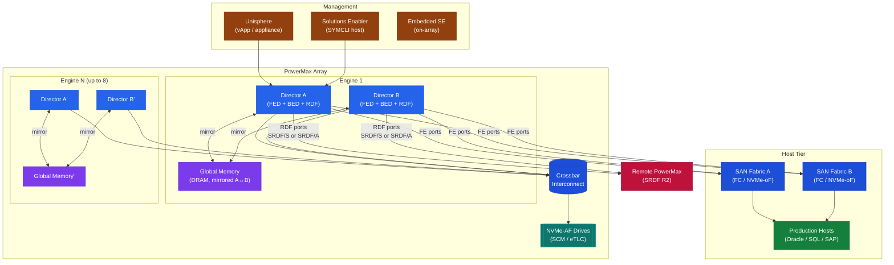
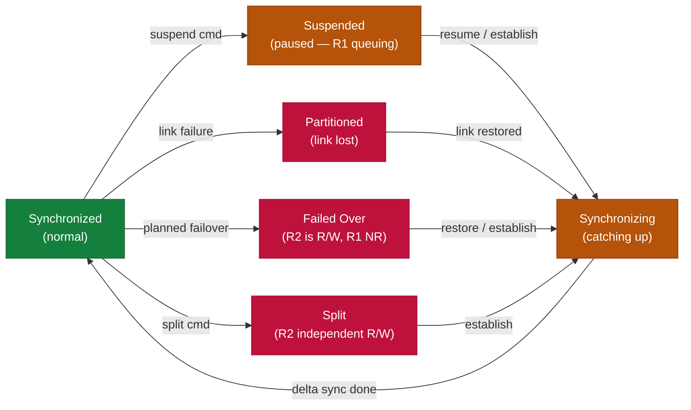

# PowerMax — Components

## Component Hierarchy



## Components

| Component | Description |
|---|---|
| Engine | Physical cabinet unit; each engine contains two directors (director pair). PowerMax 2000 supports 1–4 engines; PowerMax 8000 supports 1–8 engines. |
| Director | The compute and I/O controller within an engine. Each engine has two directors in an active-active pair for redundancy. |
| Front-end Director (FED) | Handles host connectivity. Ports exposed here are mapped to host initiators via masking views. Supports FC, FICON, and NVMe/FC port adapters. |
| Back-end Director (BED) | Manages the NVMe flash drives. All drives are NVMe-AF (all-flash NVMe). |
| RDFA Director (RDF) | Dedicated director ports for SRDF replication links. Can be shared with FED ports on smaller configurations. |
| Global Memory | DRAM shared across all directors in the array. Stores write cache and metadata. Protected by RAID 1 across directors. |
| NVMe-AF Drives | All flash, NVMe form factor. PowerMax 2000 supports SCM (Storage Class Memory) in mixed configurations. |
| Unisphere for PowerMax | Web-based management interface. Deployed as a vApp or virtual appliance. |
| Solutions Enabler (SE) | Host-based management toolkit; provides SYMCLI for scripted and automated operations. |
| EmbeddedManagement | Embedded SE instance running on the array; enables array-native CLI operations without an external SE host. |

## Connectivity

| Protocol | Director Type | Notes |
|---|---|---|
| Fibre Channel (FC) | Front-end | 32 Gb/s FC ports; standard for tier-1 block workloads |
| NVMe/FC | Front-end | NVMe over FC for lowest-latency host access |
| NVMe/TCP | Front-end | NVMe over TCP; supported on PowerMax 2000/8000 with appropriate firmware |
| iSCSI | Front-end | 25 GbE iSCSI for IP-connected hosts |
| SRDF (FC-based) | RDF | Dedicated RDF ports for inter-array replication; 8 Gb/s or 16 Gb/s FC |
| SRDF/IP | RDF | IP-based SRDF for sites without FC dark fibre |

Host connectivity best practices:
- Zone each host HBA port to ports on **both** directors of an engine (cross-director zoning) to maximise redundancy.
- Avoid connecting all host paths to a single engine; spread paths across at least two engines on large arrays.
- Use PowerPath/VE for VMware environments to provide automated path management and load balancing.

## SRDF Operations

Day-2 operational tasks for SRDF/S (synchronous) and SRDF/A (asynchronous) replication on PowerMax.

### Check SRDF State

```bash
# List all SRDF groups (RDFGs)
symrdf -sid <sid> list -rdfg all

# Query pair states for a specific RDFG
symrdf -sid <sid> query -rdfg <rdfg_id>

# Check for any pairs not in Synchronized state
symrdf -sid <sid> query -rdfg all | grep -v "Synchronized\|InSync\|^$\|Group\|Pair\|---"

# Detailed view of a specific group
symrdf -sid <sid> list -rdfg <rdfg_id> -v
```

### SRDF/S Pair States



| State | Meaning |
|---|---|
| Synchronized | In sync — normal production state |
| Synchronizing | Catching up — data transfer in progress |
| Suspended | Paused — writes queued on R1 |
| Failed Over | R2 is R/W, R1 is NR — after failover |
| Partitioned | Communication lost between R1 and R2 |
| Split | Deliberately separated — R2 is R/W independently |

### SRDF/A (Asynchronous) Specific

```bash
# Check SRDF/A cycle time and RPO
symrdf -sid <sid> list -rdfg <rdfg_id> | grep -E "Cycle|RPO|Delta"

# Check SRDF/A transmit idle state (DSE)
symrdf -sid <sid> query -rdfg <rdfg_id> | grep -i "Transmit\|Idle\|Active"
```

### Suspend and Resume

```bash
# Suspend SRDF (stops replication — R1 continues to accept writes)
symrdf -sid <sid> -rdfg <rdfg_id> suspend -noprompt

# Resume SRDF (R1 re-syncs to R2)
symrdf -sid <sid> -rdfg <rdfg_id> resume -noprompt

# Resume with consistency check
symrdf -sid <sid> -rdfg <rdfg_id> establish -noprompt
```

### Planned Failover (Swap)

```bash
# Step 1 — Suspend SRDF on R1 side
symrdf -g <dg_name> -sid <r1_sid> suspend -noprompt

# Step 2 — Swap roles (R2 becomes R/W, R1 becomes write-disabled)
symrdf -g <dg_name> -sid <r1_sid> swap -noprompt

# Step 3 — After workload moved to DR site, restore to original direction
symrdf -g <dg_name> -sid <r1_sid> restore -noprompt
```

### Failback

```bash
# After restoring primary site — re-establish sync from R1 to R2
symrdf -g <dg_name> -sid <r1_sid> establish -noprompt

# Wait for synchronization to complete
watch -n 30 "symrdf -sid <r1_sid> query -rdfg <rdfg_id> | grep -v Synchronized"
```

### SRDF Health Check

```bash
# Full RDFG health summary
symrdf -sid <sid> list -rdfg all | grep -E "RDFG|State|Mode|Pairs"

# Check for any groups with errors or issues
symrdf -sid <sid> list -rdfg all | grep -iE "error\|partition\|failed\|suspend"

# Link utilisation
symstat -sid <sid> list -type rdf -i 10 -c 3
```
